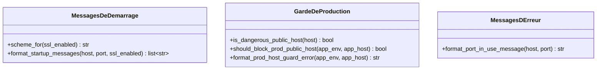

# Les messages du serveur de dev dans Forge

Ce document décrit les messages de diagnostic et les gardes du serveur de développement.

Le serveur intégré (`python app.py`) affiche des messages au démarrage et refuse certaines configurations dangereuses, comme une écoute publique en production.
Ce module construit ces messages et porte la logique de garde.
Le fichier de code correspondant est `core/app/dev_server.py`.

## 1. Rôle

Ce module rassemble des fonctions pures de mise en forme et de décision, sans aucune entrée-sortie ni gestion de processus.

Il produit les lignes d'information affichées au démarrage du serveur HTTP local, le message d'erreur quand le port est déjà occupé, et le message de refus quand `python app.py` tente de démarrer en production sur une interface publique.
Le serveur intégré reste réservé au développement : pour la production publique, Forge documente la voie WSGI plus Gunicorn plus reverse proxy.
Les fonctions sont conçues pour être testables sans démarrer de vrai serveur.

## 2. Vue d'ensemble rapide

| Élément | Valeur |
|---|---|
| Module Python | `core.app.dev_server` |
| Couche | bootstrap applicatif, serveur de développement |
| Rôle | mettre en forme les messages de démarrage et décider du garde de production |
| Dépend de | rien (fonctions pures de la bibliothèque standard) |
| API publique | `scheme_for`, `format_startup_messages`, `is_dangerous_public_host`, `should_block_prod_public_host`, `format_prod_host_guard_error`, `format_port_in_use_message` |
| Effet de bord | aucun (ni I/O, ni processus, ni détection réseau) |

## 3. Schéma des fonctions

Le module est un ensemble de fonctions pures regroupées en trois familles.



À retenir :

- la famille des messages de démarrage construit les lignes affichées quand le serveur écoute ;
- la famille du garde de production décide si le démarrage doit être refusé et compose le message de refus ;
- la famille des messages d'erreur explique un port déjà occupé.

## 4. API publique

| Fonction | Signature | Rôle |
|---|---|---|
| `scheme_for` | `scheme_for(ssl_enabled: bool) -> str` | retourne `"https"` ou `"http"` selon le drapeau SSL |
| `format_startup_messages` | `format_startup_messages(host: str, port: int, ssl_enabled: bool) -> list[str]` | construit les lignes d'information affichées au démarrage |
| `is_dangerous_public_host` | `is_dangerous_public_host(host: str) -> bool` | `True` si l'hôte écoute sur toutes les interfaces (`0.0.0.0`, `::`) |
| `should_block_prod_public_host` | `should_block_prod_public_host(app_env: str, app_host: str) -> bool` | `True` si la combinaison environnement et hôte doit déclencher le garde |
| `format_prod_host_guard_error` | `format_prod_host_guard_error(app_env: str, app_host: str) -> str` | message de refus quand `python app.py` démarre en prod sur une interface publique |
| `format_port_in_use_message` | `format_port_in_use_message(host: str, port: int) -> str` | message lisible quand le bind échoue avec `EADDRINUSE` |

## 5. Contextes d'utilisation

| Besoin | Élément |
|---|---|
| Afficher l'URL au démarrage | `format_startup_messages(...)` |
| Choisir le schéma selon SSL | `scheme_for(ssl_enabled)` |
| Détecter une écoute sur toutes les interfaces | `is_dangerous_public_host(host)` |
| Décider de bloquer le démarrage en prod | `should_block_prod_public_host(env, host)` |
| Expliquer un refus de démarrage en prod | `format_prod_host_guard_error(env, host)` |
| Expliquer un port déjà utilisé | `format_port_in_use_message(host, port)` |

## 6. Exemples d'utilisation

Construire les messages de démarrage pour une écoute sur toutes les interfaces en HTTP :

```python
from core.app.dev_server import format_startup_messages

for line in format_startup_messages("0.0.0.0", 8000, ssl_enabled=False):
    print(line)
```

Décider d'un garde de production avant de démarrer :

```python
from core.app.dev_server import (
    should_block_prod_public_host,
    format_prod_host_guard_error,
)

if should_block_prod_public_host(app_env="prod", app_host="0.0.0.0"):
    print(format_prod_host_guard_error("prod", "0.0.0.0"))
    raise SystemExit(1)
```

## 7. Le garde de production

!!! warning "Serveur de développement uniquement"
    `python app.py` est un serveur de développement.
    En `APP_ENV=prod` sur un hôte public (`0.0.0.0` ou `::`), Forge refuse explicitement de démarrer plutôt que d'émettre un simple avertissement.
    Pour rester sur `python app.py` en mode prod local, limiter `APP_HOST` à `127.0.0.1`, `localhost` ou `::1`.
    Pour la production publique, utiliser la voie WSGI plus Gunicorn plus reverse proxy.

## Voir aussi

- [Les callables WSGI](wsgi.md) : la voie de production.
- [Les avertissements de production](prod_warnings.md) : les autres alertes de démarrage.
- [L'application](application.md) : l'objet servi par le serveur de développement.
