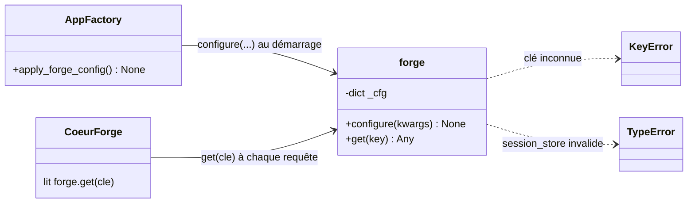
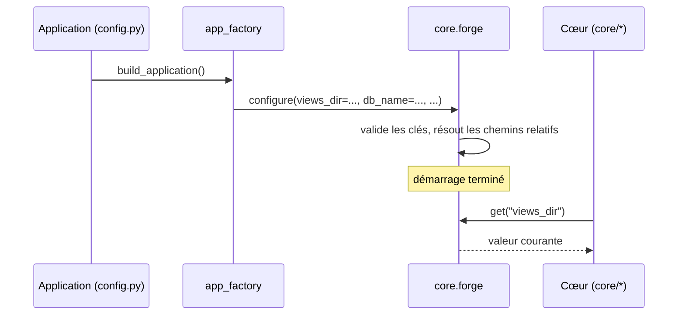

# Le registre de configuration du noyau (forge.py) dans Forge

Ce document explique le registre de configuration du noyau, porté par `core/forge.py`.

C'est le point unique où le framework lit et écrit ses paramètres runtime.

## 1. Rôle du module

`core/forge.py` centralise les paramètres runtime du framework dans un registre unique.

Aucun module du cœur n'importe `config.py` (le fichier applicatif) directement : tout passe par ce registre.

L'application configure le noyau une fois au démarrage avec `forge.configure(...)`, puis le cœur lit les valeurs avec `forge.get(...)`.

## 2. Vue d'ensemble rapide

| Élément | Valeur |
|---|---|
| Module | `core.forge` |
| Fichier | `core/forge.py` (racine du paquet `core`) |
| Couche | Noyau (configuration) |
| Rôle | registre central des paramètres runtime du framework |
| API publique | `configure(**kwargs)`, `get(key)` |
| Écrit par | l'application au démarrage (via `core.app.app_factory.apply_forge_config`) |
| Lu par | tout le cœur (`core/*`) au fil des requêtes |
| Frontière | le cœur ne lit jamais `config.py` directement |
| Exception levée | `KeyError` (clé inconnue), `TypeError` (`session_store` invalide) |
| ADR liés | ADR-032 (périmètre upload), ADR-031 (mail hors noyau), ADR-036 (typage) |

## 3. Schémas UML

Les deux schémas montrent la structure du registre et son cycle de vie.

### 3.1 Diagramme de classe

Le diagramme de classe montre le registre comme un module à deux fonctions publiques au-dessus d'un dictionnaire interne `_cfg`.



À retenir :

- `forge` expose seulement `configure` et `get` ;
- le dictionnaire `_cfg` est interne, jamais manipulé directement ;
- l'application écrit, le cœur lit ;
- les clés inconnues sont refusées (`KeyError`), pas créées silencieusement.

### 3.2 Diagramme de séquence

Le diagramme de séquence montre le cycle de vie : configuration au démarrage, lectures pendant les requêtes.



À retenir :

- `configure(...)` s'appelle une seule fois, au démarrage, avant toute requête ;
- les chemins relatifs (`views_dir`, `sql_dir`) sont résolus en absolu par rapport à la racine du projet ;
- pendant les requêtes, le cœur ne fait que lire via `get(...)` ;
- passer `session_store` délègue au gestionnaire de sessions (validation du protocole).

## 4. API publique

| Fonction | Signature | Rôle |
|---|---|---|
| `configure` | `configure(**kwargs) -> None` | écrit des valeurs de configuration ; lève `KeyError` si une clé est inconnue |
| `get` | `get(key: str) -> Any` | lit une valeur ; lève `KeyError` si la clé n'existe pas |

`configure` traite deux cas particuliers :

- `session_store` est validé contre le protocole `SessionStore` puis injecté dans le gestionnaire de sessions (`TypeError` si invalide) ;
- `views_dir` et `sql_dir`, s'ils sont relatifs, sont résolus en chemins absolus.

## 5. Clés de configuration

| Clé | Défaut | Rôle |
|---|---|---|
| `app_name` | `"Forge"` | nom de l'application |
| `app_env` | `"dev"` | environnement courant (`dev`, `test`, `prod`) |
| `views_dir` | `mvc/views` | dossier des gabarits Jinja2 |
| `sql_dir` | `mvc/models/sql` | dossier des requêtes SQL |
| `upload_max_size` | `5 Mo` | plafond du corps multipart (seul réglage upload du noyau, ADR-032) |
| `db_host` / `db_port` | `localhost` / `3306` | hôte et port de la base |
| `db_name` / `db_user` / `db_password` | `forge_db` / `root` / `""` | identité de connexion applicative |
| `db_pool_size` | `5` | taille du pool de connexions |
| `css_visible` / `css_hidden` | `block` / `hidden` | classes CSS des helpers (pagination) |
| `router` | `None` | routeur actif, renseigné au démarrage (pour `url_for`) |
| `i18n_default_locale` / `i18n_fallback_locale` | `fr` / `fr` | langues de `trans()` |
| `session_store` | `None` | store de session (None = `MemorySessionStore`) |
| `trusted_proxies` | `frozenset()` | IPs des proxies de confiance pour `X-Real-IP` |

!!! note "Mail absent du registre"
    Le noyau ne connaît pas le mail.

    L'opt-in `forge-mvc-mail` lit sa configuration directement depuis l'environnement (ADR-022, ADR-031).

## 6. Contextes d'utilisation

| Besoin | Élément |
|---|---|
| Configurer le noyau au démarrage | `forge.configure(**kwargs)` |
| Lire un paramètre dans le cœur | `forge.get("clé")` |
| Brancher un store de session | `forge.configure(session_store=mon_store)` |
| Déclarer des proxies de confiance | `forge.configure(trusted_proxies=frozenset({"10.0.0.1"}))` |

## 7. Exemples d'utilisation

### 7.1 Configurer puis lire

```python
from core import forge

forge.configure(app_name="MonApp", app_env="prod", views_dir="mvc/views")

nom = forge.get("app_name")
dossier_vues = forge.get("views_dir")
```

### 7.2 Brancher un store de session personnalisé

```python
from core import forge

forge.configure(session_store=mon_store)
forge.configure(session_store=None)
```

Passer `None` réinitialise au `MemorySessionStore` par défaut.

!!! warning "Clés inconnues refusées"
    `forge.configure(cle_inexistante=...)` lève `KeyError`.

    Le registre ne crée jamais une clé silencieusement : seul un jeu de clés connu est accepté.

!!! tip "Une seule écriture, au démarrage"
    Appelez `configure(...)` une fois, avant toute requête.

    En pratique, c'est `app_factory.apply_forge_config()` qui s'en charge à partir de `config.py`.

## Voir aussi

- [La fabrique d'application (app_factory.py)](app_factory.md) : c'est elle qui appelle `forge.configure(...)`.
- [L'application (application.py)](application.md) : le cœur du dispatch qui lit la configuration.
- [Le serveur de développement (dev_server.py)](dev_server.md) : démarrage local.
