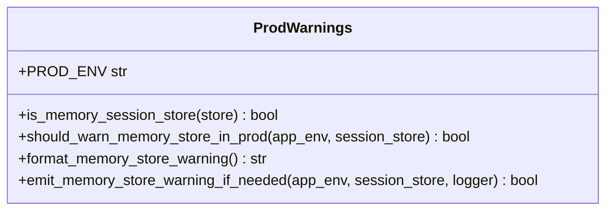

# Les avertissements de production dans Forge

Ce document décrit l'avertissement émis en production quand le stockage de session est en mémoire.

Le store de session mémoire, choisi par défaut, ne convient pas à la production : les sessions sont perdues au redémarrage et ne sont pas partagées entre workers.
Ce module détecte ce cas en `APP_ENV=prod` et émet un avertissement clair, sans rien modifier ni bloquer le démarrage.
Le fichier de code correspondant est `core/app/prod_warnings.py`.

## 1. Rôle

Le runtime Forge tolère pour le développement des choix qui deviennent fragiles en production : un `MemorySessionStore` volatile et mono-processus, et un rate-limit dont les compteurs en mémoire ne sont pas partagés entre workers.

Ce module détecte ces situations quand l'environnement est `prod` et fournit un message d'avertissement humain.
Les fonctions sont pures et testables : l'émission réelle via le logger reste à la charge du point d'entrée.
Le module ne bloque jamais le démarrage : il informe seulement.

## 2. Vue d'ensemble rapide

| Élément | Valeur |
|---|---|
| Module Python | `core.app.prod_warnings` |
| Couche | bootstrap applicatif |
| Rôle | détecter un stockage de session fragile en production et émettre un avertissement |
| Dépend de | `core.sessions.memory_store.MemorySessionStore` (import local), le module `logging` |
| API publique | `is_memory_session_store`, `should_warn_memory_store_in_prod`, `format_memory_store_warning`, `emit_memory_store_warning_if_needed` |
| Constante publique | `PROD_ENV = "prod"` |
| Effet de bord | uniquement `emit_memory_store_warning_if_needed`, qui appelle `logger.warning(...)` |

## 3. Schéma des fonctions

Le module enchaîne trois décisions pures puis une émission optionnelle.



À retenir :

- `is_memory_session_store` traite un store non configuré (`None`) comme un store mémoire, car le défaut Forge se résout en `MemorySessionStore` ;
- `should_warn_memory_store_in_prod` combine la condition d'environnement et la condition de store ;
- `format_memory_store_warning` ne fait que produire le texte ;
- `emit_memory_store_warning_if_needed` est la seule fonction à effet de bord, à invoquer une seule fois au démarrage.

## 4. API publique

| Fonction ou constante | Signature | Rôle |
|---|---|---|
| `PROD_ENV` | `PROD_ENV = "prod"` | valeur d'environnement déclenchant la détection |
| `is_memory_session_store` | `is_memory_session_store(store: Any) -> bool` | `True` si le store est mémoire ou non configuré |
| `should_warn_memory_store_in_prod` | `should_warn_memory_store_in_prod(app_env: str, session_store: Any) -> bool` | `True` si l'environnement est `prod` et le store mémoire |
| `format_memory_store_warning` | `format_memory_store_warning() -> str` | retourne le message d'avertissement multi-ligne |
| `emit_memory_store_warning_if_needed` | `emit_memory_store_warning_if_needed(app_env: str, session_store: Any, *, logger: logging.Logger | None = None) -> bool` | émet le warning si la condition est vraie ; retourne `True` si un warning a été émis |

## 5. Contextes d'utilisation

| Besoin | Élément |
|---|---|
| Alerter d'un store mémoire au démarrage en prod | `emit_memory_store_warning_if_needed(...)` |
| Tester la condition sans émettre | `should_warn_memory_store_in_prod(env, store)` |
| Reconnaître un store mémoire | `is_memory_session_store(store)` |
| Récupérer le texte de l'avertissement | `format_memory_store_warning()` |

## 6. Exemples d'utilisation

Émettre l'avertissement au démarrage, une seule fois :

```python
import core.forge as forge
from core.app.prod_warnings import emit_memory_store_warning_if_needed

emit_memory_store_warning_if_needed(
    str(forge.get("app_env") or ""),
    forge.get("session_store"),
)
```

Tester la condition sans rien émettre :

```python
from core.app.prod_warnings import should_warn_memory_store_in_prod

if should_warn_memory_store_in_prod("prod", session_store=None):
    print("Store mémoire en production : configurer un store partagé.")
```

## 7. Recommandation

!!! tip "Configurer un store partagé en production"
    Avant d'exposer publiquement une application, configurer un store de session persistant et partagé entre workers.
    L'avertissement oriente vers un store de fichiers, par exemple via `forge.configure(session_store=FileSessionStore(...))`.
    La référence est l'ADR-002 sur la stratégie de session.

## Voir aussi

- [Le serveur de dev](dev_server.md) : les autres gardes et messages de démarrage.
- [Les callables WSGI](wsgi.md) : qui émettent cet avertissement à la construction.
