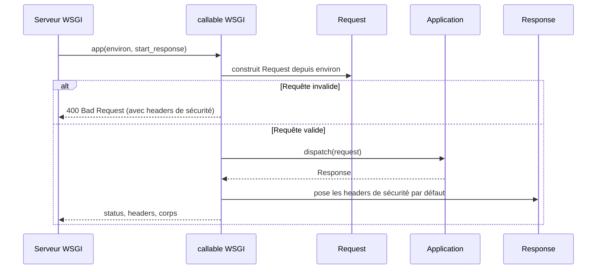

# Les callables WSGI dans Forge

Ce document décrit les points d'entrée WSGI qui permettent de servir Forge en production.

En production, Forge se sert derrière un serveur WSGI comme Gunicorn et un reverse proxy.
Ce module fournit les callables WSGI qui enveloppent l'`Application`.
Le fichier de code correspondant est `core/app/wsgi.py`.

## 1. Rôle

Un serveur WSGI externe attend un objet appelable qui prend `environ` et `start_response`, puis retourne un itérable d'octets.

Ce module adapte l'`Application` Forge à ce contrat.
`create_wsgi_app(application)` enveloppe une `Application` déjà construite.
`create_configured_wsgi_app()` charge la même configuration que `python app.py` via la fabrique, puis retourne le callable prêt à l'emploi.
Le module applique aussi le socle de headers de sécurité partagé avec le serveur de développement, et émet une fois les avertissements de production au démarrage.

Le périmètre est volontairement limité : il ne remplace pas le serveur de développement, ne sert pas les fichiers statiques (rôle du reverse proxy) et ne couvre pas la production complète.

## 2. Vue d'ensemble rapide

| Élément | Valeur |
|---|---|
| Module Python | `core.app.wsgi` |
| Couche | bootstrap applicatif, frontière WSGI |
| Rôle | exposer l'`Application` Forge comme callable WSGI |
| Dépend de | `core.app.app_factory`, `core.app.prod_warnings`, `Request`, `Response`, les headers de sécurité, la CSP |
| API publique | `create_wsgi_app(application)`, `create_configured_wsgi_app(...)` |
| Objet lié | `Application` en entrée, callable WSGI en sortie |
| Sécurité | headers de sécurité par défaut ; HSTS conditionné à `wsgi.url_scheme == "https"` |

## 3. Schéma de séquence

Le module transforme un environnement WSGI en `Request`, dispatche via l'`Application`, puis convertit la `Response` en réponse WSGI.



À retenir :

- l'environnement WSGI est adapté en `Request` via un stub de handler interne ;
- même une requête invalide reçoit le socle de headers de sécurité (réponse 400) ;
- les headers de sécurité sont posés en `setdefault` : une route qui les définit garde la main ;
- HSTS n'est ajouté que si la connexion est en HTTPS ; derrière un proxy TLS-terminé, c'est le proxy qui pose HSTS.

## 4. API publique

| Fonction | Signature | Rôle |
|---|---|---|
| `create_wsgi_app` | `create_wsgi_app(application: Any) -> Callable` | enveloppe une `Application` déjà construite en callable WSGI |
| `create_configured_wsgi_app` | `create_configured_wsgi_app(*, emit_prod_warnings: bool = True, logger: logging.Logger | None = None) -> Callable` | construit l'`Application` configurée et retourne son callable WSGI |

!!! note "Avertissements de production"
    Avec `emit_prod_warnings=True` (défaut), `create_configured_wsgi_app` émet une seule fois, à la construction, les avertissements de production (par exemple un store de session en mémoire en `APP_ENV=prod`).
    Passer `emit_prod_warnings=False` pour les tests qui ne veulent pas polluer le logger.

## 5. Contextes d'utilisation

| Besoin | Élément |
|---|---|
| Servir en production avec Gunicorn | `create_configured_wsgi_app()` dans le `wsgi.py` du projet |
| Envelopper une `Application` déjà construite | `create_wsgi_app(application)` |
| Éviter les warnings dans un test | `create_configured_wsgi_app(emit_prod_warnings=False)` |

## 6. Exemples d'utilisation

Fichier `wsgi.py` du projet, exposé à Gunicorn :

```python
from core.app.wsgi import create_configured_wsgi_app

application = create_configured_wsgi_app()
```

Lancement avec Gunicorn :

```text
gunicorn wsgi:application
```

Envelopper une `Application` construite manuellement :

```python
from core.app.application import Application
from core.app.wsgi import create_wsgi_app

app = Application(router)
wsgi_app = create_wsgi_app(app)
```

## 7. Sécurité et limites

!!! warning "Périmètre de production"
    Le callable WSGI ne sert pas les fichiers statiques : confier ce rôle au reverse proxy.
    Il ne couvre pas tous les aspects de la production ; consulter le guide de déploiement WSGI du projet pour la configuration complète.

## Voir aussi

- [La fabrique d'application](app_factory.md) : appelée par `create_configured_wsgi_app`.
- [L'application](application.md) : l'objet enveloppé par le callable WSGI.
- [Les avertissements de production](prod_warnings.md) : émis au démarrage en production.
