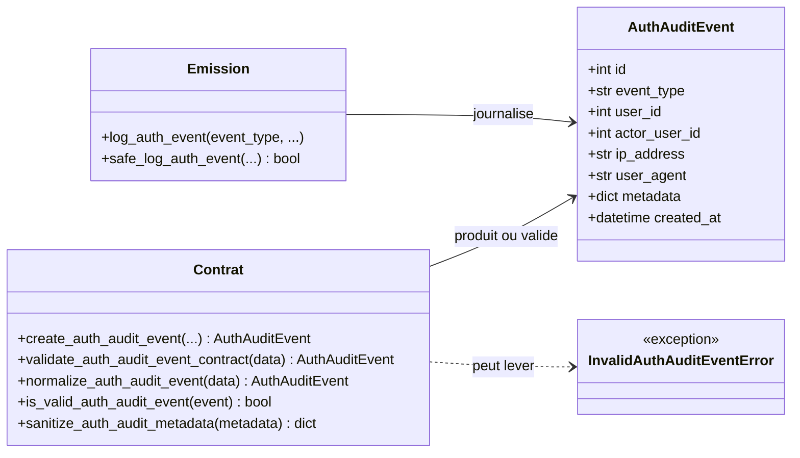
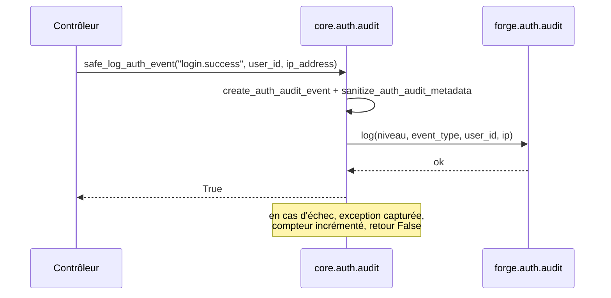

# L'audit Auth/User dans Forge

Ce document décrit la journalisation des événements d'authentification dans Forge.

Forge fournit le vocabulaire et l'émission des événements ; la persistance reste à la charge de l'application (ADR-008).

## 1. Rôle

Le module définit un vocabulaire normalisé d'événements d'audit auth (connexion réussie, échec, changement de mot de passe, désactivation de compte, événements MFA, etc.) et les émet vers un logger Python dédié.

Il ne fait aucun accès base de données : il construit, valide et journalise des événements, mais c'est l'application qui décide où les persister (handler de logging SQL, wrapper applicatif, flux externe).

Les valeurs sensibles (mot de passe, jeton, secret, code MFA) sont retirées des métadonnées avant journalisation.

La table SQL `auth_audit_log` est fournie comme infrastructure latente ; Forge n'y écrit pas par défaut.

## 2. Vue d'ensemble rapide

| Élément | Valeur |
|---|---|
| Module Python | `core.auth.audit` |
| Couche | Auth (cœur) |
| Rôle | définir et émettre les événements d'audit auth |
| Logger | `forge.auth.audit` |
| Classe de données | `AuthAuditEvent` (`dataclass(frozen=True)`) |
| Persistance | applicative (ADR-008), aucune écriture en base |
| Sanitisation | clés sensibles retirées via `sanitize_auth_audit_metadata` |
| Exception liée | `InvalidAuthAuditEventError` |

## 3. Schémas UML

### 3.1 Diagramme de classe

Le diagramme montre `AuthAuditEvent`, les constantes de type d'événement et les fonctions d'émission.



À retenir :

- `AuthAuditEvent` est immuable et porte des métadonnées déjà sanitisées ;
- `log_auth_event` peut lever sur paramètres invalides ; `safe_log_auth_event` ne propage jamais ;
- les échecs (connexion échouée, MFA échoué, compte désactivé) sont journalisés au niveau `WARNING`, le reste en `INFO`.

### 3.2 Diagramme de séquence

Le diagramme montre l'émission résiliente d'un événement.



À retenir :

- `safe_log_auth_event` retourne `True` en cas de succès, `False` en cas d'échec, sans jamais bloquer le flux métier ;
- un échec incrémente un compteur interne consultable via `get_audit_failure_count` ;
- le destinataire des journaux (handler) est configuré par l'application.

## 4. API publique

| Élément | Signature | Rôle |
|---|---|---|
| `AuthAuditEvent` | `AuthAuditEvent(id, event_type, user_id=None, actor_user_id=None, ip_address=None, user_agent=None, metadata=None, created_at=None)` | événement d'audit lisible et stockable |
| `create_auth_audit_event` | `create_auth_audit_event(event_type, user_id=None, actor_user_id=None, ip_address=None, user_agent=None, metadata=None, created_at=None) -> AuthAuditEvent` | construit un événement sans effet de bord |
| `log_auth_event` | `log_auth_event(event_type, user_id=None, ip_address=None, user_agent=None, metadata=None) -> None` | journalise via le logger `forge.auth.audit` ; peut lever |
| `safe_log_auth_event` | `safe_log_auth_event(*args, **kwargs) -> bool` | journalise sans jamais propager d'exception |
| `sanitize_auth_audit_metadata` | `sanitize_auth_audit_metadata(metadata: Any) -> dict | None` | retire les clés sensibles connues |
| `validate_auth_audit_event_contract` | `validate_auth_audit_event_contract(data: Any) -> AuthAuditEvent` | valide et normalise un événement |
| `normalize_auth_audit_event` | `normalize_auth_audit_event(data: Any) -> AuthAuditEvent` | normalise un dict ou un `AuthAuditEvent` |
| `is_valid_auth_audit_event` | `is_valid_auth_audit_event(event: Any) -> bool` | `True` si structurellement valide |
| `get_audit_failure_count` | `get_audit_failure_count() -> int` | nombre cumulatif d'échecs de `safe_log_auth_event` |
| `reset_audit_failure_count` | `reset_audit_failure_count() -> None` | remet le compteur à zéro (réservé aux tests) |

Constantes de type d'événement (extrait) :

| Constante | Valeur |
|---|---|
| `AUTH_EVENT_LOGIN_SUCCESS` | `login.success` |
| `AUTH_EVENT_LOGIN_FAILED` | `login.failed` |
| `AUTH_EVENT_LOGOUT` | `logout` |
| `AUTH_EVENT_PASSWORD_RESET_REQUESTED` | `password_reset.requested` |
| `AUTH_EVENT_PASSWORD_RESET_COMPLETED` | `password_reset.completed` |
| `AUTH_EVENT_EMAIL_VERIFIED` | `email.verified` |
| `AUTH_EVENT_USER_PASSWORD_CHANGED` | `user.password_changed` |
| `AUTH_EVENT_USER_DISABLED` | `user.disabled` |

Le module fournit aussi les constantes MFA (`AUTH_EVENT_MFA_*`) et les événements de rôle (`AUTH_EVENT_USER_ROLE_ADDED`, `AUTH_EVENT_USER_ROLE_REMOVED`).

## 5. Contextes d'utilisation

| Besoin | Élément |
|---|---|
| Journaliser une connexion réussie | `safe_log_auth_event(AUTH_EVENT_LOGIN_SUCCESS, user_id=..., ip_address=...)` |
| Journaliser un échec de connexion | `safe_log_auth_event(AUTH_EVENT_LOGIN_FAILED, ip_address=...)` |
| Tracer une action d'administration | `safe_log_auth_event(AUTH_EVENT_USER_DISABLED, user_id=...)` |
| Construire un événement à persister | `create_auth_audit_event(...)` |
| Surveiller les pertes d'audit | `get_audit_failure_count()` |

## 6. Exemples d'utilisation

Émission résiliente à la connexion :

```python
from core.auth import (
    AUTH_EVENT_LOGIN_SUCCESS,
    AUTH_EVENT_LOGIN_FAILED,
    safe_log_auth_event,
)

if user is not None:
    safe_log_auth_event(AUTH_EVENT_LOGIN_SUCCESS, user_id=user.id, ip_address=request.ip)
else:
    safe_log_auth_event(AUTH_EVENT_LOGIN_FAILED, ip_address=request.ip)
```

Construction d'un événement à persister soi-même :

```python
from core.auth import AUTH_EVENT_USER_PASSWORD_CHANGED, create_auth_audit_event

event = create_auth_audit_event(
    AUTH_EVENT_USER_PASSWORD_CHANGED,
    user_id=42,
    ip_address="203.0.113.10",
)
# persister event selon votre stratégie (table, flux externe...)
```

!!! note "Persistance applicative"
    Forge fournit le logging Python ; persister les audits (table, rétention, requêtes) appartient à l'application.

    Le vocabulaire d'audit, y compris les événements MFA, est assumé dans le cœur (ADR-011).

!!! warning "Aucune valeur sensible journalisée"
    `sanitize_auth_audit_metadata` retire les clés sensibles connues (mot de passe, jeton, secret, code de récupération, etc.).

    `safe_log_auth_event` ne journalise jamais les `kwargs` bruts : seules les métadonnées sanitisées sont consignées en cas d'échec.

## Voir aussi

- [La session Auth/User dans Forge](session.md) : la connexion à journaliser.
- [Le rate-limit Auth dans Forge](rate_limit.md) : freiner les tentatives, complément de l'audit.
- [Les exceptions Auth dans Forge](exceptions.md) : `InvalidAuthAuditEventError`.
