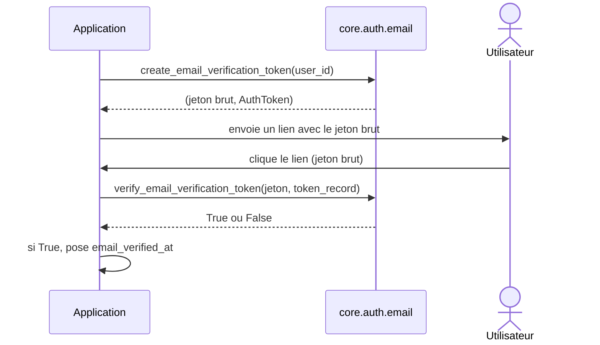

# La vérification email dans Forge

Ce document décrit la vérification d'adresse email d'un utilisateur, construite au-dessus des jetons Auth.

On envoie à l'utilisateur un jeton de vérification ; son retour marque l'adresse comme vérifiée.

## 1. Rôle

Pour confirmer qu'une adresse appartient bien à la personne qui s'inscrit, Forge génère un jeton de vérification, le transmet par email, puis valide ce jeton au retour.

Le module est une couche mince au-dessus de `core.auth.tokens` : il fixe le `purpose` `email_verification`, crée le jeton avec une expiration par défaut de 60 minutes, et le vérifie.

Forge ne stocke pas le jeton brut et n'écrit rien en base : la persistance de l'`AuthToken` et du champ `email_verified_at` reste applicative.

## 2. Vue d'ensemble rapide

| Élément | Valeur |
|---|---|
| Module Python | `core.auth.email` |
| Couche | Auth (cœur) |
| Rôle | vérifier l'adresse email d'un utilisateur |
| Dépend de | `core.auth.tokens` (`AuthToken`, génération, vérification) |
| Constante | `EMAIL_VERIFICATION_PURPOSE = "email_verification"` |
| Expiration par défaut | 60 minutes |
| API publique | `create_email_verification_token`, `verify_email_verification_token`, `email_verification_timestamp`, `is_email_verified` |
| Exception liée | `AuthError` (sur paramètres invalides à la création) |

## 3. Schéma UML

Le diagramme montre le flux de la vérification email.



À retenir :

- `create_email_verification_token` renvoie le couple `(jeton brut, AuthToken)` ;
- seule l'empreinte de l'`AuthToken` doit être stockée côté serveur ;
- `verify_email_verification_token` ne modifie ni la base ni le `token_record` ;
- `email_verification_timestamp` fournit l'horodatage UTC à enregistrer dans `email_verified_at`.

## 4. API publique

| Fonction | Signature | Rôle |
|---|---|---|
| `create_email_verification_token` | `create_email_verification_token(user_id: int, minutes: int = 60, now: datetime | None = None) -> tuple[str, AuthToken]` | crée un jeton de vérification ; retourne `(jeton brut, AuthToken)` |
| `verify_email_verification_token` | `verify_email_verification_token(token: str, token_record: Any, now: datetime | None = None) -> bool` | `True` si le jeton brut est valide pour la vérification email |
| `email_verification_timestamp` | `email_verification_timestamp(now: datetime | None = None) -> datetime` | datetime UTC courante pour renseigner `email_verified_at` |
| `is_email_verified` | `is_email_verified(email_verified_at: Any) -> bool` | `True` si `email_verified_at` est renseigné |

## 5. Contextes d'utilisation

| Besoin | Élément |
|---|---|
| Créer le jeton à l'inscription | `create_email_verification_token(user_id)` |
| Valider le retour de l'utilisateur | `verify_email_verification_token(token, token_record)` |
| Horodater la vérification | `email_verification_timestamp()` |
| Savoir si l'email est déjà vérifié | `is_email_verified(email_verified_at)` |

## 6. Exemples d'utilisation

À l'inscription :

```python
from core.auth import create_email_verification_token

raw_token, token_record = create_email_verification_token(user_id=42)
# stocker token_record (empreinte) ; envoyer raw_token dans un lien email
```

Au retour de l'utilisateur :

```python
from core.auth import verify_email_verification_token, email_verification_timestamp

if verify_email_verification_token(raw_token, token_record):
    verified_at = email_verification_timestamp()
    # enregistrer verified_at dans users.email_verified_at
```

!!! note "Persistance applicative"
    Forge produit et vérifie le jeton, mais n'écrit jamais en base.

    Le stockage de l'`AuthToken`, le marquage `used_at` et le champ `email_verified_at` sont à la charge de l'application.

## Voir aussi

- [Les jetons Auth dans Forge](tokens.md) : le mécanisme de jeton sous-jacent.
- [La réinitialisation de mot de passe dans Forge](reset.md) : le même schéma de jeton.
- [Le contrat utilisateur dans Forge](user.md) : l'utilisateur dont on vérifie l'adresse.
