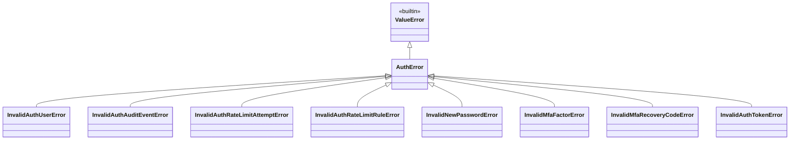

# Les exceptions Auth dans Forge

Ce document décrit la hiérarchie d'exceptions du module d'authentification de Forge.

Toutes héritent de `AuthError`, elle-même une sous-classe de `ValueError`, pour que l'application réagisse précisément à chaque type d'erreur.

## 1. Rôle

Le module auth distingue ses erreurs : utilisateur invalide, nouveau mot de passe refusé, contrat d'audit non respecté, données de rate-limit incorrectes, facteur ou code de récupération MFA invalides.

Cette granularité permet à l'application de capturer une catégorie précise sans masquer les autres, tout en gardant la possibilité d'attraper l'ensemble via `AuthError`.

Les exceptions sont levées par les fonctions `validate_*` et `normalize_*` des différents modules auth lorsqu'un contrat n'est pas respecté.

## 2. Vue d'ensemble rapide

| Élément | Valeur |
|---|---|
| Module Python | `core.auth.exceptions` |
| Couche | Auth (cœur) |
| Rôle | typer les erreurs du module auth |
| Base commune | `AuthError` (sous-classe de `ValueError`) |
| Levées par | les helpers `validate_*` et `normalize_*` du module auth |
| Cas particulier | `InvalidAuthTokenError` est définie dans `core.auth.tokens` |

## 3. Schéma UML

Le diagramme montre la hiérarchie d'exceptions du module auth.



À retenir :

- `AuthError` est la racine : la capturer attrape toutes les erreurs auth ;
- chaque sous-classe cible un contrat précis ;
- `InvalidAuthTokenError` hérite aussi de `AuthError`, bien qu'elle soit déclarée dans `core.auth.tokens`.

## 4. API publique

| Exception | Définition | Cas couvert |
|---|---|---|
| `AuthError` | `class AuthError(ValueError)` | erreur de base du module auth |
| `InvalidAuthUserError` | `class InvalidAuthUserError(AuthError)` | données utilisateur incomplètes ou invalides |
| `InvalidNewPasswordError` | `class InvalidNewPasswordError(AuthError)` | nouveau mot de passe invalide |
| `InvalidAuthAuditEventError` | `class InvalidAuthAuditEventError(AuthError)` | événement d'audit invalide |
| `InvalidAuthRateLimitAttemptError` | `class InvalidAuthRateLimitAttemptError(AuthError)` | tentative de rate-limit invalide |
| `InvalidAuthRateLimitRuleError` | `class InvalidAuthRateLimitRuleError(AuthError)` | règle de rate-limit invalide |
| `InvalidMfaFactorError` | `class InvalidMfaFactorError(AuthError)` | données de facteur MFA invalides |
| `InvalidMfaRecoveryCodeError` | `class InvalidMfaRecoveryCodeError(AuthError)` | données de code de récupération MFA invalides |
| `InvalidAuthTokenError` | `class InvalidAuthTokenError(AuthError)` | données de jeton incomplètes ou invalides |

## 5. Contextes d'utilisation

| Besoin | Élément |
|---|---|
| Capturer toute erreur auth | `except AuthError` |
| Réagir à un utilisateur invalide | `except InvalidAuthUserError` |
| Réagir à un mot de passe refusé | `except InvalidNewPasswordError` |
| Réagir à un jeton invalide | `except InvalidAuthTokenError` |
| Réagir à un contrat d'audit ou de rate-limit | `except InvalidAuthAuditEventError`, `except InvalidAuthRateLimitRuleError`, etc. |

## 6. Exemples d'utilisation

Capture ciblée puis large :

```python
from core.auth import (
    normalize_auth_user,
    InvalidAuthUserError,
    AuthError,
)

try:
    user = normalize_auth_user(row)
except InvalidAuthUserError:
    return Response.text("Données utilisateur invalides")
except AuthError:
    return Response.text("Erreur d'authentification")
```

Validation d'un nouveau mot de passe :

```python
from core.auth import validate_new_password, InvalidNewPasswordError

try:
    validate_new_password(new_password)
except InvalidNewPasswordError as exc:
    return Response.text(str(exc))
```

!!! note "Héritage de ValueError"
    `AuthError` dérive de `ValueError`.

    Un code générique qui capture déjà `ValueError` attrapera donc aussi les erreurs auth ; préférez capturer `AuthError` ou une sous-classe précise pour expliciter l'intention.

## Voir aussi

- [Le contrat utilisateur dans Forge](user.md) : lève `InvalidAuthUserError`.
- [L'audit Auth/User dans Forge](audit.md) : lève `InvalidAuthAuditEventError`.
- [Le rate-limit Auth dans Forge](rate_limit.md) : lève les erreurs de contrat du rate-limit.
- [Les jetons Auth dans Forge](tokens.md) : définit `InvalidAuthTokenError`.
