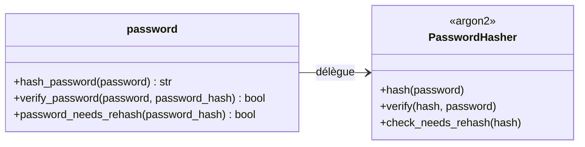

# Le mot de passe dans Forge

Ce document décrit le hachage et la vérification des mots de passe dans Forge.

C'est l'API canonique de hachage du module auth : un hachage Argon2id, exposé par trois fonctions simples.

## 1. Rôle

Un mot de passe ne doit jamais être stocké en clair.

Forge le transforme en empreinte Argon2id, l'algorithme recommandé contre les attaques par dictionnaire et par force brute.

Le module fournit trois opérations : hacher un mot de passe à la création du compte, vérifier un mot de passe à la connexion, et détecter qu'une empreinte ancienne devrait être régénérée avec les paramètres actuels.

Le PBKDF2 hérité reste dans `core/security/hashing` uniquement pour la migration des comptes existants.

## 2. Vue d'ensemble rapide

| Élément | Valeur |
|---|---|
| Module Python | `core.auth.password` |
| Couche | Auth (cœur) |
| Rôle | hacher et vérifier les mots de passe |
| Algorithme | Argon2id (`time_cost=2`, `memory_cost=19456`, `parallelism=1`) |
| Dépend de | `argon2-cffi` (`PasswordHasher`) |
| API publique | `hash_password`, `verify_password`, `password_needs_rehash` |
| Exception liée | `AuthError` (interne ; jamais propagée par `verify_password`) |
| Limite de longueur | 128 caractères (protection contre le déni de service) |

Ce module est un ensemble de fonctions pures sans état partagé.

## 3. Schéma UML

Ce module n'a pas de classe propre : il enveloppe le `PasswordHasher` d'Argon2.



À retenir :

- `hash_password` produit une empreinte Argon2id à stocker en base ;
- `verify_password` ne lève jamais : un mot de passe erroné ou une empreinte invalide renvoient `False` ;
- `password_needs_rehash` signale qu'une empreinte a été produite avec des paramètres dépassés.

## 4. API publique

| Fonction | Signature | Rôle |
|---|---|---|
| `hash_password` | `hash_password(password: str) -> str` | retourne une empreinte Argon2id pour un mot de passe clair |
| `verify_password` | `verify_password(password: str, password_hash: str) -> bool` | vérifie un mot de passe clair contre une empreinte Argon2id |
| `password_needs_rehash` | `password_needs_rehash(password_hash: str) -> bool` | `True` si l'empreinte devrait être régénérée avec les paramètres actuels |

## 5. Contextes d'utilisation

| Besoin | Élément |
|---|---|
| Créer un compte | `hash_password(clear)` puis stocker le résultat |
| Vérifier une connexion | `verify_password(clear, stored_hash)` |
| Faire évoluer le coût Argon2 | `password_needs_rehash(stored_hash)` après une connexion réussie |

## 6. Exemples d'utilisation

Création d'un compte :

```python
from core.auth import hash_password

stored_hash = hash_password(clear_password)
# stocker stored_hash dans users.password_hash
```

Connexion avec re-hachage opportuniste :

```python
from core.auth import verify_password, password_needs_rehash

if verify_password(clear_password, stored_hash):
    if password_needs_rehash(stored_hash):
        stored_hash = hash_password(clear_password)
        # mettre à jour users.password_hash
    # ouvrir la session
```

!!! warning "Longueur maximale"
    Forge refuse les mots de passe de plus de 128 caractères.

    Argon2 pré-hache l'entrée entière avant la partie mémoire-dure : sans plafond, un mot de passe de plusieurs mégaoctets envoyé à `hash_password` ou `verify_password` ouvrirait un vecteur de déni de service.

    128 caractères restent largement au-dessus de tout mot de passe légitime (OWASP ASVS exige au moins 64).

## Voir aussi

- [Le contrat utilisateur dans Forge](user.md) : porte le champ `password_hash`.
- [La session Auth/User dans Forge](session.md) : appelle `verify_password` lors de l'authentification.
- [La réinitialisation de mot de passe dans Forge](reset.md) : produit un nouveau hash via `hash_password`.
