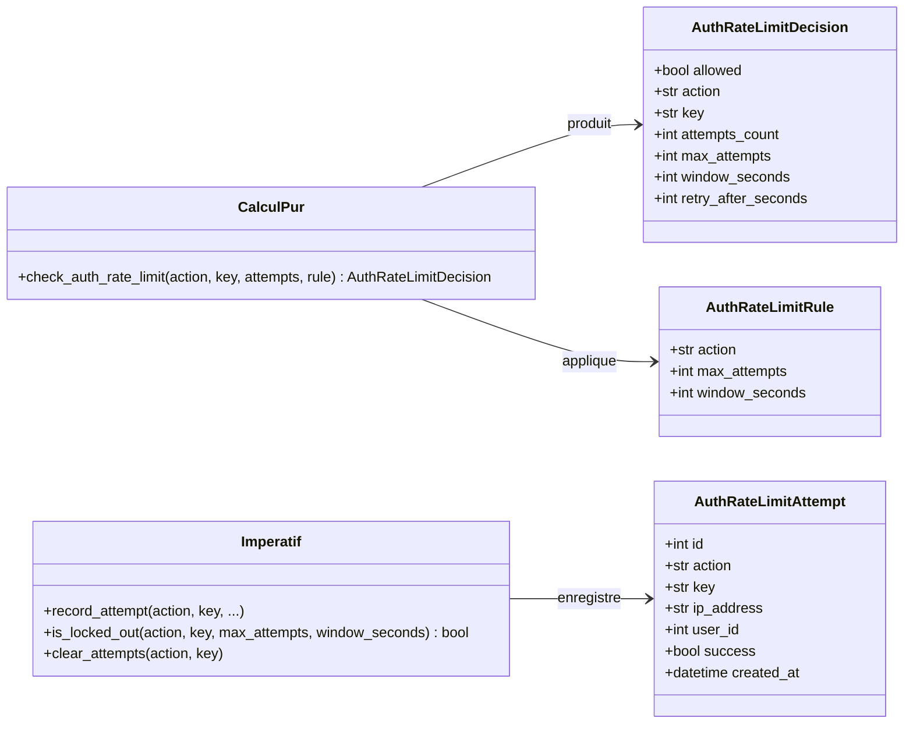
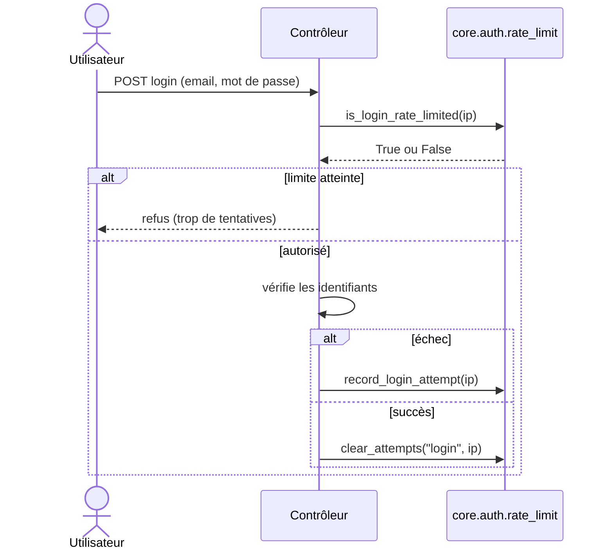

# Le rate-limit Auth dans Forge

Ce document décrit la protection anti-bruteforce des actions sensibles du module auth.

Forge limite le nombre de tentatives par clé (IP, email) sur une fenêtre glissante, en mémoire processus.

## 1. Rôle

Pour freiner les attaques par force brute (connexion, réinitialisation, défi MFA), le module compte les tentatives échouées par couple action/clé et décide si une nouvelle tentative reste autorisée dans la fenêtre de temps configurée.

Il propose deux niveaux d'API : un calcul pur sans état (`check_auth_rate_limit`, qui reçoit des tentatives déjà chargées), et des helpers impératifs (`record_attempt`, `is_locked_out`, `clear_attempts`) qui stockent les tentatives en mémoire processus.

Une API simplifiée centrée sur l'IP (`record_login_attempt`, `is_login_rate_limited`) couvre le cas courant de la connexion.

Le module ne lit ni n'écrit aucune base, ne crée aucun audit et ne modifie aucune session.

## 2. Vue d'ensemble rapide

| Élément | Valeur |
|---|---|
| Module Python | `core.auth.rate_limit` |
| Couche | Auth (cœur) |
| Rôle | limiter les tentatives d'actions sensibles |
| Stockage | en mémoire processus, thread-safe via `RLock` |
| Classes de données | `AuthRateLimitAttempt`, `AuthRateLimitRule`, `AuthRateLimitDecision` |
| Limite connexion par défaut | 5 tentatives sur une fenêtre de 60 secondes |
| API publique | calcul pur, helpers impératifs, contrats, API IP |
| Exception liée | `InvalidAuthRateLimitAttemptError`, `InvalidAuthRateLimitRuleError` |

!!! warning "Limitation multi-worker"
    Le compteur vit dans la mémoire de chaque processus.

    En multi-worker (Gunicorn, uWSGI), chaque processus a son propre compteur, et le comptage est perdu au redémarrage.

    Un backend partagé (base de données, Redis) est hors du périmètre de ce module.

## 3. Schémas UML

### 3.1 Diagramme de classe

Le diagramme montre les trois dataclasses et les familles de fonctions.



À retenir :

- `AuthRateLimitAttempt` modélise une tentative, `AuthRateLimitRule` une limite, `AuthRateLimitDecision` le verdict ;
- `check_auth_rate_limit` ne compte que les échecs (`success=False`) dans la fenêtre ;
- la décision porte `retry_after_seconds` quand l'accès est bloqué.

### 3.2 Diagramme de séquence

Le diagramme montre la garde d'une connexion via l'API IP.



À retenir :

- on vérifie `is_login_rate_limited` avant de tenter l'authentification ;
- on enregistre une tentative seulement en cas d'échec ;
- une connexion réussie peut effacer les tentatives accumulées.

## 4. API publique

| Élément | Signature | Rôle |
|---|---|---|
| `record_login_attempt` | `record_login_attempt(ip: str) -> None` | enregistre une tentative de connexion échouée pour cette IP |
| `is_login_rate_limited` | `is_login_rate_limited(ip: str) -> bool` | `True` si l'IP a atteint la limite de connexion |
| `record_attempt` | `record_attempt(action: str, key: str, user_id=None, ip_address=None, success=False, now=None) -> None` | enregistre une tentative pour une action quelconque |
| `is_locked_out` | `is_locked_out(action: str, key: str, max_attempts: int, window_seconds: int, now=None) -> bool` | `True` si la clé a dépassé le seuil dans la fenêtre |
| `clear_attempts` | `clear_attempts(action: str, key: str) -> None` | efface les tentatives mémorisées pour cette action/clé |
| `purge_all_attempts` | `purge_all_attempts() -> None` | vide tout le store (réservé aux tests) |
| `check_auth_rate_limit` | `check_auth_rate_limit(action, key, attempts, rule, now=None) -> AuthRateLimitDecision` | calcule la décision à partir de tentatives fournies |
| `create_auth_rate_limit_attempt` | `create_auth_rate_limit_attempt(action, key, ip_address=None, user_id=None, success=False, created_at=None) -> AuthRateLimitAttempt` | construit une tentative sans effet de bord |
| `AuthRateLimitAttempt`, `AuthRateLimitRule`, `AuthRateLimitDecision` | dataclasses | tentative, règle et décision |
| `validate_*` / `normalize_*` / `is_valid_*` | contrats | valident et normalisent tentatives et règles |
| `normalize_rate_limit_key` | `normalize_rate_limit_key(value: object) -> str` | normalise une clé de limitation stable |

Constantes d'action : `AUTH_RATE_LIMIT_LOGIN`, `AUTH_RATE_LIMIT_PASSWORD_RESET`, `AUTH_RATE_LIMIT_MFA_CHALLENGE`, `AUTH_RATE_LIMIT_MFA_REVALIDATION`.

## 5. Contextes d'utilisation

| Besoin | Élément |
|---|---|
| Garder une route de connexion | `is_login_rate_limited(ip)` |
| Compter un échec de connexion | `record_login_attempt(ip)` |
| Limiter une autre action sensible | `record_attempt(action, key)` puis `is_locked_out(...)` |
| Réinitialiser après un succès | `clear_attempts(action, key)` |
| Calculer une décision détaillée | `check_auth_rate_limit(action, key, attempts, rule)` |

## 6. Exemples d'utilisation

Garde de connexion (API IP) :

```python
from core.auth.rate_limit import is_login_rate_limited, record_login_attempt, clear_attempts

if is_login_rate_limited(request.ip):
    return Response.text("Trop de tentatives, réessayez plus tard")

user = authenticate_user(email, password, load_user_by_email)
if user is None:
    record_login_attempt(request.ip)
else:
    clear_attempts("login", request.ip)
```

Décision détaillée (calcul pur) :

```python
from core.auth import AuthRateLimitRule, check_auth_rate_limit

rule = AuthRateLimitRule(action="login", max_attempts=5, window_seconds=60)
decision = check_auth_rate_limit("login", key, attempts, rule)

if not decision.allowed:
    return Response.text(f"Réessayez dans {decision.retry_after_seconds} s")
```

## Voir aussi

- [La session Auth/User dans Forge](session.md) : la connexion à protéger.
- [L'audit Auth/User dans Forge](audit.md) : journaliser les tentatives et les blocages.
- [Les exceptions Auth dans Forge](exceptions.md) : les erreurs de contrat du rate-limit.
