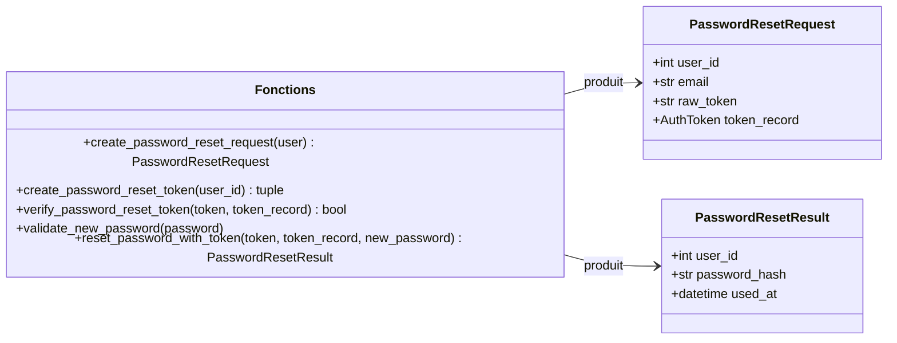
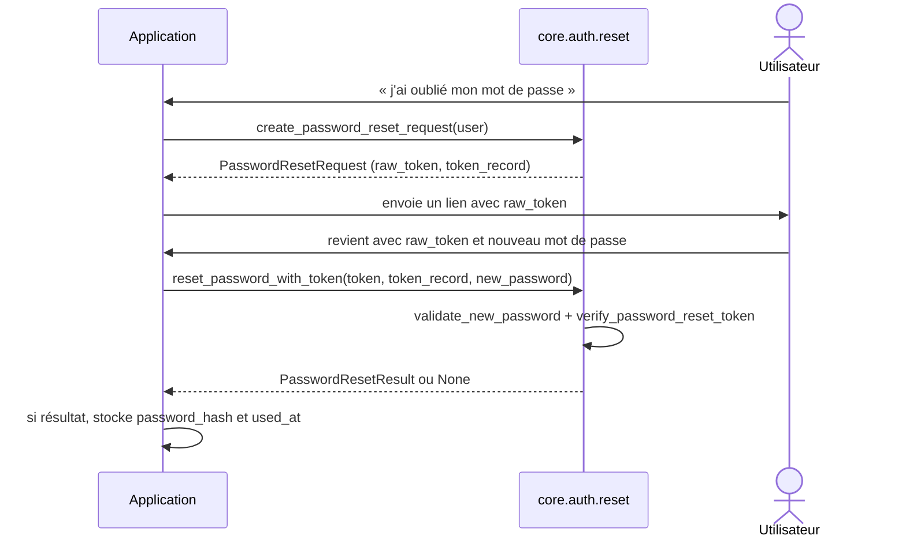

# La réinitialisation de mot de passe dans Forge

Ce document décrit la demande et la réinitialisation de mot de passe du module auth.

Un utilisateur qui a oublié son mot de passe demande un lien (jeton), puis pose un nouveau mot de passe via ce jeton.

## 1. Rôle

Le module orchestre le parcours « mot de passe oublié » au-dessus des jetons Auth et du hachage Argon2id.

Il fournit deux étapes : créer une demande de réinitialisation (jeton de `purpose` `password_reset`, expiration par défaut de 30 minutes) à partir d'un utilisateur valide et actif, puis vérifier ce jeton et produire le nouveau hash.

Forge ne stocke jamais le jeton brut ni le mot de passe clair, et n'écrit rien en base : il renvoie des objets prêts à persister (`PasswordResetRequest`, `PasswordResetResult`).

## 2. Vue d'ensemble rapide

| Élément | Valeur |
|---|---|
| Module Python | `core.auth.reset` |
| Couche | Auth (cœur) |
| Rôle | demander puis réinitialiser un mot de passe |
| Dépend de | `core.auth.tokens`, `core.auth.password`, `core.auth.user` |
| Constante | `PASSWORD_RESET_PURPOSE = "password_reset"` |
| Expiration par défaut | 30 minutes |
| Longueur du nouveau mot de passe | entre 8 et 128 caractères |
| Objets liés | `PasswordResetRequest`, `PasswordResetResult` |
| Exception liée | `AuthError`, `InvalidNewPasswordError` |

## 3. Schémas UML

### 3.1 Diagramme de classe

Le diagramme montre les deux dataclasses de résultat et les fonctions qui les produisent.



À retenir :

- `PasswordResetRequest` porte le jeton brut à envoyer et l'`AuthToken` à stocker ;
- `PasswordResetResult` porte le nouveau `password_hash` et le `used_at` à persister ;
- aucune fonction n'écrit en base : la persistance est applicative.

### 3.2 Diagramme de séquence

Le diagramme montre le parcours complet « mot de passe oublié ».



À retenir :

- `create_password_reset_request` refuse un utilisateur inactif ou invalide ;
- `reset_password_with_token` renvoie `None` si le jeton est invalide, expiré, déjà utilisé ou de mauvais `purpose` ;
- elle lève `InvalidNewPasswordError` si le nouveau mot de passe ne respecte pas les règles de longueur.

## 4. API publique

| Élément | Signature | Rôle |
|---|---|---|
| `PasswordResetRequest` | `PasswordResetRequest(user_id, email, raw_token, token_record)` | données pour envoyer un lien de réinitialisation |
| `PasswordResetResult` | `PasswordResetResult(user_id, password_hash, used_at)` | résultat prêt à persister après réinitialisation |
| `create_password_reset_request` | `create_password_reset_request(user: Any, minutes: int = 30, now: datetime | None = None) -> PasswordResetRequest` | crée une demande à partir d'un utilisateur actif |
| `create_password_reset_token` | `create_password_reset_token(user_id: int, minutes: int = 30, now: datetime | None = None) -> tuple[str, AuthToken]` | crée le jeton de réinitialisation |
| `verify_password_reset_token` | `verify_password_reset_token(token: str, token_record: Any, now: datetime | None = None) -> bool` | valide le jeton pour le `purpose` réinitialisation |
| `password_reset_timestamp` | `password_reset_timestamp(now: datetime | None = None) -> datetime` | datetime UTC pour `auth_tokens.used_at` |
| `validate_new_password` | `validate_new_password(password: str) -> None` | valide le nouveau mot de passe ; lève `InvalidNewPasswordError` |
| `reset_password_with_token` | `reset_password_with_token(token: str, token_record: Any, new_password: str, now: datetime | None = None) -> PasswordResetResult | None` | vérifie le jeton et produit le nouveau hash |

## 5. Contextes d'utilisation

| Besoin | Élément |
|---|---|
| Lancer la demande à partir d'un utilisateur | `create_password_reset_request(user)` |
| Créer seulement le jeton | `create_password_reset_token(user_id)` |
| Valider la robustesse d'un mot de passe | `validate_new_password(password)` |
| Réinitialiser à partir du jeton | `reset_password_with_token(token, token_record, new_password)` |

## 6. Exemples d'utilisation

Demande de réinitialisation :

```python
from core.auth import create_password_reset_request

request_data = create_password_reset_request(user)
# stocker request_data.token_record (empreinte)
# envoyer request_data.raw_token dans un lien à request_data.email
```

Réinitialisation effective :

```python
from core.auth import reset_password_with_token

result = reset_password_with_token(raw_token, token_record, new_password)
if result is None:
    # jeton invalide, expiré ou déjà utilisé
    ...
else:
    # stocker result.password_hash dans users.password_hash
    # stocker result.used_at dans auth_tokens.used_at
    ...
```

!!! warning "Règles du nouveau mot de passe"
    Le nouveau mot de passe doit contenir entre 8 et 128 caractères.

    `validate_new_password` et `reset_password_with_token` lèvent `InvalidNewPasswordError` si cette contrainte n'est pas respectée.

## Voir aussi

- [Les jetons Auth dans Forge](tokens.md) : le jeton de réinitialisation sous-jacent.
- [Le mot de passe dans Forge](password.md) : le hachage du nouveau mot de passe.
- [Les exceptions Auth dans Forge](exceptions.md) : `InvalidNewPasswordError` et `AuthError`.
