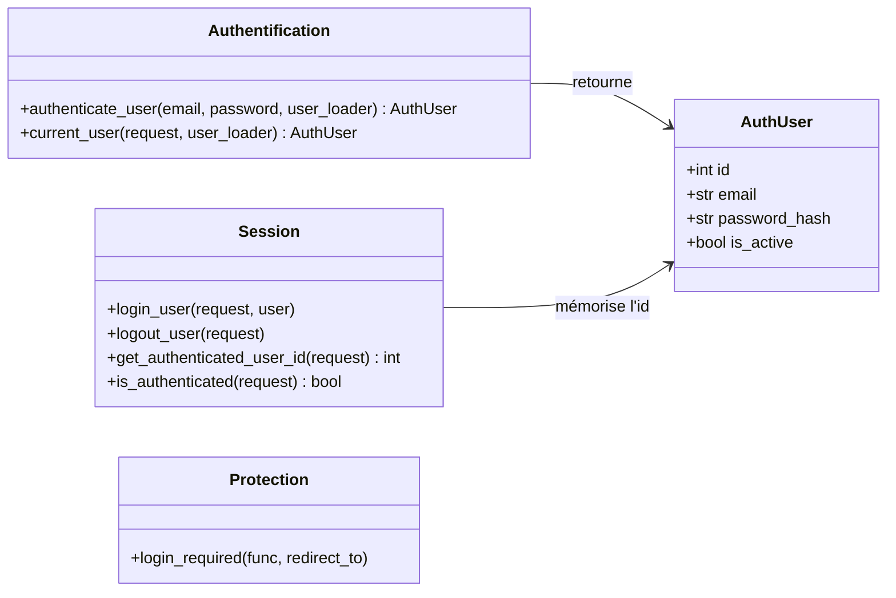
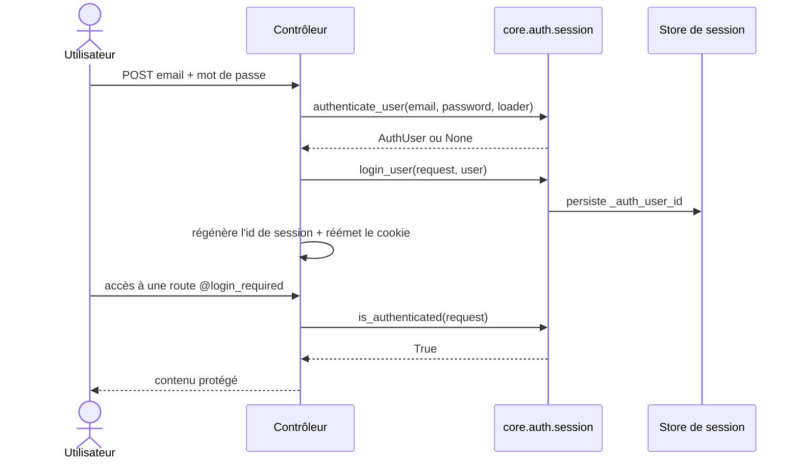

# La session Auth/User dans Forge

Ce document décrit l'authentification et la session de l'utilisateur applicatif, c'est-à-dire l'API canonique pour connecter une personne et protéger une route.

Authentifier un couple email/mot de passe, ouvrir et fermer la session, lire l'utilisateur courant et garder une action : tout passe par ce module.

## 1. Rôle

C'est l'API canonique d'authentification des nouveaux projets Forge.

Le module relie le contrat `AuthUser`, le hachage des mots de passe et le stockage de session : il authentifie un email et un mot de passe via un loader applicatif, mémorise l'identifiant utilisateur dans la session, et expose des helpers pour lire l'état d'authentification ou protéger une action de contrôleur.

Le loader reste applicatif : Forge ne décide pas comment charger un utilisateur depuis votre base, il reçoit une fonction qui le fait.

## 2. Vue d'ensemble rapide

| Élément | Valeur |
|---|---|
| Module Python | `core.auth.session` |
| Couche | Auth (cœur) |
| Rôle | authentifier l'utilisateur et gérer sa session |
| Dépend de | `core.auth.user`, `core.auth.password`, `core.http.response`, `core.security.session` |
| Clé de session | `AUTH_USER_ID_SESSION_KEY = "_auth_user_id"` |
| API publique | `authenticate_user`, `login_user`, `logout_user`, `get_authenticated_user_id`, `current_user`, `is_authenticated`, `login_required` |
| Objet lié | `AuthUser` |
| Exception liée | `AuthError` |

## 3. Schémas UML

### 3.1 Diagramme de classe

Le diagramme regroupe les fonctions par responsabilité.



À retenir :

- `authenticate_user` et `current_user` reçoivent un loader applicatif et renvoient un `AuthUser` ou `None` ;
- `login_user` ne stocke que l'identifiant de l'utilisateur dans la session ;
- `login_required` est un décorateur de protection d'action.

### 3.2 Diagramme de séquence

Le diagramme montre une connexion suivie d'un accès à une route protégée.



À retenir :

- `login_user` persiste explicitement la session (les backends fichier et MariaDB renvoient une copie à chaque lecture) ;
- la régénération de l'identifiant de session est à la charge de l'appelant, juste après `login_user` ;
- `login_required` renvoie une réponse 401 par défaut, ou une redirection 302 si `redirect_to` est fourni.

## 4. API publique

| Fonction | Signature | Rôle |
|---|---|---|
| `authenticate_user` | `authenticate_user(email: str, password: str, user_loader: Callable[[str], Any]) -> AuthUser | None` | authentifie via un loader ; retourne l'utilisateur ou `None` |
| `login_user` | `login_user(request: Any, user: AuthUser) -> None` | stocke et persiste l'identifiant utilisateur en session |
| `logout_user` | `logout_user(request: Any) -> None` | retire l'identifiant de la session et persiste |
| `get_authenticated_user_id` | `get_authenticated_user_id(request: Any) -> int | None` | l'identifiant en session, ou `None` |
| `current_user` | `current_user(request: Any, user_loader: Callable[[int], Any]) -> AuthUser | None` | l'utilisateur courant via un loader |
| `is_authenticated` | `is_authenticated(request: Any) -> bool` | `True` si la session contient un utilisateur |
| `login_required` | `login_required(func=None, *, redirect_to: str | None = None)` | décorateur : protège une action par la session Auth/User |

## 5. Contextes d'utilisation

| Besoin | Élément |
|---|---|
| Vérifier email et mot de passe | `authenticate_user(...)` |
| Ouvrir la session | `login_user(request, user)` |
| Fermer la session | `logout_user(request)` |
| Lire l'utilisateur connecté | `current_user(request, loader)` |
| Tester l'état de connexion | `is_authenticated(request)` |
| Protéger une route | `@login_required` |

## 6. Exemples d'utilisation

Connexion :

```python
from core.auth import authenticate_user, login_user

user = authenticate_user(email, password, load_user_by_email)
if user is not None:
    login_user(request, user)
    # régénérer l'id de session puis réémettre le cookie (voir la note sécurité)
```

Route protégée :

```python
from core.auth import login_required
from core.http.response import Response


@login_required(redirect_to="/login")
def dashboard(request) -> Response:
    return Response.text("Espace privé")
```

Utilisateur courant :

```python
from core.auth import current_user

user = current_user(request, load_user_by_id)
if user is None:
    return Response.text("Non connecté")
```

!!! warning "Fixation de session"
    `login_user` ne régénère pas l'identifiant de session : il n'a pas accès à la réponse HTTP et ne peut donc pas réémettre le cookie.

    Juste après une authentification réussie, l'appelant doit régénérer l'identifiant de session et réémettre le cookie correspondant pour fermer le vecteur de fixation de session.

    Le contrôleur de référence `mvc/controllers/auth_controller.py` applique ce flux.

## Voir aussi

- [Le contrat utilisateur dans Forge](user.md) : l'`AuthUser` manipulé par ces fonctions.
- [Le mot de passe dans Forge](password.md) : la vérification appelée par `authenticate_user`.
- [Le rate-limit Auth dans Forge](rate_limit.md) : freiner les tentatives de connexion.
- [L'audit Auth/User dans Forge](audit.md) : journaliser les connexions réussies ou échouées.
