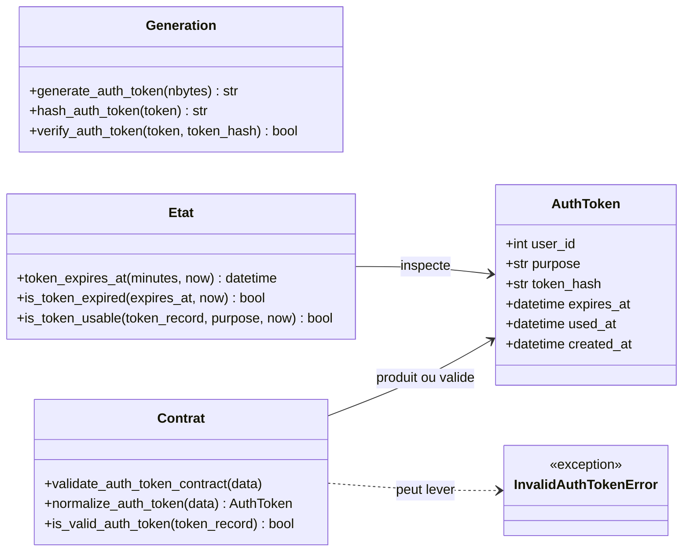
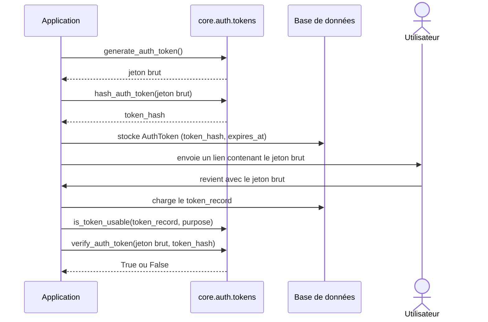

# Les jetons Auth dans Forge

Ce document décrit les jetons à usage limité du module auth, employés notamment pour la vérification d'email et la réinitialisation de mot de passe.

Un jeton est généré, envoyé, vérifié, puis consommé une seule fois.

## 1. Rôle

Certaines actions sensibles, comme vérifier une adresse email ou réinitialiser un mot de passe, reposent sur un secret à usage limité.

Forge génère un jeton aléatoire cryptographiquement sûr, n'en stocke jamais la valeur brute, mais conserve uniquement son empreinte SHA-256.

Le jeton brut est transmis une seule fois à l'application pour construire un lien ; sa vérification ultérieure compare les empreintes.

Le module fournit la génération, le hachage, la vérification, le calcul d'expiration et le test d'usabilité, plus le contrat `AuthToken`.

## 2. Vue d'ensemble rapide

| Élément | Valeur |
|---|---|
| Module Python | `core.auth.tokens` |
| Couche | Auth (cœur) |
| Rôle | gérer des jetons à usage limité |
| Classe de données | `AuthToken` (`dataclass(frozen=True)`) |
| Algorithme d'empreinte | SHA-256 hexadécimal |
| Génération | `secrets.token_urlsafe` |
| API publique | génération, hachage, expiration, usabilité, contrat |
| Exception liée | `InvalidAuthTokenError` (sous-classe de `AuthError`) |
| Utilisé par | la vérification email et la réinitialisation de mot de passe |

## 3. Schémas UML

### 3.1 Diagramme de classe

Le diagramme montre `AuthToken` et les familles de fonctions qui l'entourent.



À retenir :

- `AuthToken` ne contient jamais le jeton brut, seulement son empreinte (`token_hash`) ;
- `used_at` marque un jeton déjà consommé ;
- `is_token_usable` vérifie en un appel l'expiration, la consommation et le `purpose` attendu.

### 3.2 Diagramme de séquence

Le diagramme montre le cycle de vie d'un jeton, de la génération à la vérification.



À retenir :

- seul `token_hash` est persisté ;
- le jeton brut ne circule qu'une fois, dans le lien envoyé ;
- la vérification combine `is_token_usable` (expiration, usage, purpose) et `verify_auth_token` (correspondance d'empreinte).

## 4. API publique

| Élément | Signature | Rôle |
|---|---|---|
| `AuthToken` | `AuthToken(user_id, purpose, token_hash, expires_at, used_at=None, created_at=None)` | jeton stockable côté serveur, immuable |
| `generate_auth_token` | `generate_auth_token(nbytes: int = 32) -> str` | génère un jeton URL-safe cryptographiquement sûr |
| `hash_auth_token` | `hash_auth_token(token: str) -> str` | retourne le SHA-256 hexadécimal du jeton brut |
| `verify_auth_token` | `verify_auth_token(token: str, token_hash: str) -> bool` | compare le jeton brut à l'empreinte stockée |
| `token_expires_at` | `token_expires_at(minutes: int = 60, now: datetime | None = None) -> datetime` | calcule la date d'expiration |
| `is_token_expired` | `is_token_expired(expires_at: datetime, now: datetime | None = None) -> bool` | `True` si `expires_at` est dans le passé |
| `is_token_usable` | `is_token_usable(token_record: Any, purpose: str | None = None, now: datetime | None = None) -> bool` | `True` si le jeton est valide, non expiré, non utilisé et de bon `purpose` |
| `validate_auth_token_contract` | `validate_auth_token_contract(data: Any) -> None` | valide le contrat `AuthToken` ; lève `InvalidAuthTokenError` |
| `normalize_auth_token` | `normalize_auth_token(data: Any) -> AuthToken` | valide puis convertit un dict en `AuthToken` |
| `is_valid_auth_token` | `is_valid_auth_token(token_record: Any) -> bool` | `True` si structurellement valide |
| `InvalidAuthTokenError` | `class InvalidAuthTokenError(AuthError)` | données de jeton incomplètes ou invalides |

## 5. Contextes d'utilisation

| Besoin | Élément |
|---|---|
| Créer un secret à envoyer | `generate_auth_token()` |
| Stocker un jeton sans révéler le secret | `hash_auth_token(token)` puis persister l'empreinte |
| Définir une durée de vie | `token_expires_at(minutes)` |
| Vérifier un jeton au retour | `is_token_usable(...)` puis `verify_auth_token(...)` |
| Convertir une ligne de base | `normalize_auth_token(row)` |

## 6. Exemples d'utilisation

Génération et stockage :

```python
from core.auth import AuthToken, generate_auth_token, hash_auth_token, token_expires_at

raw_token = generate_auth_token()
record = AuthToken(
    user_id=42,
    purpose="email_verification",
    token_hash=hash_auth_token(raw_token),
    expires_at=token_expires_at(minutes=60),
)
# stocker record ; envoyer raw_token dans un lien
```

Vérification au retour :

```python
from core.auth import is_token_usable, verify_auth_token

if is_token_usable(record, purpose="email_verification"):
    if verify_auth_token(raw_token, record.token_hash):
        # jeton accepté
        ...
```

!!! warning "On stocke le hash, jamais le jeton brut"
    Comme pour les codes de récupération, seule l'empreinte SHA-256 est conservée côté serveur.

    `verify_auth_token` compare les empreintes via `secrets.compare_digest`, à temps constant.

## Voir aussi

- [La vérification email dans Forge](email.md) : un usage direct de ces jetons.
- [La réinitialisation de mot de passe dans Forge](reset.md) : le même mécanisme de jeton.
- [Les exceptions Auth dans Forge](exceptions.md) : la hiérarchie dont fait partie `InvalidAuthTokenError`.
