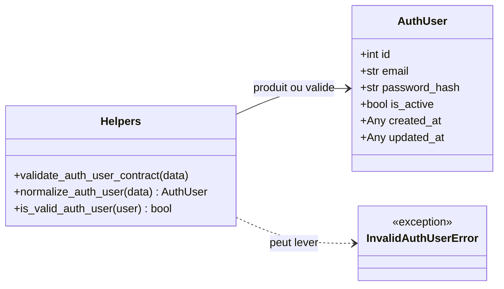

# Le contrat utilisateur dans Forge

Ce document décrit la représentation minimale d'un utilisateur authentifiable dans Forge, portée par la classe `AuthUser` et ses helpers de validation.

Forge n'impose pas de modèle utilisateur métier riche : il définit un contrat minimal que l'application étend librement.

## 1. Rôle

`AuthUser` représente l'identité minimale dont le module auth a besoin pour authentifier une personne.

Forge ne décide pas de la forme de votre table `users` : il fixe seulement quatre champs obligatoires (`id`, `email`, `password_hash`, `is_active`) plus deux champs optionnels d'horodatage.

L'application charge un utilisateur depuis sa base, puis le normalise en `AuthUser` avant de le passer aux fonctions d'authentification.

Les rôles et les permissions ne vivent pas ici : ils relèvent du module de contrôle d'accès optionnel `forge-mvc-rbac`, pas de la table `users`.

## 2. Vue d'ensemble rapide

| Élément | Valeur |
|---|---|
| Classe | `AuthUser` |
| Module | `core.auth.user` |
| Couche | Auth (cœur) |
| Rôle | représenter une identité authentifiable minimale |
| Type | `dataclass(frozen=True)`, immuable |
| API publique | `AuthUser`, `validate_auth_user_contract`, `normalize_auth_user`, `is_valid_auth_user` |
| Exception liée | `InvalidAuthUserError` |
| Utilisé par | `authenticate_user`, `current_user`, `create_password_reset_request` |

`AuthUser` est un contrat de frontière : il sépare le modèle de base de l'application des fonctions d'authentification du cœur.

## 3. Schémas UML

### 3.1 Diagramme de classe

Le diagramme montre les champs de `AuthUser` et les helpers qui valident ou construisent l'objet.



À retenir :

- `AuthUser` est immuable (frozen) ;
- `normalize_auth_user` accepte un dict brut et renvoie un `AuthUser` ;
- `validate_auth_user_contract` lève `InvalidAuthUserError` en cas de données incomplètes ;
- `is_valid_auth_user` renvoie un booléen, sans lever d'exception.

## 4. API publique

| Élément | Signature | Rôle |
|---|---|---|
| `AuthUser` | `AuthUser(id, email, password_hash, is_active=True, created_at=None, updated_at=None)` | identité authentifiable minimale, immuable |
| `validate_auth_user_contract` | `validate_auth_user_contract(data: Any) -> None` | valide un `AuthUser` ou un dict ; lève `InvalidAuthUserError` si invalide |
| `normalize_auth_user` | `normalize_auth_user(data: Any) -> AuthUser` | valide puis convertit un dict brut en `AuthUser` |
| `is_valid_auth_user` | `is_valid_auth_user(user: Any) -> bool` | `True` si `user` est un `AuthUser` structurellement valide |

Règles de validation appliquées :

- `id` doit être un entier strictement positif (un booléen est refusé) ;
- `email` doit être une chaîne non vide (les espaces de bordure sont retirés) ;
- `password_hash` doit être une chaîne non vide ;
- `is_active` doit être un booléen.

## 5. Contextes d'utilisation

| Besoin | Élément |
|---|---|
| Convertir une ligne de base en utilisateur | `normalize_auth_user(...)` |
| Vérifier qu'un dict respecte le contrat | `validate_auth_user_contract(...)` |
| Tester sans lever d'exception | `is_valid_auth_user(...)` |
| Fournir un loader à `authenticate_user` | renvoyer un `AuthUser` ou un dict normalisable |

## 6. Exemples d'utilisation

Construction directe d'un `AuthUser` :

```python
from core.auth import AuthUser

user = AuthUser(
    id=42,
    email="lea@example.com",
    password_hash="$argon2id$...",
    is_active=True,
)
```

Normalisation d'un dict chargé depuis la base :

```python
from core.auth import normalize_auth_user

row = {
    "id": 42,
    "email": "lea@example.com",
    "password_hash": "$argon2id$...",
}

user = normalize_auth_user(row)  # AuthUser(id=42, email="lea@example.com", ...)
```

Loader applicatif passé à `authenticate_user` :

```python
from core.auth import AuthUser


def load_user_by_email(email: str) -> AuthUser | None:
    row = db.fetch_one(
        "SELECT id, email, password_hash, is_active FROM users WHERE email = ?",
        [email],
    )
    if row is None:
        return None
    return AuthUser(
        id=row["id"],
        email=row["email"],
        password_hash=row["password_hash"],
        is_active=bool(row["is_active"]),
    )
```

!!! note "Identité minimale"
    `AuthUser` ne contient ni rôle, ni permission, ni profil métier.

    Ces données restent dans vos propres tables et dans le module `forge-mvc-rbac` lorsqu'il est activé.

## Voir aussi

- [La session Auth/User dans Forge](session.md) : authentifie et ouvre la session à partir d'un `AuthUser`.
- [Le mot de passe dans Forge](password.md) : produit et vérifie le `password_hash`.
- [Les exceptions Auth dans Forge](exceptions.md) : la hiérarchie dont fait partie `InvalidAuthUserError`.
