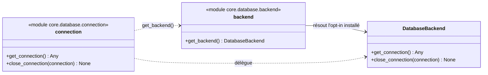

# L'emprunt de connexion dans Forge

Ce document décrit l'emprunt et la restitution d'une connexion à la base de données.

C'est une API interne du cœur : le code applicatif passe en pratique par les helpers SQL.

## 1. Rôle

Le module `core.database.connection` emprunte une connexion au backend BDD actif et la restitue après usage.

Ouvrir une connexion à chaque requête HTTP serait coûteux.
Selon le backend installé, la connexion peut provenir d'un pool puis y retourner plutôt que d'être détruite.

Depuis ADR-054, le cœur est agnostique BDD : ce module ne connaît plus aucun SGBD particulier.
Il délègue l'acquisition et la restitution au backend résolu par `core.database.backend.get_backend()` (l'opt-in installé, par exemple `forge-mvc-mariadb`).

C'est une API interne.
En usage normal, on passe par les helpers SQL (`fetch_one`, `fetch_all`, `execute`, `insert`) qui empruntent et restituent la connexion pour vous.

## 2. Vue d'ensemble rapide

| Élément | Valeur |
|---|---|
| Module | `core.database.connection` |
| Couche | Accès base de données |
| Rôle | emprunter et restituer une connexion BDD |
| Dépend de | `core.database.backend` |
| API publique | `get_connection`, `close_connection` |
| Statut | API interne (préférer les helpers SQL) |

Ce module est une frontière fine entre le cœur et le backend BDD opt-in.
Il ne porte aucune logique propre à un SGBD.

## 3. Schéma UML

Le diagramme montre la délégation au backend résolu par ADR-054.



À retenir :

- `connection` ne connaît aucun SGBD ;
- il délègue au backend actif résolu par `core.database.backend` ;
- chaque emprunt par `get_connection()` doit être suivi d'un `close_connection()` ;
- selon le backend, la connexion retourne à un pool plutôt que d'être détruite.

## 4. API publique

| Fonction | Signature | Rôle |
|---|---|---|
| `get_connection` | `get_connection() -> Any` | emprunter une connexion auprès du backend BDD actif |
| `close_connection` | `close_connection(connection) -> None` | restituer la connexion au backend BDD actif |

## 5. Contextes d'utilisation

| Besoin | Élément |
|---|---|
| Exécuter une requête courante | helpers SQL `fetch_*` / `execute` / `insert` (ne pas appeler ce module) |
| Cas avancé non couvert par les helpers | `get_connection()` puis `close_connection()` systématique |
| Transaction multi-instructions | bloc `with transaction()` (qui s'appuie sur ce module) |

## 6. Exemples d'utilisation

En usage normal, on ne touche pas à ce module : on passe par les helpers SQL.

```python
from core.database.db import fetch_all

rows = fetch_all("SELECT id, name FROM categories ORDER BY name")
```

Pour un cas avancé non couvert par les helpers, l'emprunt direct reste possible, mais la restitution doit être systématique.

```python
from core.database.connection import get_connection, close_connection

connection = get_connection()
try:
    cursor = connection.cursor(dictionary=True)
    cursor.execute("SELECT COUNT(*) AS total FROM article")
    total = cursor.fetchone()["total"]
    connection.commit()
finally:
    close_connection(connection)
```

!!! note "Préférer les helpers"
    Cet exemple montre la mécanique interne.

    Dans le code applicatif, `fetch_*`, `execute` et `insert` gèrent l'emprunt, le commit et la restitution à votre place.

## 7. Paralléliser dans une requête

Le runtime de Forge est synchrone, ce qui n'interdit pas de paralléliser.
Un `ThreadPoolExecutor` fonctionne sous Gunicorn, et trois appels sortants de huit cents millisecondes coûtent huit cents millisecondes au lieu de deux secondes quatre.

Forge ne livre pas de client HTTP, ce choix appartient à l'application.
Ce qui suit ne concerne que la base, dont le comportement sous threads n'était écrit nulle part (`DB-POOL-THREADS-DOC-001`).

### Le parallélisme est plafonné par le pool

Le pool est fermé par un sémaphore aux jetons de `DB_POOL_SIZE`, cinq par défaut, **et par processus**.
Ouvrir vingt threads n'ouvre donc pas vingt connexions, il en ouvre cinq et les dix-huit autres patientent.

Mesuré sur MariaDB, avec un pool de cinq et un appel qui tient sa connexion trois cents millisecondes.

| Threads dans une requête | Durée | Refus |
|---|---|---|
| 4 | 0,32 s | aucun |
| 8 | 0,60 s | aucun |
| 20 | 1,21 s | aucun |

Le parallélisme reste gagnant, vingt appels en série coûteraient six secondes.
Personne n'est refusé, l'attente étant bornée par `DB_POOL_TIMEOUT`, cinq secondes par défaut, au delà desquelles Forge rend un `503`.

### Ce qu'il faut vraiment surveiller

Une requête qui parallélise prend les connexions de **tout son processus**, donc de toutes les requêtes que ce travailleur sert au même moment.

Mesuré dans les mêmes conditions, pendant qu'une requête tient le pool avec dix appels d'une seconde, une lecture ordinaire de dix millisecondes a attendu **1,83 s**.
Cent quatre-vingts fois sa durée, pour un utilisateur qui n'a rien demandé de particulier.

!!! danger "Ne tenez pas une connexion pendant un appel réseau"
    C'est le vrai piège, et il n'a rien à voir avec le parallélisme.

    Une connexion empruntée avant un appel à une API distante reste immobilisée pendant toute son attente.
    Cinq requêtes qui font cela épuisent le pool du travailleur, et les suivantes reçoivent un `503` alors que la base n'a rien à se reprocher.

    Faites les appels sortants **sans** connexion, puis écrivez une fois les réponses arrivées.

!!! info "Bornez l'exécuteur, et sachez ce que vous bornez"
    Un `ThreadPoolExecutor(max_workers=...)` au delà de `DB_POOL_SIZE` n'accélère rien s'il n'y a que des requêtes SQL derrière, il ne fait qu'allonger la file d'attente du sémaphore.

    Élargir `DB_POOL_SIZE` se décide côté serveur : chaque connexion en est une de plus ouverte, multipliée par le nombre de travailleurs.
    Quatre travailleurs et un pool de vingt font quatre-vingts connexions, à comparer au `max_connections` du serveur.

## Voir aussi

- [Les helpers SQL dans Forge](db.md) : l'API publique qui s'appuie sur cet emprunt.
- [Les transactions dans Forge](transaction.md) : grouper des écritures sur une même connexion.
