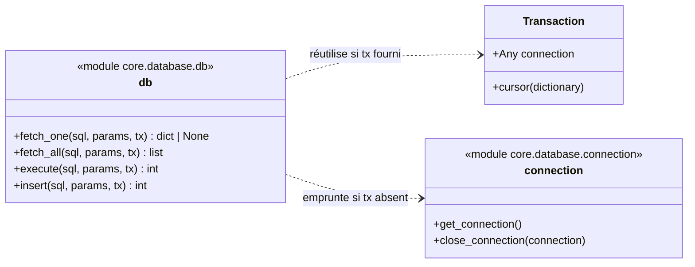
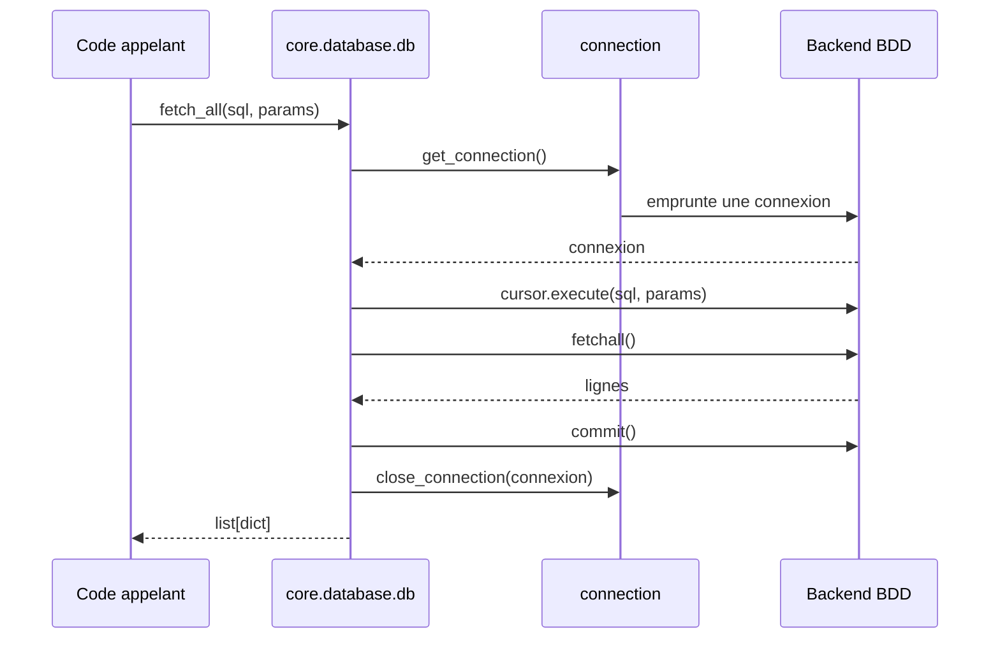

# Les helpers SQL dans Forge

Ce document décrit les fonctions d'exécution SQL explicites du cœur de Forge.

Ces helpers exécutent vos requêtes paramétrées sans masquer le SQL, conformément au principe « Garder SQL visible ».

## 1. Rôle

Le module `core.database.db` fournit quatre fonctions pour exécuter une requête SQL et récupérer son résultat.

Forge ne propose pas d'ORM : vous écrivez vos requêtes en clair, et ces helpers les exécutent.
Chaque valeur passe par un paramètre lié, jamais par interpolation de chaîne : c'est la défense contre l'injection SQL.

Les helpers empruntent une connexion au backend BDD actif, exécutent la requête, valident (commit) puis restituent la connexion.
Si vous passez une transaction explicite (`tx`), ils réutilisent sa connexion et ne valident pas eux-mêmes.

```python
from core.database.db import fetch_all, fetch_one, insert, execute

rows = fetch_all("SELECT id, name FROM categories ORDER BY name")
row = fetch_one("SELECT * FROM article WHERE id = ?", (article_id,))
new_id = insert("INSERT INTO article (title) VALUES (?)", (title,))
count = execute("UPDATE article SET title = ? WHERE id = ?", (title, article_id))
```

## 2. Vue d'ensemble rapide

| Élément | Valeur |
|---|---|
| Module | `core.database.db` |
| Couche | Accès base de données |
| Rôle | exécuter du SQL explicite et paramétré |
| Dépend de | `core.database.connection`, `core.database.transaction` |
| API publique | `fetch_one`, `fetch_all`, `execute`, `insert` |
| Objet lié | `Transaction` (paramètre `tx`) |
| Backend | résolu par `core.database.backend` (ADR-054) |

Ce module est l'API publique d'exécution SQL du cœur.
Le code applicatif passe par lui plutôt que par l'emprunt de connexion direct.

## 3. Schémas UML

Le diagramme de classe montre les fonctions exposées et leurs liens.

Le diagramme de séquence montre le parcours d'une requête simple, sans transaction.

### 3.1 Diagramme de classe

Le diagramme situe les quatre helpers entre le code appelant, la transaction optionnelle et la connexion empruntée au backend.



À retenir :

- `fetch_one` et `fetch_all` lisent des données ;
- `execute` et `insert` écrivent des données ;
- sans `tx`, le helper emprunte et restitue lui-même la connexion ;
- avec `tx`, le helper écrit dans la transaction et ne valide pas seul.

### 3.2 Diagramme de séquence

Le diagramme montre une requête autonome, sans transaction explicite.

Forge emprunte une connexion, exécute la requête, valide puis restitue la connexion.



À retenir :

- l'appelant ne manipule jamais la connexion directement ;
- le commit a lieu même après un SELECT, pour ne pas rendre une connexion au pool avec une transaction figée ;
- en cas d'erreur, Forge annule (rollback) avant de relever l'exception ;
- la connexion est toujours restituée, succès ou échec.

## 4. API publique

Toutes les fonctions partagent la même signature : la requête `sql`, des `params` liés, et une transaction optionnelle `tx`.

| Fonction | Signature | Rôle | Retour |
|---|---|---|---|
| `fetch_one` | `fetch_one(sql, params=(), *, tx=None)` | exécuter un SELECT et lire la première ligne | `dict[str, Any]` ou `None` |
| `fetch_all` | `fetch_all(sql, params=(), *, tx=None)` | exécuter un SELECT et lire toutes les lignes | `list[dict[str, Any]]` |
| `execute` | `execute(sql, params=(), *, tx=None)` | exécuter une requête (UPDATE, DELETE, DDL) | `rowcount` (`int`) |
| `insert` | `insert(sql, params=(), *, tx=None)` | exécuter une insertion | `lastrowid` (`int`) |

Le paramètre `params` est une séquence de valeurs liées aux placeholders `?` de la requête.

Le paramètre `tx` rattache la requête à une transaction explicite ouverte avec `transaction()`.

## 5. Contextes d'utilisation

| Besoin | Élément |
|---|---|
| Lire une seule ligne | `fetch_one(...)` |
| Lire plusieurs lignes | `fetch_all(...)` |
| Insérer et récupérer l'identifiant | `insert(...)` |
| Mettre à jour ou supprimer | `execute(...)` |
| Grouper des écritures atomiques | passer `tx=tx` dans un bloc `with transaction()` |

## 6. Exemples d'utilisation

Lecture d'une ligne unique avec un paramètre lié :

```python
from core.database.db import fetch_one

article = fetch_one("SELECT * FROM article WHERE id = ?", (article_id,))

if article is None:
    return Response.text("Article introuvable")
```

Lecture de plusieurs lignes :

```python
from core.database.db import fetch_all

categories = fetch_all("SELECT id, name FROM categories ORDER BY name")

for category in categories:
    print(category["name"])
```

Insertion avec récupération de l'identifiant :

```python
from core.database.db import insert

new_id = insert("INSERT INTO article (title) VALUES (?)", (title,))
```

Mise à jour et lecture du nombre de lignes affectées :

```python
from core.database.db import execute

count = execute("UPDATE article SET title = ? WHERE id = ?", (title, article_id))
```

Écritures liées dans une transaction :

```python
from core.database.db import insert, execute
from core.database.transaction import transaction

with transaction() as tx:
    insert("INSERT INTO article (title, category_id) VALUES (?, ?)", (title, cat), tx=tx)
    execute("UPDATE categories SET article_count = article_count + 1 WHERE id = ?", (cat,), tx=tx)
```

## 7. Sécurité et bonnes pratiques

!!! warning "Toujours paramétrer les valeurs"
    Les valeurs passent toujours par `params` (placeholders `?`), jamais par interpolation dans la chaîne SQL.

    C'est la protection contre l'injection SQL. Le nom des tables et des colonnes, lui, ne peut pas être paramétré : il doit venir de code de confiance, jamais d'une entrée utilisateur.

!!! note "Commit après lecture"
    Forge valide la connexion même après un simple SELECT.

    Sans cela, la connexion reviendrait au pool avec une transaction ouverte, et l'emprunteur suivant hériterait d'un instantané figé (lectures périmées en concurrence).

## Voir aussi

- [Les transactions dans Forge](transaction.md) : grouper des écritures atomiques avec `tx=`.
- [Le pool de connexions dans Forge](connection.md) : la connexion empruntée sous le capot.
- [Le chargeur de requêtes SQL dans Forge](sql_loader.md) : ranger ses requêtes par environnement.
