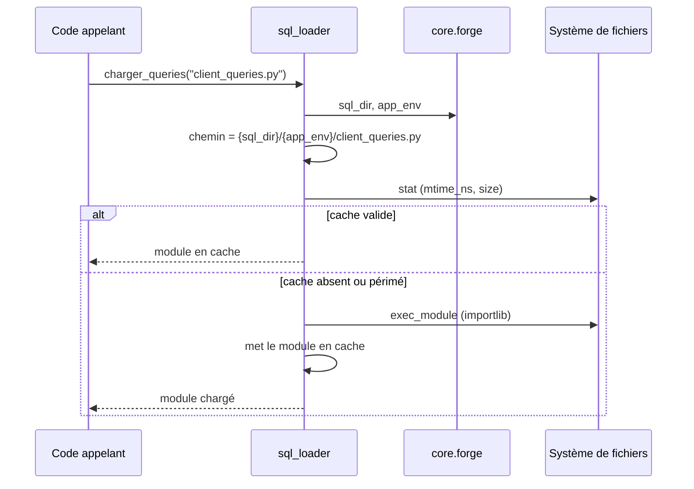

# Le chargeur de requêtes SQL dans Forge

Ce document décrit le chargement de modules de requêtes SQL par environnement.

Il permet de ranger ses requêtes dans des fichiers dédiés, choisis selon l'environnement courant.

## 1. Rôle

Le module `core.database.sql_loader` charge dynamiquement un fichier de constantes SQL depuis le dossier de l'environnement actif.

Pour garder le SQL visible et organisé, on peut centraliser les requêtes d'une entité dans un module dédié.
Le chargeur lit ce fichier dans `{SQL_DIR}/{APP_ENV}/`, où `SQL_DIR` et `APP_ENV` viennent de la configuration Forge.

On peut ainsi avoir des requêtes différentes selon l'environnement : un fichier dans `sql/dev/`, un autre dans `sql/prod/`.

```python
from core.database.sql_loader import charger_queries

queries = charger_queries("client_queries.py")
rows = fetch_all(queries.COUNT_CLIENTS)
```

Le module chargé est mis en cache et réutilisé tant que le fichier n'a pas changé.
Le cache est invalidé automatiquement si la date de modification ou la taille du fichier change.

## 2. Vue d'ensemble rapide

| Élément | Valeur |
|---|---|
| Module | `core.database.sql_loader` |
| Couche | Accès base de données |
| Rôle | charger un module de requêtes SQL selon l'environnement |
| Dépend de | `core.forge` (configuration `sql_dir`, `app_env`) |
| API publique | `charger_queries` |
| Cache | thread-safe, invalidé sur changement de fichier |
| Exception liée | `FileNotFoundError` si le fichier est absent |

Le chargeur s'appuie sur `importlib` : les sous-dossiers `sql/dev/` et `sql/prod/` ne sont pas des packages Python importables par leur nom depuis la racine.

## 3. Schéma UML

Le diagramme de séquence montre la résolution du chemin et le passage par le cache.



À retenir :

- le chemin combine `sql_dir`, `app_env` et le nom du fichier ;
- le module est mis en cache après le premier chargement ;
- le cache est invalidé si `mtime_ns` ou la taille change ;
- l'accès au cache est protégé par un verrou (thread-safe).

## 4. API publique

| Fonction | Signature | Rôle |
|---|---|---|
| `charger_queries` | `charger_queries(nom_fichier: str) -> ModuleType` | charger et retourner un module de requêtes SQL depuis `{SQL_DIR}/{APP_ENV}/` |

Le paramètre `nom_fichier` est le nom du fichier `.py`, par exemple `"client_queries.py"`.

La fonction retourne un module Python exposant les constantes SQL définies dans le fichier (par exemple `COUNT_CLIENTS`, `ADD_CLIENT`).

Si le fichier est absent du dossier de l'environnement, la fonction lève `FileNotFoundError` avec un message indiquant le fichier d'exemple à copier.

## 5. Contextes d'utilisation

| Besoin | Élément |
|---|---|
| Centraliser les requêtes d'une entité | un fichier dédié dans `sql/{env}/` |
| Avoir des requêtes par environnement | un fichier distinct dans `sql/dev/` et `sql/prod/` |
| Lire une constante SQL chargée | attribut du module retourné, par exemple `queries.COUNT_CLIENTS` |

## 6. Exemples d'utilisation

Fichier de requêtes `sql/dev/client_queries.py` :

```python
COUNT_CLIENTS = "SELECT COUNT(*) AS total FROM client"
ADD_CLIENT = "INSERT INTO client (name) VALUES (?)"
```

Chargement et exécution avec les helpers SQL :

```python
from core.database.db import fetch_one, insert
from core.database.sql_loader import charger_queries

queries = charger_queries("client_queries.py")

total = fetch_one(queries.COUNT_CLIENTS)["total"]
new_id = insert(queries.ADD_CLIENT, (name,))
```

!!! note "Fichier introuvable"
    Si le fichier demandé n'existe pas dans `{SQL_DIR}/{APP_ENV}/`, le chargeur lève `FileNotFoundError`.

    Le message indique le fichier d'exemple à copier depuis `{SQL_DIR}/example/` vers le dossier de l'environnement courant.

## Voir aussi

- [Les helpers SQL dans Forge](db.md) : exécuter les requêtes chargées.
- [Les transactions dans Forge](transaction.md) : grouper des écritures atomiques.
