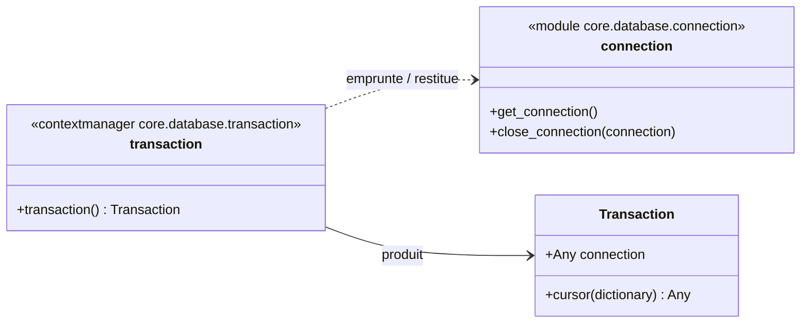
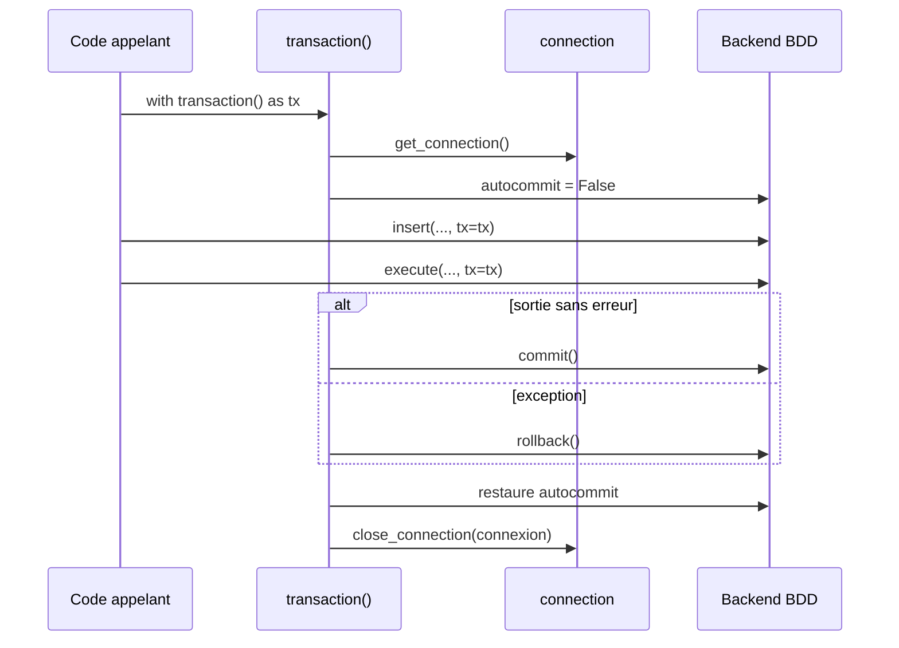

# Les transactions dans Forge

Ce document décrit les transactions SQL explicites du cœur de Forge.

Une transaction groupe plusieurs écritures qui doivent réussir ensemble ou échouer ensemble.

## 1. Rôle

Le module `core.database.transaction` fournit un bloc `with transaction()` qui ouvre une transaction explicite.

Quand plusieurs écritures forment une opération métier indivisible, on les groupe dans le même bloc.
À la sortie sans erreur, Forge valide (commit) l'ensemble.
Si une exception traverse le bloc, Forge annule tout (rollback) : aucune écriture partielle ne subsiste.

Le développeur choisit lui-même le périmètre du bloc.
Les helpers SQL qui reçoivent `tx` réutilisent la connexion de la transaction et ne valident jamais d'eux-mêmes.

```python
from core.database.db import insert, execute
from core.database.transaction import transaction

with transaction() as tx:
    insert("INSERT INTO article (title, category_id) VALUES (?, ?)", (title, cat), tx=tx)
    execute("UPDATE categories SET article_count = article_count + 1 WHERE id = ?", (cat,), tx=tx)
```

## 2. Vue d'ensemble rapide

| Élément | Valeur |
|---|---|
| Module | `core.database.transaction` |
| Couche | Accès base de données |
| Rôle | grouper des écritures atomiques |
| Dépend de | `core.database.connection` |
| API publique | `transaction()`, classe `Transaction` |
| Objet lié | helpers SQL via le paramètre `tx` |

`transaction()` est un gestionnaire de contexte.
La classe `Transaction` porte la connexion empruntée le temps du bloc et se passe en `tx=` aux helpers.

## 3. Schémas UML

Le diagramme de classe montre l'objet `Transaction` et le gestionnaire de contexte.

Le diagramme de séquence montre le cycle commit ou rollback.

### 3.1 Diagramme de classe



À retenir :

- `transaction()` emprunte une connexion et produit une `Transaction` ;
- `Transaction` porte la connexion et expose `cursor(...)` ;
- les helpers SQL reçoivent cet objet via `tx=` ;
- la connexion est restituée à la fin du bloc, quel que soit le résultat.

### 3.2 Diagramme de séquence

Le diagramme montre les deux issues possibles d'un bloc transactionnel.



À retenir :

- Forge désarme l'autocommit le temps du bloc pour garantir un vrai contexte transactionnel ;
- une sortie sans erreur déclenche un commit ;
- une exception déclenche un rollback puis se propage ;
- l'état autocommit initial est restauré avant de rendre la connexion au backend.

## 4. API publique

| Élément | Signature | Rôle |
|---|---|---|
| `transaction` | `transaction() -> Generator[Transaction, None, None]` | gestionnaire de contexte ouvrant une transaction explicite |
| `Transaction` | `Transaction(connection)` | objet transaction porté par le bloc, passé en `tx=` aux helpers |
| `Transaction.cursor` | `cursor(*, dictionary=False) -> Any` | ouvrir un curseur sur la connexion de la transaction |

## 5. Contextes d'utilisation

| Besoin | Élément |
|---|---|
| Grouper des écritures liées | bloc `with transaction() as tx` |
| Garantir le tout ou rien | passer `tx=tx` à chaque helper du bloc |
| Annuler en cas d'erreur | laisser l'exception traverser le bloc (rollback automatique) |

## 6. Exemples d'utilisation

Créer une entité et mettre à jour un compteur de façon atomique :

```python
from core.database.db import insert, execute
from core.database.transaction import transaction

with transaction() as tx:
    article_id = insert(
        "INSERT INTO article (title, category_id) VALUES (?, ?)",
        (title, category_id),
        tx=tx,
    )
    execute(
        "UPDATE categories SET article_count = article_count + 1 WHERE id = ?",
        (category_id,),
        tx=tx,
    )
```

Si la seconde requête échoue, l'insertion de l'article est annulée par le rollback automatique.

!!! note "Les helpers ne committent pas dans une transaction"
    Quand un helper SQL reçoit `tx=tx`, il écrit dans la transaction sans valider lui-même.

    C'est le bloc `with transaction()` qui décide du commit final ou du rollback. Vous gardez ainsi la maîtrise du périmètre atomique.

## Voir aussi

- [Les helpers SQL dans Forge](db.md) : `insert` et `execute` avec le paramètre `tx`.
- [Le pool de connexions dans Forge](connection.md) : la connexion empruntée par la transaction.
