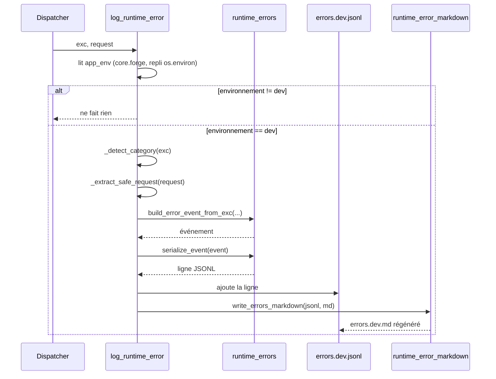

# Le collecteur d'erreurs runtime dans Forge

Ce document décrit la journalisation d'une erreur survenue à l'exécution.

Quand une exception non gérée traverse l'application en mode `dev`, Forge l'enregistre dans un journal JSONL, régénère le rendu Markdown associé, et prépare un contexte pour la page d'erreur 500.
En mode `prod`, ce module reste silencieux et n'expose rien.

## 1. Rôle

`core.errors.runtime_error_logger` collecte les erreurs runtime et les écrit dans `storage/logs/errors.dev.jsonl`.

Il joue deux rôles distincts :

* `log_runtime_error` enregistre l'erreur dans le journal JSONL, puis régénère `storage/logs/errors.dev.md` depuis ce journal ;
* `build_dev_error_context` prépare un contexte pour la page `errors/500.html`, uniquement en `APP_ENV=dev`.

Le module est volontairement silencieux : si l'écriture échoue, il logge un avertissement Python et laisse l'application continuer.
Il n'écrit rien en dehors du mode `dev`.

## 2. Vue d'ensemble rapide

| Élément | Valeur |
|---|---|
| Module | `core.errors.runtime_error_logger` |
| Couche | Erreurs runtime (cœur) |
| Rôle | journaliser les erreurs runtime et préparer la page 500 (dev) |
| Type | ensemble de fonctions |
| Dépend de | `core.errors.runtime_errors`, `core.errors.runtime_error_markdown`, `core.forge` (config `app_env`) |
| Fichier produit | `storage/logs/errors.dev.jsonl` puis `storage/logs/errors.dev.md` |
| Actif en | `APP_ENV=dev` uniquement |
| Comportement en erreur | silencieux, journalise un warning et ne propage rien |

Ce module est l'unique point d'entrée d'écriture des erreurs runtime ; il s'appuie sur le schéma et le rendu pour le format.

## 3. Schémas UML

Le module est un ensemble de fonctions.
Le schéma de séquence ci-dessous montre le déroulement de `log_runtime_error` lors d'une erreur interceptée par le dispatcher.

### 3.1 Diagramme de séquence

Ce diagramme montre le parcours d'une erreur non gérée jusqu'à son enregistrement.

Il permet de comprendre que le mode est lu en premier (et coupe court en `prod`), que la catégorie est détectée automatiquement, que la requête est filtrée, puis que l'événement est sérialisé et ajouté au JSONL avant la régénération du Markdown.



À retenir :

- en `prod`, ou si l'environnement est indéterminé, `log_runtime_error` ne fait rien ;
- la catégorie est déduite du type et du module de l'exception (template, base de données, configuration, runtime) ;
- la requête est filtrée avant journalisation, sans valeurs sensibles ;
- chaque écriture JSONL déclenche la régénération du Markdown.

## 4. API publique

| Fonction | Signature | Rôle |
|---|---|---|
| `log_runtime_error` | `log_runtime_error(exc, request=None) -> None` | journalise l'erreur dans `errors.dev.jsonl` et régénère le Markdown (dev uniquement) |
| `build_dev_error_context` | `build_dev_error_context(exc) -> dict[str, Any] \| None` | contexte pour la page `errors/500.html` en `dev`, sinon `None` |
| `set_jsonl_dir` | `set_jsonl_dir(path) -> None` | surcharge le répertoire de logs JSONL, `None` rétablit le défaut (tests) |

Forme du contexte renvoyé par `build_dev_error_context` en mode `dev` :

```python
{"error": {"type": ..., "message": ..., "traceback": ...}}
```

## 5. Contextes d'utilisation

| Besoin | Élément |
|---|---|
| Journaliser une erreur non gérée | `log_runtime_error(exc, request)` |
| Afficher la cause sur la page 500 en dev | `build_dev_error_context(exc)` |
| Isoler le journal dans un test | `set_jsonl_dir(tmp_path)` |
| Rétablir le répertoire par défaut | `set_jsonl_dir(None)` |

## 6. Exemples d'utilisation

Journaliser une erreur non gérée et préparer la page 500 depuis un bloc `except` :

```python
from core.errors.runtime_error_logger import (
    log_runtime_error,
    build_dev_error_context,
)


try:
    controller_action(request)
except Exception as exc:
    log_runtime_error(exc, request)
    context = build_dev_error_context(exc)   # None en prod
    # context alimente errors/500.html en dev
```

Isoler le journal JSONL dans un test :

```python
from core.errors.runtime_error_logger import log_runtime_error, set_jsonl_dir


def test_logging(tmp_path):
    set_jsonl_dir(tmp_path)
    try:
        try:
            raise ValueError("boom")
        except ValueError as exc:
            log_runtime_error(exc)
        assert (tmp_path / "errors.dev.jsonl").exists()
    finally:
        set_jsonl_dir(None)
```

## 7. Contrat dev / prod et sécurité

!!! warning "Aucune trace exposée par défaut"
    `build_dev_error_context` ne renvoie un contexte riche que si `APP_ENV` vaut explicitement `dev`.

    Si le boot est incomplet ou l'environnement indéterminé, la fonction retourne `None` : aucune trace n'est exposée par défaut, conformément à la charte (sécuriser par défaut).
    En `prod`, la page 500 reste sobre et ne divulgue rien.

!!! note "Écriture silencieuse"
    `log_runtime_error` ne propage jamais d'exception.

    Si le dossier de logs ne peut pas être créé ou si l'écriture échoue, le module journalise un avertissement Python et laisse l'application continuer.

!!! tip "Appeler depuis un bloc except"
    `log_runtime_error` et `build_dev_error_context` lisent la pile via le contexte d'exception courant.

    Elles doivent être appelées depuis un bloc `except` actif pour capturer la trace correspondant à l'exception.

## Voir aussi

- [Le schéma des erreurs runtime](runtime_errors.md) : la forme de l'événement journalisé.
- [Le rendu Markdown des erreurs](runtime_error_markdown.md) : relire le journal en Markdown.
