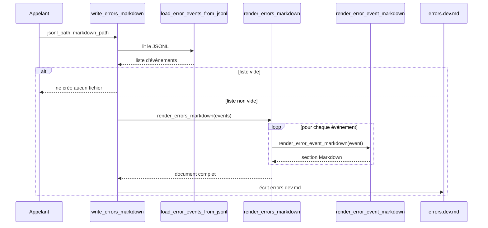

# Le rendu Markdown des erreurs dans Forge

Ce document décrit la transformation du journal d'erreurs JSONL en Markdown lisible.

Le journal d'erreurs est en JSONL, une ligne par erreur : pratique pour la machine, peu lisible pour l'humain.
Ce module lit `storage/logs/errors.dev.jsonl` et génère `storage/logs/errors.dev.md`, un document trié et lisible.

## 1. Rôle

`core.errors.runtime_error_markdown` rend le journal d'erreurs JSONL en un document Markdown.

La règle est stricte :

* `errors.dev.jsonl` est la source canonique ;
* `errors.dev.md` est un rendu généré depuis le JSONL, à ne jamais modifier à la main.

Le module charge les événements, rend chaque événement en une section Markdown, assemble un document complet avec un résumé, puis écrit le fichier.
Les lignes JSONL invalides ne sont pas perdues : elles sont signalées dans le rendu.

## 2. Vue d'ensemble rapide

| Élément | Valeur |
|---|---|
| Module | `core.errors.runtime_error_markdown` |
| Couche | Erreurs runtime (cœur) |
| Rôle | rendre le journal JSONL en document Markdown lisible |
| Type | ensemble de fonctions |
| Dépend de | bibliothèque standard uniquement (`json`, `pathlib`, `datetime`) |
| Lit | `storage/logs/errors.dev.jsonl` |
| Écrit | `storage/logs/errors.dev.md` |
| Source canonique | le JSONL ; le Markdown est un rendu jetable |

Ce module ne modifie jamais le JSONL : il le lit seulement, et produit un fichier Markdown dérivé.

## 3. Schémas UML

Le module est un ensemble de fonctions chaînées : charger, rendre un événement, rendre la liste, écrire.

### 3.1 Diagramme de séquence

Ce diagramme montre l'enchaînement des fonctions lors de l'appel à `write_errors_markdown`.

Il permet de comprendre que la lecture du JSONL produit une liste d'événements (les lignes invalides incluses comme marqueurs), que chaque événement est rendu en section, que le tout est assemblé avec un en-tête et un résumé, puis écrit.



À retenir :

- les lignes vides du JSONL sont ignorées ;
- une ligne JSON invalide devient un dict marqueur `{"_invalid_line", "_raw"}`, signalé dans le rendu ;
- si la liste d'événements est vide, aucun fichier Markdown n'est créé ;
- le JSONL n'est jamais modifié.

## 4. API publique

| Fonction | Signature | Rôle |
|---|---|---|
| `load_error_events_from_jsonl` | `load_error_events_from_jsonl(path) -> list[dict[str, Any]]` | charge les événements depuis un fichier JSONL (lignes invalides marquées) |
| `render_error_event_markdown` | `render_error_event_markdown(event) -> str` | rend un événement en une section Markdown |
| `render_errors_markdown` | `render_errors_markdown(events) -> str` | assemble un document Markdown complet avec en-tête et résumé |
| `write_errors_markdown` | `write_errors_markdown(jsonl_path, markdown_path) -> None` | lit le JSONL et écrit le fichier Markdown (silencieux si vide) |

## 5. Contextes d'utilisation

| Besoin | Élément |
|---|---|
| Lire un journal JSONL en mémoire | `load_error_events_from_jsonl(path)` |
| Rendre un seul événement | `render_error_event_markdown(event)` |
| Produire le document complet en chaîne | `render_errors_markdown(events)` |
| Régénérer le fichier Markdown depuis le JSONL | `write_errors_markdown(jsonl_path, markdown_path)` |

## 6. Exemples d'utilisation

Régénérer le fichier Markdown depuis le journal JSONL :

```python
import pathlib

from core.errors.runtime_error_markdown import write_errors_markdown


log_dir = pathlib.Path("storage/logs")
write_errors_markdown(
    log_dir / "errors.dev.jsonl",
    log_dir / "errors.dev.md",
)
```

Charger les événements et rendre un document en mémoire, sans écrire de fichier :

```python
import pathlib

from core.errors.runtime_error_markdown import (
    load_error_events_from_jsonl,
    render_errors_markdown,
)


events = load_error_events_from_jsonl(pathlib.Path("storage/logs/errors.dev.jsonl"))
document = render_errors_markdown(events)
print(document)
```

## 7. Règle source / rendu

!!! warning "Ne pas modifier le rendu à la main"
    `errors.dev.md` est régénéré à chaque nouvelle erreur journalisée.

    Toute modification manuelle de ce fichier sera écrasée.
    Pour corriger ou enrichir le contenu, agir sur la source canonique `errors.dev.jsonl` ou sur le code de rendu.

!!! note "Lignes invalides conservées"
    Une ligne JSONL qui ne parse pas n'est pas supprimée.

    Elle est rendue dans une section dédiée signalant son numéro et son contenu brut, ce qui facilite le diagnostic sans perdre d'information.

## Voir aussi

- [Le collecteur d'erreurs runtime](runtime_error_logger.md) : produit le journal JSONL et déclenche ce rendu.
- [Le schéma des erreurs runtime](runtime_errors.md) : la forme de chaque événement rendu.
