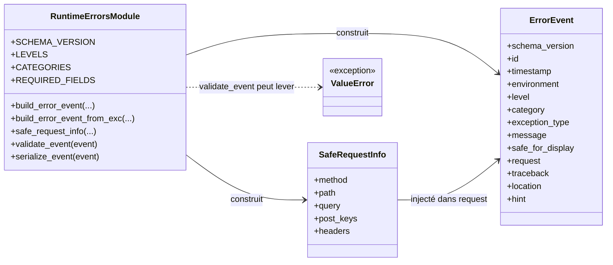
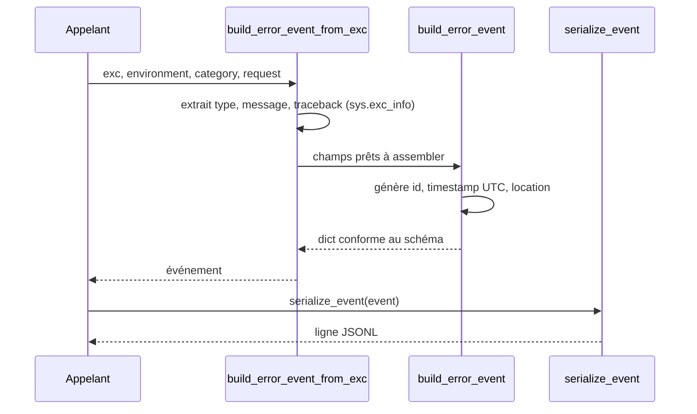

# Le schéma des erreurs runtime dans Forge

Ce document décrit le schéma canonique d'un événement d'erreur runtime Forge.

Quand une erreur survient à l'exécution, Forge la représente sous une forme structurée et stable, sérialisable en JSONL.
Ce module définit ce format, fournit les constantes officielles, et les fonctions pour construire, valider et sérialiser un événement.

## 1. Rôle

`core.errors.runtime_errors` définit le format officiel des événements d'erreur runtime de Forge.

Il ne collecte ni n'écrit aucun fichier : il se contente de produire des dictionnaires conformes au schéma, de les valider, et de les transformer en lignes JSONL.

Trois familles de fonctions :

* construire un événement, à partir de champs (`build_error_event`) ou d'une exception active (`build_error_event_from_exc`) ;
* filtrer les informations de requête pour ne garder que ce qui est sûr (`safe_request_info`) ;
* valider (`validate_event`) et sérialiser (`serialize_event`) un événement.

Le module expose aussi des constantes : la version de schéma, les niveaux, les catégories et la liste des champs obligatoires.

## 2. Vue d'ensemble rapide

| Élément | Valeur |
|---|---|
| Module | `core.errors.runtime_errors` |
| Couche | Erreurs runtime (cœur) |
| Rôle | définir le schéma canonique JSONL des erreurs runtime |
| Type | ensemble de fonctions et de constantes |
| Dépend de | bibliothèque standard uniquement (`json`, `secrets`, `sys`, `traceback`, `datetime`) |
| Version de schéma | `SCHEMA_VERSION = "1.0"` |
| Consommé par | `core.errors.runtime_error_logger` |
| Exception levée | `ValueError` par `validate_event` si un champ obligatoire manque |

Ce module est une frontière de format : il produit la représentation stable d'une erreur, sans décider où ni quand l'écrire.

## 3. Schémas UML

Le module est un ensemble de fonctions et de constantes sans état.
Le schéma de classe ci-dessous regroupe les fonctions publiques et leurs liens, le schéma de séquence montre la construction d'un événement depuis une exception.

### 3.1 Diagramme de classe

Ce diagramme regroupe les fonctions publiques, les constantes exposées et l'événement produit.

Il montre que `build_error_event_from_exc` s'appuie sur `build_error_event`, que `safe_request_info` prépare l'objet requête injecté dans l'événement, et que `serialize_event` produit la ligne JSONL finale.



À retenir :

- `build_error_event` et `build_error_event_from_exc` produisent un `ErrorEvent` (un `dict`) ;
- `safe_request_info` prépare un objet requête sûr, sans valeurs sensibles ;
- `validate_event` lève `ValueError` si un champ obligatoire manque ;
- `serialize_event` transforme l'événement en une ligne JSONL.

### 3.2 Diagramme de séquence

Ce diagramme montre la construction d'un événement depuis une exception active.

Il permet de comprendre que `build_error_event_from_exc` extrait la pile d'appels via `sys.exc_info()`, déduit le type et le message de l'exception, puis délègue à `build_error_event` qui ajoute l'identifiant, l'horodatage et la localisation.



À retenir :

- `build_error_event_from_exc` doit être appelée depuis un bloc `except` pour que `sys.exc_info()` soit valide ;
- l'identifiant et l'horodatage sont générés automatiquement par `build_error_event` ;
- la localisation est déduite du dernier frame de la pile ;
- la sérialisation produit une seule ligne JSON, sans saut de ligne final.

## 4. API publique

| Fonction | Signature | Rôle |
|---|---|---|
| `build_error_event` | `build_error_event(exception_type, message, *, environment="dev", level=LEVEL_ERROR, category=CATEGORY_RUNTIME, request=None, traceback_frames=None, hint="", safe_for_display=False) -> dict[str, Any]` | construit un événement conforme au schéma v1.0 à partir de champs |
| `build_error_event_from_exc` | `build_error_event_from_exc(exc, *, environment="dev", level=LEVEL_ERROR, category=CATEGORY_RUNTIME, request=None, hint="", safe_for_display=False) -> dict[str, Any]` | construit un événement depuis une exception active (bloc `except`) |
| `safe_request_info` | `safe_request_info(method, path, query=None, post_keys=None, header_names=None) -> dict[str, Any]` | construit un objet requête sûr (noms de champs et de headers seulement, jamais les valeurs) |
| `validate_event` | `validate_event(event) -> None` | vérifie la présence des champs obligatoires, lève `ValueError` sinon |
| `serialize_event` | `serialize_event(event) -> str` | sérialise l'événement en une ligne JSONL (UTF-8, sans saut de ligne) |

Constantes publiques :

| Constante | Valeur | Rôle |
|---|---|---|
| `SCHEMA_VERSION` | `"1.0"` | version du schéma d'événement |
| `LEVELS` | `frozenset` | niveaux acceptés : `LEVEL_ERROR`, `LEVEL_WARNING`, `LEVEL_INFO`, `LEVEL_CRITICAL` |
| `CATEGORIES` | `frozenset` | catégories fonctionnelles : `runtime`, `controller`, `routing`, `template`, `database`, `configuration`, `http`, `unknown` |
| `REQUIRED_FIELDS` | `frozenset` | champs obligatoires d'un événement |

Champs obligatoires d'un événement (`REQUIRED_FIELDS`) :

`schema_version`, `id`, `timestamp`, `environment`, `level`, `category`, `exception_type`, `message`, `safe_for_display`.

## 5. Contextes d'utilisation

| Besoin | Élément |
|---|---|
| Décrire une erreur à partir de champs | `build_error_event(...)` |
| Décrire une erreur depuis une exception capturée | `build_error_event_from_exc(exc, ...)` |
| Préparer une requête sûre pour l'événement | `safe_request_info(...)` |
| Vérifier qu'un événement est complet | `validate_event(event)` |
| Écrire un événement dans un fichier JSONL | `serialize_event(event)` |
| Choisir un niveau ou une catégorie | constantes `LEVELS` et `CATEGORIES` |

## 6. Exemples d'utilisation

Construire un événement depuis une exception active, puis le sérialiser :

```python
from core.errors.runtime_errors import (
    build_error_event_from_exc,
    safe_request_info,
    serialize_event,
    CATEGORY_DATABASE,
)


try:
    risky_database_call()
except Exception as exc:
    request = safe_request_info(
        method="POST",
        path="/article/create",
        post_keys=["title", "body"],
    )
    event = build_error_event_from_exc(
        exc,
        environment="dev",
        category=CATEGORY_DATABASE,
        request=request,
    )
    line = serialize_event(event)
    # line est une ligne JSONL prête à être écrite dans un fichier
```

Construire un événement à partir de champs, puis le valider :

```python
from core.errors.runtime_errors import (
    build_error_event,
    validate_event,
    LEVEL_WARNING,
    CATEGORY_CONFIGURATION,
)


event = build_error_event(
    exception_type="ValueError",
    message="Variable d'environnement manquante",
    level=LEVEL_WARNING,
    category=CATEGORY_CONFIGURATION,
    hint="Vérifier le fichier env/dev",
)

validate_event(event)   # lève ValueError si un champ obligatoire manque
```

## 7. Sécurité

!!! warning "Aucune valeur sensible dans l'événement"
    `safe_request_info` ne conserve que les noms des champs POST et des en-têtes, jamais leurs valeurs.

    Le module maintient en interne une liste de clés réputées sensibles (mots de passe, jetons, cookies, clés d'API).
    L'objet requête sécurisé ne transporte donc ni secret, ni corps de formulaire en clair.

!!! note "Construire depuis un bloc except"
    `build_error_event_from_exc` lit la pile d'appels via `sys.exc_info()`.

    Elle doit être appelée depuis un bloc `except` actif, sinon la pile capturée sera vide.

## Voir aussi

- [Le collecteur d'erreurs runtime](runtime_error_logger.md) : journalise les événements dans un fichier JSONL.
- [Le rendu Markdown des erreurs](runtime_error_markdown.md) : relit le JSONL et produit un document lisible.
