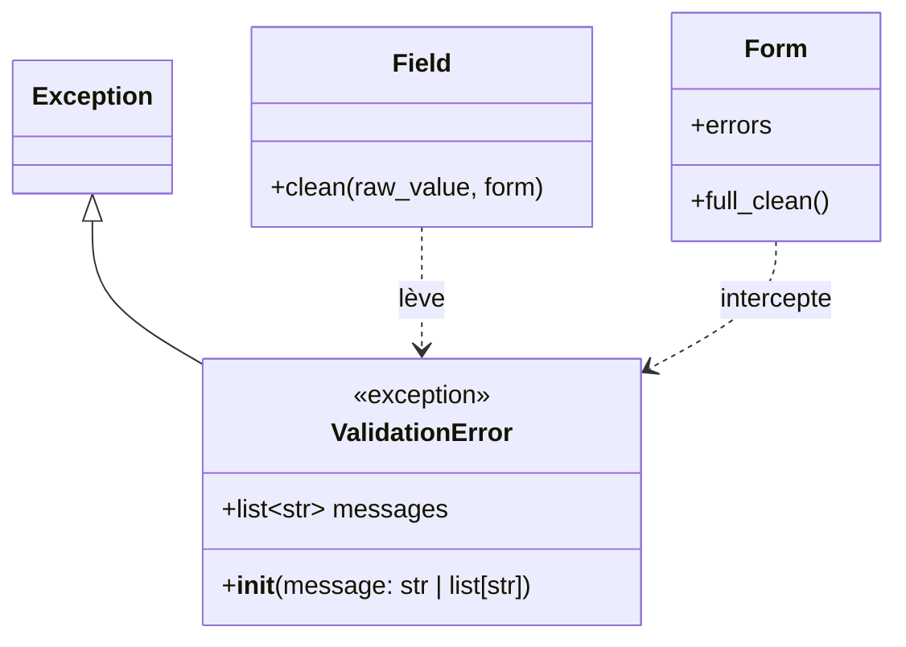

# L'erreur de validation de formulaire dans Forge

Ce document explique l'exception levée quand un champ ou un formulaire refuse une valeur, et comment son message est destiné à l'affichage.

## 1. Rôle

`ValidationError` signale une valeur refusée pendant la validation d'un formulaire.

Quand un champ refuse une valeur, il lève une `ValidationError` portant un ou plusieurs messages destinés à être affichés à l'utilisateur.
Le formulaire intercepte cette exception et range les messages dans `errors`, sous le nom du champ concerné.

Un message peut être unique ou multiple : le constructeur accepte une chaîne ou une liste de chaînes, et expose toujours une liste normalisée dans `messages`.

```python
from core.forms.exceptions import ValidationError

raise ValidationError("Le champ est obligatoire.")
raise ValidationError(["Trop court.", "Format invalide."])
```

## 2. Vue d'ensemble rapide

| Élément | Valeur |
|---|---|
| Classe | `ValidationError` |
| Module | `core.forms.exceptions` |
| Couche | Formulaires (cœur) |
| Type | exception, dérive de `Exception` |
| Rôle | signaler une valeur refusée, avec messages affichables |
| Levée par | les champs (`Field.clean`) et le hook `Form.clean` |
| Interceptée par | `Form.full_clean`, qui remplit `errors` |
| Attribut | `messages: list[str]` |

## 3. Schéma UML

`ValidationError` est une exception simple, sans flux : un diagramme de classe suffit.



À retenir :

- `ValidationError` dérive de `Exception` ;
- elle normalise toujours son message en liste dans `messages` ;
- les champs la lèvent, le formulaire l'intercepte ;
- ses messages sont pensés pour l'affichage utilisateur.

## 4. API publique

| Élément | Signature | Rôle |
|---|---|---|
| `ValidationError` | `ValidationError(message: str \| list[str])` | construit l'exception, normalise le message en liste |
| `messages` | `messages: list[str]` | liste des messages affichables |

Le message hérité de `Exception` est la jonction des messages par `"; "`.

## 5. Contextes d'utilisation

| Besoin | Élément |
|---|---|
| Refuser une valeur dans un champ | `raise ValidationError(message)` |
| Refuser une combinaison de champs | `raise ValidationError(message)` dans `Form.clean()` |
| Porter plusieurs messages | `ValidationError([msg1, msg2])` |
| Lire les messages collectés | `Form.errors` ou `Form.field_errors(name)` |

## 6. Exemples d'utilisation

??? example "Lever l'erreur dans un validateur de champ"

    ```python
    from core.forms.exceptions import ValidationError


    def positive(value: int) -> None:
        if value <= 0:
            raise ValidationError("La valeur doit etre positive.")
    ```

??? example "Lever l'erreur dans la validation entre champs"

    ```python
    from core.forms.form import Form
    from core.forms.fields import StringField
    from core.forms.exceptions import ValidationError


    class SignupForm(Form):
        password = StringField(required=True)
        confirm = StringField(required=True)

        def clean(self):
            if self.cleaned_data["password"] != self.cleaned_data["confirm"]:
                raise ValidationError("Les deux mots de passe different.")
            return None
    ```

    Levée dans `clean()`, l'erreur est rangée dans `non_field_errors`.

## Voir aussi

- [Les formulaires dans Forge](form.md) : `Form` qui intercepte l'erreur et remplit `errors`.
- [Les champs de formulaire dans Forge](fields.md) : les champs qui lèvent cette erreur.
