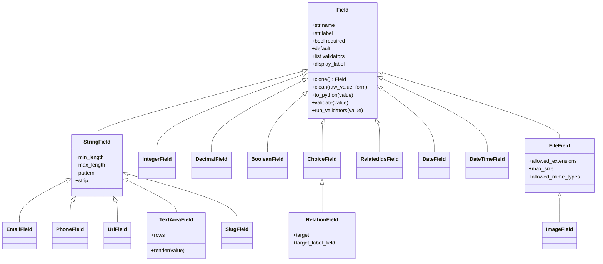
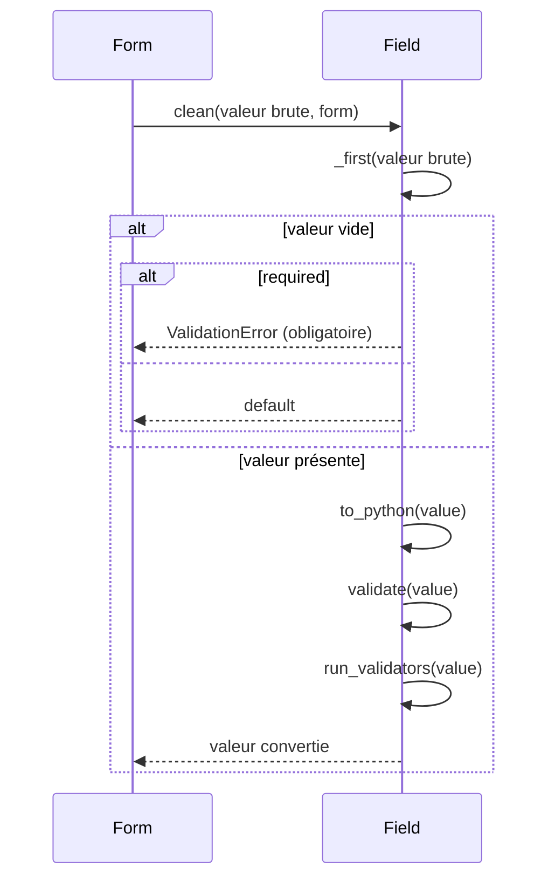

# Les champs de formulaire dans Forge

Ce document explique ce qu'est un champ de formulaire Forge, comment la classe de base `Field` lit, convertit et valide une valeur, quels champs typés sont fournis, et comment les déclarer sur un `Form`.

## 1. Rôle

Un champ lit la valeur brute reçue, la convertit vers le bon type Python, puis la valide.

Chaque champ d'un formulaire est un objet `Field` ou une sous-classe.
Il applique ses contraintes locales : champ obligatoire, longueurs, plages de valeurs, format.
En cas de refus, il lève une `ValidationError` portant un message destiné à l'affichage.

Ce module fournit la classe de base `Field` et une famille de champs typés prêts à l'emploi.

```python
from core.forms.fields import StringField, IntegerField

title = StringField(required=True, max_length=120)
count = IntegerField(min_value=0, max_value=100)
```

## 2. Vue d'ensemble rapide

| Élément | Valeur |
|---|---|
| Classe de base | `Field` |
| Module | `core.forms.fields` |
| Couche | Formulaires (cœur) |
| Rôle | lire, convertir et valider une valeur de formulaire |
| Dépend de | `ValidationError`, `is_valid_slug` (slug), validation d'upload (fichiers) |
| Objet lié | `Form` qui assemble les champs |
| Exception liée | `ValidationError` levée en cas de refus |
| Constante liée | `EMPTY_VALUES = (None, "")` |

## 3. Schémas UML

### 3.1 Diagramme de classe

Le diagramme montre la classe de base `Field` et la hiérarchie des champs typés.

`StringField` sert de base aux champs au format vérifié, et `FileField` à `ImageField`.



À retenir :

- tous les champs dérivent de `Field` ;
- `StringField` est la base des champs texte au format vérifié ;
- `RelationField` est un `ChoiceField` spécialisé pour une clé étrangère ;
- `ImageField` est un `FileField` avec extensions et types MIME image par défaut.

### 3.2 Diagramme de séquence

Le diagramme montre l'ordre des opérations dans `clean()`, appelé par le formulaire.

Un champ vide est traité à part : obligatoire, il lève une erreur ; sinon il retourne sa valeur par défaut.



À retenir :

- `clean()` orchestre conversion puis validation ;
- une valeur vide obligatoire lève une `ValidationError` ;
- une valeur vide non obligatoire retourne `default` ;
- `run_validators` applique les validateurs personnalisés passés au champ.

## 4. API publique

| Champ | Signature | Rôle |
|---|---|---|
| `Field` | `Field(*, label=None, required=True, default=None, validators=None)` | classe de base, lit, convertit et valide |
| `StringField` | `StringField(*, min_length=None, max_length=None, pattern=None, strip=True, **kwargs)` | chaîne avec longueurs et motif optionnel |
| `TextAreaField` | `TextAreaField(*, rows=None, **kwargs)` | texte long, sait se rendre en `<textarea>` |
| `IntegerField` | `IntegerField(*, min_value=None, max_value=None, **kwargs)` | entier avec bornes |
| `DecimalField` | `DecimalField(*, min_value=None, max_value=None, **kwargs)` | décimal avec bornes, virgule acceptée |
| `BooleanField` | `BooleanField(**kwargs)` | booléen, non requis par défaut |
| `ChoiceField` | `ChoiceField(*, choices=None, choices_key=None, coerce=None, empty_value=None, **kwargs)` | choix dans une liste explicite |
| `EmailField` | `EmailField(**kwargs)` | adresse email, `max_length` par défaut 254 |
| `PhoneField` | `PhoneField(**kwargs)` | numéro de téléphone français |
| `UrlField` | `UrlField(**kwargs)` | URL `http://` ou `https://`, `max_length` par défaut 2048 |
| `DateField` | `DateField(**kwargs)` | date au format `YYYY-MM-DD` |
| `DateTimeField` | `DateTimeField(**kwargs)` | date et heure au format `YYYY-MM-DDTHH:MM` |
| `SlugField` | `SlugField(**kwargs)` | slug d'URL, `max_length` par défaut 120 |
| `RelationField` | `RelationField(*, target="", target_label_field="", **kwargs)` | clé étrangère `many_to_one` validée par liste de choix |
| `RelatedIdsField` | `RelatedIdsField(*, allowed_ids=None, allowed_ids_key=None, **kwargs)` | liste d'identifiants liés, non requise par défaut |
| `FileField` | `FileField(*, allowed_extensions=None, max_size=None, allowed_mime_types=None, **kwargs)` | fichier téléversé validé |
| `ImageField` | `ImageField(*, allowed_extensions=None, allowed_mime_types=None, **kwargs)` | fichier image, extensions et types MIME image par défaut |

Méthodes principales de `Field` :

| Méthode | Signature | Rôle |
|---|---|---|
| `clone` | `clone() -> Field` | copie le champ pour une instance de formulaire |
| `display_label` | `display_label -> str` | libellé affiché, dérivé du nom si absent |
| `clean` | `clean(raw_value: Any, *, form: Form \| None = None) -> Any` | conversion puis validation complètes |
| `to_python` | `to_python(value: Any) -> Any` | convertit la valeur brute vers le type cible |
| `validate` | `validate(value: Any) -> None` | applique les contraintes du champ |
| `run_validators` | `run_validators(value: Any) -> None` | applique les validateurs personnalisés |

## 5. Contextes d'utilisation

| Besoin | Élément |
|---|---|
| Champ texte avec longueurs | `StringField` |
| Texte long avec rendu `<textarea>` | `TextAreaField` |
| Nombre entier ou décimal | `IntegerField`, `DecimalField` |
| Case à cocher | `BooleanField` |
| Format email, URL ou téléphone | `EmailField`, `UrlField`, `PhoneField` |
| Date ou date et heure | `DateField`, `DateTimeField` |
| Slug d'URL | `SlugField` |
| Choix dans une liste fournie | `ChoiceField` |
| Clé étrangère validée | `RelationField` |
| Liste d'identifiants pour un pivot | `RelatedIdsField` |
| Fichier ou image téléversés | `FileField`, `ImageField` |

## 6. Exemples d'utilisation

??? example "Champs typés sur un formulaire"

    ```python
    from core.forms.form import Form
    from core.forms.fields import StringField, EmailField, IntegerField


    class ContactForm(Form):
        name = StringField(required=True, min_length=2, max_length=80)
        email = EmailField(required=True)
        age = IntegerField(required=False, min_value=0, max_value=130)
    ```

??? example "ChoiceField avec liste de choix fournie"

    Les choix autorisés sont fournis au champ ou au formulaire ; le champ ne les cherche jamais lui-même.

    ```python
    from core.forms.form import Form
    from core.forms.fields import ChoiceField


    class StatusForm(Form):
        status = ChoiceField(choices=["draft", "published", "archived"])
    ```

    Les choix peuvent aussi venir des options du formulaire, via la clé `allowed_status` :

    ```python
    form = StatusForm(request.body, allowed_status=["draft", "published"])
    ```

??? example "Validateur personnalisé"

    Un validateur reçoit la valeur convertie et retourne un message non vide pour refuser.

    ```python
    from core.forms.fields import StringField


    def no_space(value: str) -> str:
        if " " in value:
            return "Le pseudo ne doit pas contenir d'espace."
        return ""


    pseudo = StringField(required=True, validators=[no_space])
    ```

??? example "ImageField avec valeurs par défaut"

    `ImageField` accepte par défaut les extensions `jpg`, `jpeg`, `png`, `webp` et les types MIME image correspondants.

    ```python
    from core.forms.form import Form
    from core.forms.fields import ImageField


    class AvatarForm(Form):
        avatar = ImageField(required=True, max_size=2 * 1024 * 1024)
    ```

## 7. Détails techniques

!!! note "Choix et identifiants fournis, jamais devinés"
    `ChoiceField`, `RelationField` et `RelatedIdsField` ne vont jamais chercher eux-mêmes les valeurs autorisées.

    Elles sont passées au constructeur, ou lues dans les options du formulaire, par exemple `allowed_<nom>`.

!!! warning "Validation de fichier : nom du client non fiable"
    `FileField` valide extension, taille et type MIME via la validation d'upload du cœur.

    Le nom et le type annoncés par le navigateur ne sont pas fiables ; l'application reste responsable du nom de stockage final.

## Voir aussi

- [Les formulaires dans Forge](form.md) : `Form` qui assemble les champs.
- [L'erreur de validation de formulaire dans Forge](exceptions.md) : `ValidationError`.
- [La validation d'upload dans Forge](upload_validation.md) : contrôles utilisés par `FileField`.
- [Les exceptions d'upload dans Forge](upload_exceptions.md) : erreurs levées sur un fichier refusé.
