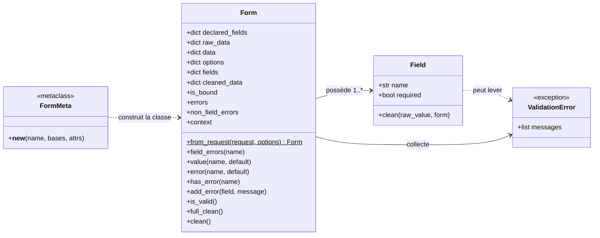
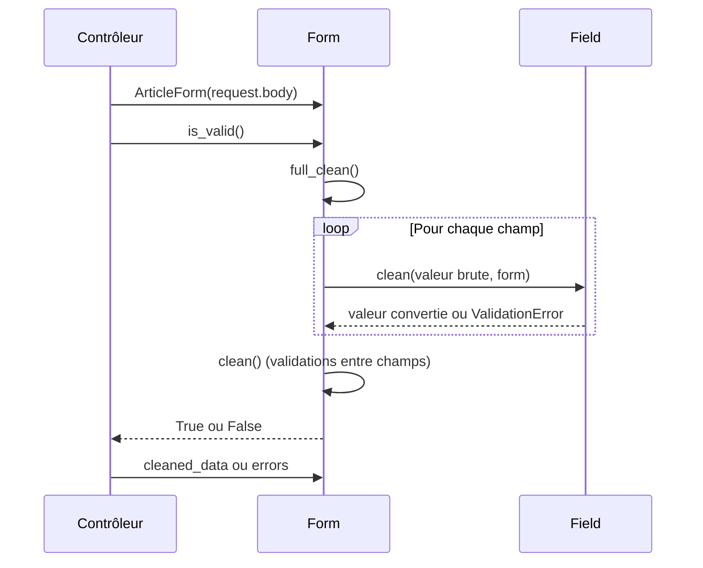

# Les formulaires dans Forge

Ce document explique ce qu'est un formulaire Forge, comment la classe `Form` lit une source HTTP pour produire des données validées et des erreurs affichables, comment elle se situe dans l'architecture du framework, et comment l'utiliser dans un contrôleur.

## 1. Rôle

`Form` transforme une source HTTP brute en données validées et en erreurs affichables.

Un formulaire rassemble des champs déclarés sur la classe, lit la valeur brute de chacun, la convertit vers le bon type Python, la valide, puis expose le résultat sous deux formes : `cleaned_data` quand tout est valide, `errors` sinon.

Un formulaire ne connaît ni la base de données, ni les redirections, ni la logique métier.
Son seul rôle est de valider une entrée.

La validation est explicite : un formulaire invalide n'écrit rien.
Le contrôleur lit `errors` pour afficher les messages, champ par champ.

```python
from core.forms.form import Form
from core.forms.fields import StringField, IntegerField


class ArticleForm(Form):
    title = StringField(required=True, max_length=120)
    category_id = IntegerField(required=True)
```

## 2. Vue d'ensemble rapide

| Élément | Valeur |
|---|---|
| Classe | `Form` |
| Module | `core.forms.form` |
| Couche | Formulaires (cœur) |
| Rôle | valider une source HTTP, exposer `cleaned_data` et `errors` |
| Dépend de | `Field` et `ValidationError` |
| Objet lié | `Field` pour chaque champ déclaré |
| Métaclasse | `FormMeta`, collecte les `Field` déclarés sur la classe |
| Constante liée | `NON_FIELD_ERRORS` pour les erreurs hors champ |
| Construit depuis | `Form(data)` ou `Form.from_request(request)` |

`Form` est une classe de frontière : elle se trouve entre les données reçues dans la requête et le code applicatif qui les exploite.

## 3. Schémas UML

### 3.1 Diagramme de classe

Le diagramme montre la place de `Form` parmi les objets manipulés.

`FormMeta` collecte les `Field` déclarés sur la classe, `Form` les clone à l'instanciation, et chaque `Field` peut lever une `ValidationError` collectée dans `errors`.



À retenir :

- `FormMeta` collecte les `Field` déclarés au niveau de la classe ;
- `Form` clone ces champs pour chaque instance ;
- chaque `Field` peut lever une `ValidationError` ;
- les erreurs sont regroupées dans `errors`, par nom de champ.

### 3.2 Diagramme de séquence

Le diagramme montre l'ordre des opérations lors d'une validation.

Le contrôleur construit le formulaire, appelle `is_valid()`, puis lit `cleaned_data` ou `errors`.



À retenir :

- `is_valid()` déclenche `full_clean()` ;
- chaque champ est nettoyé indépendamment ;
- `clean()` permet une validation entre champs, seulement si aucun champ n'a échoué ;
- le contrôleur lit ensuite `cleaned_data` ou `errors`.

## 4. API publique

| Élément | Signature | Rôle |
|---|---|---|
| `Form` | `Form(data: Any = None, **options: Any)` | construit un formulaire lié ou vide |
| `from_request` | `Form.from_request(request: Any, **options: Any) -> Form` | construit le formulaire depuis `request.body` et `request.files` |
| `is_bound` | `is_bound -> bool` | indique si le formulaire a reçu des données |
| `errors` | `errors -> dict[str, list[str]]` | erreurs par champ |
| `non_field_errors` | `non_field_errors -> list[str]` | erreurs hors champ (clé `NON_FIELD_ERRORS`) |
| `field_errors` | `field_errors(name: str) -> list[str]` | erreurs d'un champ donné |
| `value` | `value(name: str, default: Any = "") -> Any` | valeur saisie d'un champ |
| `error` | `error(name: str, default: str = "") -> str` | première erreur d'un champ |
| `has_error` | `has_error(name: str) -> bool` | présence d'une erreur sur un champ |
| `add_error` | `add_error(field: str \| None, message: str \| list[str]) -> None` | ajoute une erreur, hors champ si `field` vaut `None` |
| `is_valid` | `is_valid() -> bool` | nettoie tout et indique si le formulaire est valide |
| `full_clean` | `full_clean() -> None` | nettoie chaque champ puis appelle `clean()` |
| `clean` | `clean() -> Any` | point d'extension pour les validations entre champs |
| `context` | `context -> dict[str, Any]` | vue `data` / `errors` / `cleaned_data` pour le template |
| `NON_FIELD_ERRORS` | `NON_FIELD_ERRORS = "__all__"` | clé des erreurs non rattachées à un champ |

## 5. Contextes d'utilisation

| Besoin | Élément |
|---|---|
| Valider un POST avant un insert | `Form.is_valid()` |
| Construire le formulaire depuis la requête | `Form.from_request(request)` |
| Lire les données validées | `Form.cleaned_data` |
| Afficher les erreurs par champ | `Form.errors` ou `Form.error(name)` |
| Réafficher les valeurs saisies | `Form.value(name)` |
| Valider une règle entre plusieurs champs | surcharge de `clean()` |
| Ajouter une erreur globale | `Form.add_error(None, message)` |
| Fournir le contexte au template | `Form.context` |

## 6. Exemples d'utilisation

??? example "Valider un POST dans un contrôleur"

    ```python
    from core.forms.form import Form
    from core.forms.fields import StringField, IntegerField
    from core.http.request import Request
    from core.http.response import Response


    class ArticleForm(Form):
        title = StringField(required=True, max_length=120)
        category_id = IntegerField(required=True)


    def create(request: Request) -> Response:
        form = ArticleForm(request.body)
        if not form.is_valid():
            return Response.text(f"Erreurs : {form.errors}")

        data = form.cleaned_data
        return Response.text(f"Article : {data['title']}")
    ```

??? example "Construire le formulaire depuis la requête"

    `from_request` lit `request.body` puis ajoute les fichiers de `request.files`.

    ```python
    form = ArticleForm.from_request(request)
    if form.is_valid():
        data = form.cleaned_data
    ```

??? example "Validation entre champs avec clean()"

    `clean()` n'est appelé que si aucun champ n'a déjà échoué.

    ```python
    from core.forms.form import Form
    from core.forms.fields import DateField
    from core.forms.exceptions import ValidationError


    class PeriodForm(Form):
        start = DateField(required=True)
        end = DateField(required=True)

        def clean(self):
            if self.cleaned_data["end"] < self.cleaned_data["start"]:
                raise ValidationError("La date de fin precede la date de debut.")
            return None
    ```

    Une `ValidationError` levée dans `clean()` est rangée dans `non_field_errors`.

## 7. Détails techniques

!!! note "Champs clonés par instance"
    Les champs sont déclarés au niveau de la classe, mais `Form` les clone à l'instanciation.

    Chaque formulaire travaille donc sur ses propres champs, sans effet de bord entre instances.

!!! tip "Erreurs hors champ"
    Une erreur ajoutée avec `add_error(None, message)` est rangée sous la clé `NON_FIELD_ERRORS` (`"__all__"`).

    On la lit ensuite avec `non_field_errors`.

## Voir aussi

- [Les champs de formulaire dans Forge](fields.md) : les types de champ déclarables sur un `Form`.
- [L'erreur de validation de formulaire dans Forge](exceptions.md) : `ValidationError`.
- [La validation d'upload dans Forge](upload_validation.md) : utilisée par les champs de fichier.
