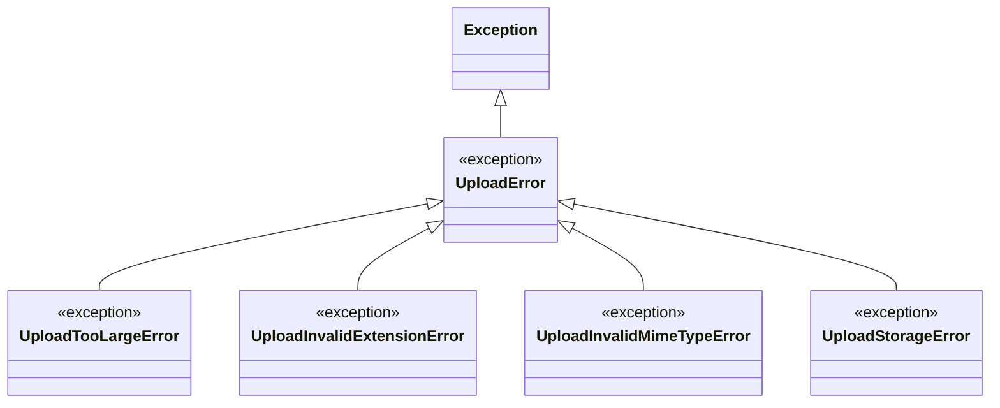

# Les exceptions d'upload dans Forge

Ce document explique la hiérarchie d'exceptions signalant un upload refusé ou un échec de stockage, et pourquoi elle reste dans le cœur.

## 1. Rôle

Ces exceptions signalent un fichier refusé à la validation, ou un échec d'écriture ou de suppression.

Elles restent dans le cœur (ADR-019) car `core/forms` (`FileField`) en dépend, et le cœur ne peut pas dépendre d'un opt-in (ADR-004).
Ce sont de simples types d'erreur, sans aucune entrée-sortie.

L'opt-in `forge-mvc-files` réutilise ces exceptions, puisqu'il dépend du cœur.

Toutes dérivent d'`UploadError`, ce qui permet d'attraper d'un coup tous les refus liés à un upload.

## 2. Vue d'ensemble rapide

| Élément | Valeur |
|---|---|
| Module | `core.forms.upload_exceptions` |
| Couche | Formulaires (cœur) |
| Rôle | signaler un upload refusé ou un échec de stockage |
| Type de base | `UploadError`, dérive de `Exception` |
| Nature | types d'erreur purs, sans I/O |
| Levées par | la validation d'upload, et le service d'upload de l'opt-in |
| Réutilisé par | l'opt-in `forge-mvc-files` |

## 3. Schéma UML

La hiérarchie est un simple arbre d'exceptions, sans flux : un diagramme de classe suffit.



À retenir :

- `UploadError` est la base commune ;
- les quatre sous-classes précisent la cause du refus ;
- attraper `UploadError` capture tous les cas ;
- ces types ne font aucune entrée-sortie.

## 4. API publique

| Exception | Signature | Cas signalé |
|---|---|---|
| `UploadError` | `UploadError(...)` | erreur de base de validation ou de service d'upload |
| `UploadTooLargeError` | `UploadTooLargeError(...)` | fichier au-delà de la taille maximale |
| `UploadInvalidExtensionError` | `UploadInvalidExtensionError(...)` | extension non autorisée |
| `UploadInvalidMimeTypeError` | `UploadInvalidMimeTypeError(...)` | type MIME non autorisé ou incohérent |
| `UploadStorageError` | `UploadStorageError(...)` | nom vide, taille invalide, ou écriture/suppression impossible |

## 5. Contextes d'utilisation

| Besoin | Élément |
|---|---|
| Attraper tous les refus d'upload | `except UploadError` |
| Distinguer un fichier trop lourd | `UploadTooLargeError` |
| Distinguer une extension refusée | `UploadInvalidExtensionError` |
| Distinguer un type MIME refusé ou incohérent | `UploadInvalidMimeTypeError` |
| Signaler un échec de stockage | `UploadStorageError` |

## 6. Exemples d'utilisation

??? example "Attraper tous les refus d'upload"

    ```python
    from core.forms.upload_validation import validate_upload_metadata
    from core.forms.upload_exceptions import UploadError

    try:
        validate_upload_metadata(
            filename="archive.zip",
            size=5_000_000,
            mime_type="application/zip",
            allowed_extensions=["png", "jpg"],
            allowed_mime_types=["image/png", "image/jpeg"],
            max_size=2 * 1024 * 1024,
        )
    except UploadError as exc:
        print(f"Upload refuse : {exc}")
    ```

??? example "Distinguer la cause du refus"

    ```python
    from core.forms.upload_validation import validate_size
    from core.forms.upload_exceptions import UploadTooLargeError

    try:
        validate_size(5_000_000, max_size=1_000_000)
    except UploadTooLargeError as exc:
        print(f"Fichier trop lourd : {exc}")
    ```

## Voir aussi

- [La validation d'upload dans Forge](upload_validation.md) : les fonctions qui lèvent ces exceptions.
- [Les champs de formulaire dans Forge](fields.md) : `FileField` traduit ces erreurs en `ValidationError`.
