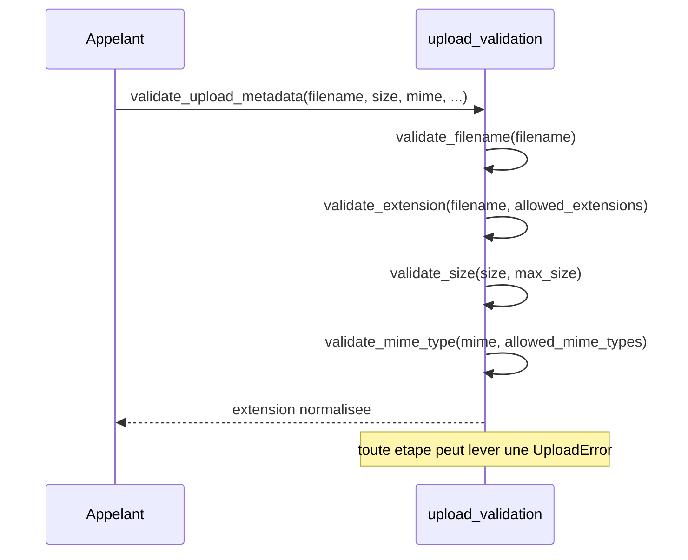

# La validation d'upload dans Forge

Ce document explique la validation pure des métadonnées d'un fichier téléversé, pourquoi elle reste dans le cœur, et quelles fonctions elle expose.

## 1. Rôle

Ce module valide les métadonnées d'un fichier téléversé : nom, extension, taille, type MIME.

L'écriture et le stockage des uploads vivent dans l'opt-in `forge-mvc-files` (ADR-019), mais la validation pure reste dans le cœur.
Le cœur ne peut pas dépendre d'un opt-in (ADR-004), et `core/forms` (`FileField`) a besoin de ces contrôles : ils sont donc maintenus ici.

Ce sont des fonctions pures, sans aucune écriture disque.
L'opt-in d'upload les réutilise avant d'écrire le fichier.

Le module fournit aussi une vérification des magic bytes : il refuse un fichier dont la signature réelle ne correspond pas à l'extension annoncée, par exemple un contenu HTML nommé `.png` (SEC-UPLOAD-MIME-MAGIC-001).

## 2. Vue d'ensemble rapide

| Élément | Valeur |
|---|---|
| Module | `core.forms.upload_validation` |
| Couche | Formulaires (cœur) |
| Rôle | valider extension, taille, type MIME et signature d'un fichier |
| Nature | fonctions pures, sans I/O |
| Dépend de | les exceptions d'upload (`UploadError` et dérivées) |
| Exceptions levées | `UploadInvalidExtensionError`, `UploadTooLargeError`, `UploadInvalidMimeTypeError`, `UploadStorageError` |
| Réutilisé par | `FileField` (cœur) et l'opt-in `forge-mvc-files` |

## 3. Schéma UML

Le module est un ensemble de fonctions pures : un diagramme de séquence montre l'enchaînement de `validate_upload_metadata`.



À retenir :

- chaque contrôle est une fonction indépendante ;
- `validate_upload_metadata` les enchaîne et retourne l'extension normalisée ;
- toute étape peut lever une sous-classe d'`UploadError` ;
- la vérification des magic bytes est un contrôle léger, distinct du décodage d'image complet (qui reste côté `forge-mvc-images`).

## 4. API publique

| Fonction | Signature | Rôle |
|---|---|---|
| `normalize_extensions` | `normalize_extensions(extensions: Iterable[Any] \| None) -> set[str]` | normalise les extensions, en minuscules, sans point |
| `filename_extension` | `filename_extension(filename: str) -> str` | extrait l'extension d'un nom de fichier |
| `validate_filename` | `validate_filename(filename: str \| None) -> str` | refuse un nom vide, retourne le nom nettoyé |
| `validate_extension` | `validate_extension(filename: str, allowed_extensions: Iterable[Any] \| None) -> str` | valide l'extension contre la liste autorisée |
| `validate_size` | `validate_size(size: int, max_size: int) -> None` | refuse une taille négative ou au-delà de la limite |
| `validate_mime_type` | `validate_mime_type(mime_type: str \| None, allowed_mime_types: Iterable[Any] \| None) -> None` | valide le type MIME contre la liste autorisée |
| `validate_upload_metadata` | `validate_upload_metadata(*, filename, size, mime_type, allowed_extensions, allowed_mime_types, max_size) -> str` | valide l'ensemble et retourne l'extension normalisée |
| `sniff_content_type` | `sniff_content_type(content: bytes) -> str \| None` | déduit le type logique réel d'après les magic bytes |
| `validate_magic_bytes` | `validate_magic_bytes(content: bytes, extension: str) -> None` | refuse un contenu incohérent avec l'extension annoncée |

## 5. Contextes d'utilisation

| Besoin | Élément |
|---|---|
| Valider un champ de fichier de formulaire | `validate_extension`, `validate_size`, `validate_mime_type` (via `FileField`) |
| Valider toutes les métadonnées d'un coup | `validate_upload_metadata` |
| Normaliser une liste d'extensions | `normalize_extensions` |
| Vérifier que le contenu correspond à l'extension | `validate_magic_bytes` |
| Identifier un type à partir du contenu | `sniff_content_type` |

## 6. Exemples d'utilisation

??? example "Valider les métadonnées d'un fichier"

    ```python
    from core.forms.upload_validation import validate_upload_metadata
    from core.forms.upload_exceptions import UploadError

    try:
        extension = validate_upload_metadata(
            filename="photo.png",
            size=240_000,
            mime_type="image/png",
            allowed_extensions=["png", "jpg"],
            allowed_mime_types=["image/png", "image/jpeg"],
            max_size=2 * 1024 * 1024,
        )
    except UploadError as exc:
        print(f"Upload refuse : {exc}")
    ```

??? example "Vérifier la signature réelle du contenu"

    `validate_magic_bytes` refuse un fichier dont les premiers octets ne correspondent pas à l'extension.

    ```python
    from core.forms.upload_validation import validate_magic_bytes
    from core.forms.upload_exceptions import UploadInvalidMimeTypeError

    content = b"<html>...</html>"
    try:
        validate_magic_bytes(content, extension="png")
    except UploadInvalidMimeTypeError as exc:
        print(f"Contenu incoherent : {exc}")
    ```

## 7. Sécurité

!!! warning "Extension et type MIME annoncés non fiables"
    L'extension et le `content_type` sont fournis par le client : ils ne sont pas dignes de confiance.

    Pour les types à signature connue (image, PDF), `validate_magic_bytes` vérifie les premiers octets du contenu réel et refuse un fichier qui ment sur son type.

!!! note "Type MIME absent refusé"
    Si une liste de types MIME autorisés est fournie mais que le fichier n'annonce aucun type, le fichier est refusé.

## Voir aussi

- [Les exceptions d'upload dans Forge](upload_exceptions.md) : la hiérarchie levée en cas de refus.
- [Les champs de formulaire dans Forge](fields.md) : `FileField` et `ImageField` s'appuient sur cette validation.
