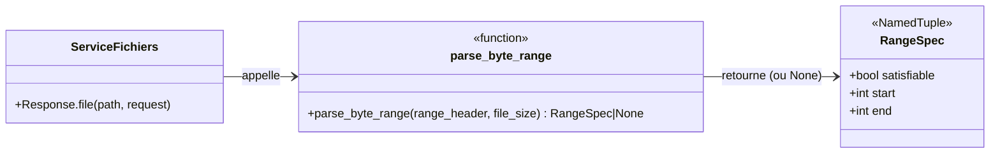
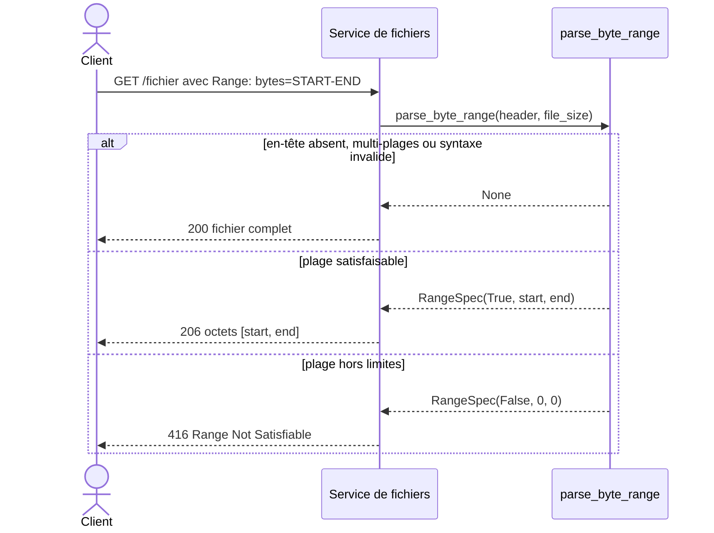

# L'en-tête Range dans Forge

Ce document explique l'en-tête HTTP `Range`, comment Forge le parse avec le module `core.http.byte_range`, et comment ce parsing alimente le service de fichiers en flux.

## 1. Rôle

`core.http.byte_range` parse l'en-tête HTTP `Range` envoyé par un client qui ne veut qu'une portion d'un fichier.

Un lecteur vidéo qui avance dans la piste, un gestionnaire de téléchargement qui reprend un transfert ou un lecteur audio qui se positionne envoient un en-tête `Range: bytes=...`.
Le module transforme cet en-tête en un intervalle d'octets exploitable, puis l'appelant sert la portion demandée avec un statut `206 Partial Content`.

Le module est volontairement minimal et explicite : il gère une seule plage d'octets.
Les requêtes multi-plages (`bytes=0-1,5-9`) ne sont pas servies en partiel : la fonction retourne `None` et l'appelant sert la ressource complète en `200`, ce qui reste conforme à la RFC 7233 (le serveur peut ignorer `Range`).

La fonction est pure : elle ne fait aucune entrée-sortie et prend la taille du fichier en argument, donc elle reste trivialement testable.

## 2. Vue d'ensemble rapide

| Élément | Valeur |
|---|---|
| Module | `core.http.byte_range` |
| Couche | HTTP |
| Rôle | parser l'en-tête `Range` en un intervalle d'octets |
| Type lié | `RangeSpec` (un `NamedTuple`) |
| API publique | `parse_byte_range`, `RangeSpec` |
| Pureté | fonction pure, sans entrée-sortie |
| Consommé par | le service de fichiers, sous-jacent à `Response.file` |
| Ticket d'origine | CORE-HTTP-FILE-RANGE-001 |

## 3. Schémas UML

### 3.1 Diagramme de classe

Le diagramme montre la fonction de parsing, son résultat `RangeSpec`, et l'appelant qui s'en sert pour servir un fichier.



À retenir :

- `parse_byte_range` est la seule fonction publique du module ;
- elle retourne un `RangeSpec`, ou `None` quand il faut servir tout le fichier ;
- `RangeSpec` porte trois champs : `satisfiable`, `start`, `end` (bornes incluses).

### 3.2 Diagramme de séquence

Le diagramme montre le déroulement d'une requête partielle.



À retenir :

- le client ne reçoit du partiel que pour une plage unique et satisfaisable ;
- une plage hors limites donne un `416` avec `Content-Range: bytes */SIZE` ;
- tout le reste (absence d'en-tête, multi-plages, syntaxe invalide) retombe sur un service complet en `200`.

## 4. API publique

| Élément | Signature | Rôle |
|---|---|---|
| `parse_byte_range` | `parse_byte_range(range_header: str | None, file_size: int) -> RangeSpec | None` | parse une plage d'octets unique |
| `RangeSpec` | `RangeSpec(satisfiable: bool, start: int, end: int)` | résultat du parsing : intervalle résolu, bornes incluses |

Valeurs de retour de `parse_byte_range` :

| Retour | Signification | Réponse attendue de l'appelant |
|---|---|---|
| `None` | en-tête absent, non géré, multi-plages ou syntaxe invalide | servir la ressource complète (`200`) |
| `RangeSpec(True, start, end)` | plage satisfaisable, bornes incluses | servir les octets `[start, end]` (`206`) |
| `RangeSpec(False, 0, 0)` | plage hors limites | répondre `416 Range Not Satisfiable` |

Formes de plage reconnues :

| Forme | Sens |
|---|---|
| `bytes=START-END` | de l'octet `START` à l'octet `END` (inclus) |
| `bytes=START-` | de l'octet `START` jusqu'à la fin du fichier |
| `bytes=-SUFFIX` | les `SUFFIX` derniers octets du fichier |

## 5. Contextes d'utilisation

| Besoin | Élément |
|---|---|
| Servir un fichier avec reprise et seek | `Response.file(path, request=request)` (consomme ce parsing) |
| Lecture média (vidéo, audio) en flux | `parse_byte_range(request.header("Range"), file_size)` |
| Parser un en-tête `Range` brut | `parse_byte_range(...)` |

## 6. Exemples d'utilisation

Parser un en-tête puis décider du service à rendre :

```python
from core.http.byte_range import parse_byte_range

file_size = 10_000
spec = parse_byte_range("bytes=0-1023", file_size)

if spec is None:
    # Pas de Range exploitable : servir tout le fichier (200).
    served = (0, file_size - 1)
elif not spec.satisfiable:
    # Plage hors limites : répondre 416.
    served = None
else:
    # Plage satisfaisable : servir [start, end] (206).
    served = (spec.start, spec.end)
```

Forme suffixe (les derniers octets) :

```python
from core.http.byte_range import parse_byte_range

spec = parse_byte_range("bytes=-500", file_size=10_000)
# RangeSpec(satisfiable=True, start=9500, end=9999)
```

!!! note "Bornes incluses"
    Les champs `start` et `end` de `RangeSpec` sont des bornes incluses.

    Une plage `bytes=0-1023` couvre 1024 octets : de l'octet 0 à l'octet 1023.

!!! tip "Toujours servir quelque chose"
    Quand le parsing retourne `None`, ce n'est pas une erreur.

    C'est le signal que l'appelant doit servir la ressource complète en `200`, conformément à la RFC 7233.

## Voir aussi

- [L'objet Response dans Forge](response.md) : `Response.file` consomme ce parsing.
- [L'objet Request dans Forge](request.md) : `request.header("Range")` fournit l'en-tête à parser.
