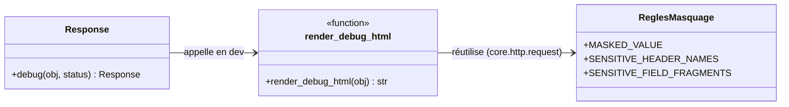
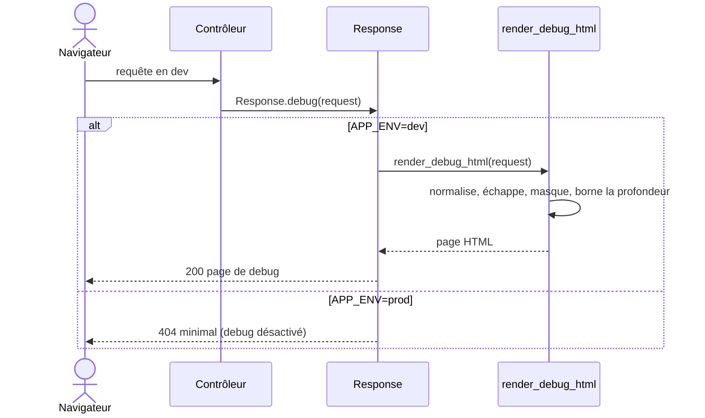

# L'inspection de debug dans Forge

Ce document explique le rendu HTML lisible d'un objet, comment Forge le produit avec le module `core.http.debug_dumper`, et comment il alimente `Response.debug`.

## 1. Rôle

`core.http.debug_dumper` produit une page HTML lisible et sûre à partir d'un objet quelconque.

En développement, on veut inspecter un objet, souvent la requête, sous une forme lisible.
Ce module rend cette vue HTML, employée par `Response.debug(obj)` quand l'application tourne en `APP_ENV=dev`.

Le rendu est volontairement simple, pédagogique et indépendant d'assets statiques : le CSS est inclus dans la page, aucun JavaScript n'est requis (les sections repliables utilisent l'élément natif `<details>`).

La normalisation suit trois priorités :

1. si l'objet possède une propriété `.data` exploitable (`dict`, `list`, `tuple` ou `set`), utiliser `obj.data` ;
2. sinon, si l'objet est un conteneur natif, rendre récursivement ;
3. sinon, afficher `type(obj).__name__` suivi de `repr(obj)`.

## 2. Vue d'ensemble rapide

| Élément | Valeur |
|---|---|
| Module | `core.http.debug_dumper` |
| Couche | HTTP |
| Rôle | rendre un objet en page HTML lisible et sûre |
| API publique | `render_debug_html` |
| Appelé par | `Response.debug(obj)` en `APP_ENV=dev` |
| Masquage | mêmes règles que `request.data` (valeurs sensibles remplacées par `[masked]`) |
| Profondeur maximale | `MAX_DEPTH = 5` |
| Ticket d'origine | DX-DEBUG-DUMP-HTML-001 |

## 3. Schémas UML

### 3.1 Diagramme de classe

Le diagramme montre la fonction publique, sa relation avec `Response.debug`, et la dépendance aux règles de masquage partagées avec `Request`.



À retenir :

- `render_debug_html` est la seule fonction publique du module ;
- `Response.debug` ne l'appelle qu'en `APP_ENV=dev` (en production, la réponse est refusée) ;
- les règles de masquage viennent de `core.http.request`, comme pour `request.data`.

### 3.2 Diagramme de séquence

Le diagramme montre comment une inspection est produite depuis un contrôleur.



À retenir :

- l'inspection est réservée au développement ;
- le dumper échappe les chaînes, masque les valeurs sensibles, borne la profondeur et détecte les cycles ;
- en production, `Response.debug` renvoie une réponse minimale sans appeler le dumper.

## 4. API publique

| Élément | Signature | Rôle |
|---|---|---|
| `render_debug_html` | `render_debug_html(obj: Any) -> str` | rend `obj` en page HTML lisible et sûre |

Garanties du rendu :

- toutes les chaînes (clés et valeurs) sont échappées via `html.escape` ;
- les clés sensibles (`Authorization`, `Cookie`, `password`, `csrf`, `token`, `api_key`, ...) sont remplacées par `[masked]` ;
- la récursion est bornée par `MAX_DEPTH` (affiche `<max depth reached>` au-delà) ;
- les références circulaires sont détectées (affiche `<cycle detected>`).

## 5. Contextes d'utilisation

| Besoin | Élément |
|---|---|
| Inspecter la requête en développement | `Response.debug(request)` dans une vue |
| Inspecter un objet quelconque | `Response.debug(objet)` |
| Obtenir directement le HTML d'inspection | `render_debug_html(objet)` |

## 6. Exemples d'utilisation

Usage courant via `Response.debug` dans un contrôleur :

```python
from core.http.request import Request
from core.http.response import Response


def debug(request: Request) -> Response:
    return Response.debug(request)
```

Obtenir directement la chaîne HTML, sans passer par `Response` :

```python
from core.http.debug_dumper import render_debug_html

page = render_debug_html({"name": "Lea", "token": "abc123"})
# La clé "token" est rendue masquée : [masked]
```

!!! note "Le dumper rend ce qu'on lui donne"
    Côté requête, `request.data` masque déjà les valeurs sensibles en amont.

    Le dumper applique en plus ses propres règles de masquage sur les clés sensibles qu'il rencontre, mais il reste une vue d'inspection, pas le format HTTP brut.

!!! warning "Réservé au développement"
    `render_debug_html` produit une page lisible destinée au mode développement.

    En production, `Response.debug` refuse de l'appeler et renvoie une réponse minimale.

## Voir aussi

- [L'objet Request dans Forge](request.md) : `request.data`, la vue sûre inspectée.
- [L'objet Response dans Forge](response.md) : `Response.debug`, qui appelle ce rendu.
