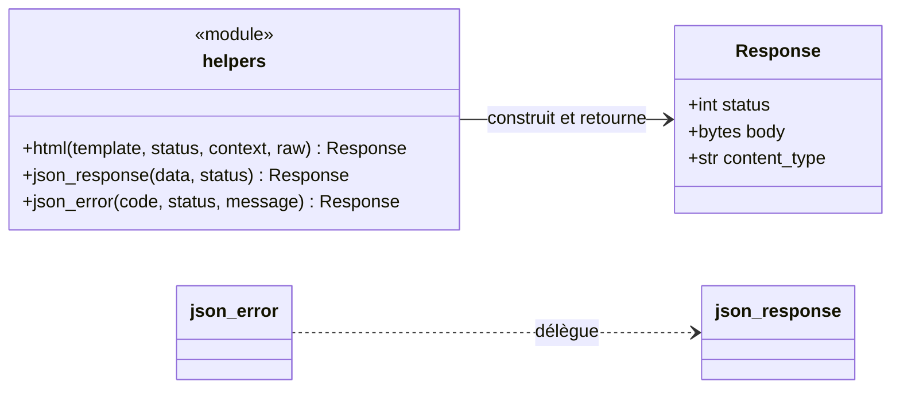

# Les helpers de réponse dans Forge

Ce document explique les fonctions raccourcies du module `core.http.helpers`, qui construisent les réponses HTTP les plus fréquentes : gabarit HTML, JSON, enveloppe d'API.

## 1. Rôle

`core.http.helpers` fournit des raccourcis pour construire une `Response` dans les cas courants.

Construire une `Response` à la main est répétitif pour les cas fréquents : rendre un gabarit, renvoyer du JSON, répondre une API.
Ces helpers raccourcissent ces cas tout en restant explicites : chacun retourne un objet `Response` prêt à être renvoyé par le contrôleur.

Le helper `html(...)` ajoute une garde utile : son deuxième argument positionnel est le statut HTTP, pas le contexte.
Passer un dictionnaire en deuxième position lève une `TypeError` claire, au lieu d'une erreur différée et obscure.

## 2. Vue d'ensemble rapide

| Élément | Valeur |
|---|---|
| Module | `core.http.helpers` |
| Couche | HTTP |
| Rôle | construire les réponses HTTP courantes |
| Objet produit | `Response` |
| API publique | `html`, `json_response`, `json_error` |
| Exception liée | `TypeError` si le 2e argument de `html()` n'est pas un entier ; `ValueError` si les données JSON ne sont pas sérialisables |
| Dépend de | `core.templating` (rendu des gabarits), `core.forge` (lecture de `app_env` et `views_dir`) |

## 3. Schémas UML

### 3.1 Diagramme de classe

Le diagramme montre les quatre helpers et l'objet `Response` qu'ils produisent tous.



À retenir :

- les quatre helpers retournent tous un `Response` ;
- `json_error` délègue à `json_response` ;
- `html(...)` rend un gabarit, `json_response(...)` sérialise des données brutes.

## 4. API publique

| Élément | Signature | Rôle |
|---|---|---|
| `html` | `html(template: str, status: int = 200, context: dict[str, Any] | None = None, *, raw: bool = False) -> Response` | rend un gabarit en `Response` HTML |
| `json_response` | `json_response(data: Any, status: int = 200) -> Response` | renvoie `data` sérialisé en JSON |
| `json_error` | `json_error(code: str, status: int, *, message: str | None = None) -> Response` | réponse d'erreur d'API, forme unique (ADR-088) |

Forme des enveloppes d'API :

| Helper | Corps JSON produit |
|---|---|
| `json_error` | `{"error": "<code>"}`, plus `"message"` s'il est fourni |

`json_error` est la **seule** fabrique de réponse d'erreur JSON du dépôt, et un garde-fou l'exige (ADR-088).
Une réponse de succès n'a pas d'enveloppe en regard : elle rend la ressource, le code HTTP portant déjà l'information de succès.
Les clients d'API trouvent ainsi toujours la même forme : un drapeau `success`, des données ou un bloc d'erreur structuré.

## 5. Contextes d'utilisation

| Besoin | Élément |
|---|---|
| Rendre une vue HTML | `html(template, context=...)` |
| Renvoyer du JSON brut | `json_response(...)` |
| Répondre un succès d'API | `json_response(...)`, qui rend la ressource |
| Répondre une erreur d'API | `json_error(code, status)` |

## 6. Exemples d'utilisation

```python
from core.http.helpers import html, json_error, json_response


def page(request):
    return html("article/index.html", context={"articles": rows})


def feed(request):
    return json_response({"items": rows})


def api(request):
    return json_response({"rows": rows, "total": len(rows)})


def api_invalid(request):
    return json_error("validation_error", 422, message="Champ manquant")
```

!!! warning "Le 2e argument de html() est le statut"
    `html(template, {...})` ne passe pas un contexte : le deuxième argument positionnel est le statut HTTP.

    Passez toujours le contexte par mot-clé : `html(template, context={...})`.
    Le helper lève une `TypeError` explicite si le deuxième argument n'est pas un entier.

!!! warning "Données JSON sérialisables"
    `json_response(...)` lève `ValueError` si les données ne sont pas sérialisables en JSON.

    Convertissez vos objets (dates, décimaux) avant de les passer.

## Voir aussi

- [L'objet Response dans Forge](response.md) : ce que ces helpers construisent.
- [L'objet Request dans Forge](request.md) : l'entrée de l'échange HTTP.
