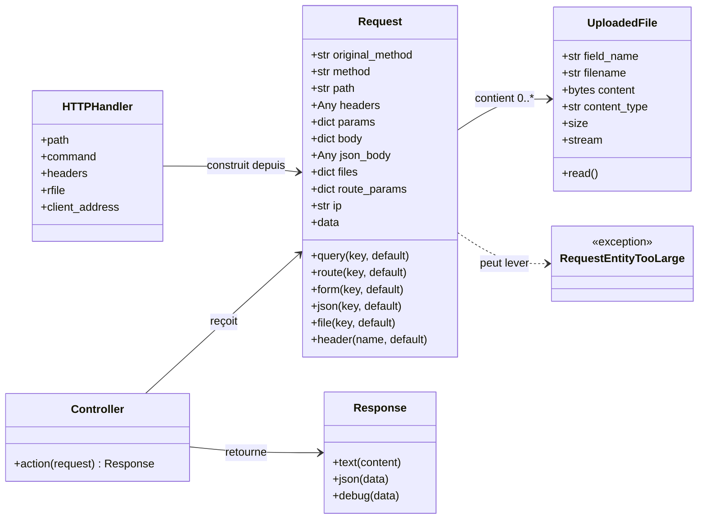
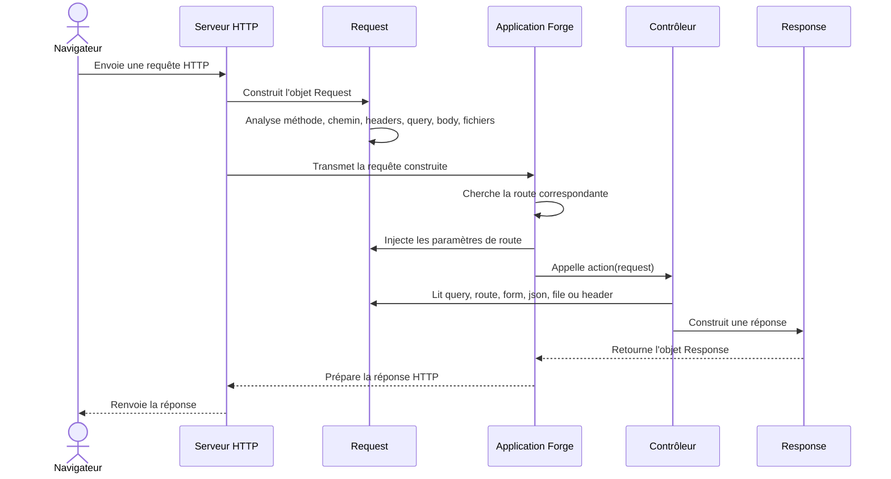

# L'objet Request dans Forge

Ce document explique ce qu'est une requête HTTP, comment Forge la représente avec l'objet `Request`, comment cette classe se situe dans l'architecture du framework, et comment la lire dans un contrôleur.

Cette page sert aussi de modèle de formalisme pour documenter les classes importantes de Forge : rôle, vue d'ensemble, schémas UML, API publique, exemples, détails techniques, sécurité et limites.

## 1. Rôle de la classe

`Request` représente une requête HTTP entrante dans Forge.

Quand un navigateur ouvre une page, envoie un formulaire, appelle une API ou téléverse un fichier, il envoie une requête au serveur.
Forge transforme cette requête en objet `Request`, puis transmet cet objet à l'action de contrôleur concernée.

Le contrôleur lit ensuite `Request` pour construire une `Response`.

```python
from core.http.request import Request
from core.http.response import Response


def hello(request: Request) -> Response:
    name = request.query("name", default="Forge")
    return Response.text(f"Bonjour {name}")
```

Vous ne créez jamais cet objet vous-même.
Forge le construit pour vous et vous le transmet au moment où l'action du contrôleur est appelée.

Votre rôle est de lire `Request` pour produire la réponse adaptée.

Une requête HTTP peut transporter :

* une **méthode**, par exemple `GET`, `POST`, `PUT`, `PATCH` ou `DELETE` ;
* un **chemin**, par exemple `/welcome/hello` ;
* des **paramètres d'URL**, par exemple `?name=Lea` ;
* des **en-têtes**, par exemple `Content-Type` ou `Cookie` ;
* parfois un **corps**, par exemple les champs d'un formulaire, un document JSON ou un fichier envoyé.

Le parcours complet de la requête est détaillé dans les schémas UML du chapitre suivant.


## 2. Vue d'ensemble rapide

| Élément | Valeur |
|---|---|
| Classe | `Request` |
| Module | `core.http.request` |
| Couche | HTTP |
| Rôle | représenter une requête HTTP entrante |
| Créée par | Forge, à partir de la requête reçue par le serveur HTTP |
| Reçue par | les actions de contrôleur |
| Utilisée avec | `Response` |
| Usage principal | lire les données envoyées par le client |
| Objet lié important | `UploadedFile` pour les fichiers téléversés |
| Exception liée | `RequestEntityTooLarge` si le corps HTTP dépasse la taille autorisée |

`Request` est une classe de frontière : elle se trouve entre le monde HTTP reçu par le serveur et le code applicatif écrit dans les contrôleurs.

## 3. Schémas UML de Request

Les deux schémas suivants montrent deux vues complémentaires de `Request`.

Le diagramme de classe montre les objets liés à `Request`.

Le diagramme de séquence montre le déroulement d'une requête jusqu'à la réponse.

### 3.1 Diagramme de classe

Le diagramme de classe montre la place de `Request` dans les objets manipulés par Forge.

Il permet de voir que `Request` est construit à partir de la requête HTTP reçue, qu'il peut contenir des fichiers `UploadedFile`, et qu'il est transmis au contrôleur.
Le contrôleur ne crée pas `Request` : il le reçoit déjà prêt à être lu.



À retenir :

- `Request` représente la requête entrante ;
- `UploadedFile` représente un fichier reçu dans un formulaire ;
- `RequestEntityTooLarge` signale un corps HTTP trop volumineux ;
- le contrôleur reçoit `Request` et retourne une `Response`.

### 3.2 Diagramme de séquence

Le diagramme de séquence montre l'ordre des opérations.

Il permet de comprendre le parcours d'une requête : le navigateur envoie une requête HTTP, Forge construit un objet `Request`, cherche la route, appelle le contrôleur, puis renvoie une `Response`.



À retenir :

- le navigateur ne manipule jamais directement `Request` ;
- Forge construit `Request` avant d'appeler le contrôleur ;
- les paramètres de route sont injectés avant l'appel de l'action ;
- le contrôleur lit `Request`, puis construit une `Response`.

## 4. Accesseurs publics

Forge expose la requête avec des **accesseurs**.

Un accesseur est une méthode prévue pour lire une donnée dans l'objet `Request`, sans manipuler directement ses attributs internes.

Le nom de l'accesseur indique la source de la donnée.

| Source | Accesseur | Exemple |
|---|---|---|
| Paramètre d'URL | `request.query(...)` | `/hello?name=Lea` |
| Segment dynamique de route | `request.route(...)` | `/article/42` |
| En-tête HTTP | `request.header(...)` | `Content-Type` |
| Champ de formulaire | `request.form(...)` | `title=Bonjour+Forge` |
| Corps JSON | `request.json(...)` | `{ "name": "Lea" }` |
| Fichier téléversé | `request.file(...)` | champ `avatar` |

Au lieu d'accéder directement à la structure interne :

```python
request.params["name"][0]
```

on utilise l'accesseur prévu :

```python
request.query("name")
```

C'est plus lisible, plus stable, et plus clair sur l'origine de la donnée.

### Valeur par défaut

Chaque accesseur accepte une valeur `default`.

Si la donnée est absente, Forge renvoie cette valeur de repli.

```python
request.query("name", default="Forge")   # /hello?name=Lea  -> "Lea"
request.query("name", default="Forge")   # /hello           -> "Forge"
```

Sans `default`, les accesseurs peuvent renvoyer `None` si la donnée est absente.

```python
name = request.query("name")

if name is None:
    return Response.text("Nom manquant")
```

!!! tip "Aide-mémoire"
    Six accesseurs, six sources :

    - `query` lit l'URL après `?` ;
    - `route` lit les segments dynamiques de route ;
    - `form` lit les champs de formulaire présents dans le corps HTTP ;
    - `json` lit un corps JSON si celui-ci contient un objet ;
    - `header` lit les en-têtes HTTP ;
    - `file` lit les fichiers téléversés.

## 5. Contextes d'utilisation

| Besoin | Accesseur |
|---|---|
| Lire une valeur dans l'URL | `request.query(...)` |
| Lire un segment dynamique | `request.route(...)` |
| Lire un champ de formulaire | `request.form(...)` |
| Lire un corps JSON | `request.json(...)` |
| Lire un fichier téléversé | `request.file(...)` |
| Lire un en-tête HTTP | `request.header(...)` |
| Inspecter la requête | `request.data` ou `Response.debug(request)` |

Cette table donne la règle pratique : on choisit l'accesseur selon l'endroit où la donnée a été envoyée.

## 6. Exemples d'utilisation

Les exemples suivants montrent les usages les plus fréquents de `Request` dans un contrôleur Forge.

Ils sont repliables pour garder une vision générale de la page.

??? example "Lire un paramètre d'URL avec request.query(...)"

    Requête appelée dans le navigateur :

    ```text
    /welcome/hello?name=Lea
    ```

    Contrôleur :

    ```python
    from core.http.request import Request
    from core.http.response import Response


    def hello(request: Request) -> Response:
        name = request.query("name", default="Forge")
        return Response.text(f"Bonjour {name}")
    ```

    Résultat :

    ```text
    Bonjour Lea
    ```

    Si le paramètre `name` est absent :

    ```text
    /welcome/hello
    ```

    Forge utilise la valeur par défaut :

    ```text
    Bonjour Forge
    ```

??? example "Lire un segment de route avec request.route(...)"

    Une route peut contenir un segment dynamique :

    ```python
    router.get("/article/{id}", ArticleController.show)
    ```

    Dans le contrôleur, ce segment est lu avec `request.route(...)`.

    ```python
    from core.http.request import Request
    from core.http.response import Response


    def show(request: Request) -> Response:
        article_id = request.route("id", default="0")
        return Response.text(f"Article demandé : {article_id}")
    ```

    Pour l'URL suivante :

    ```text
    /article/42
    ```

    Forge renvoie :

    ```text
    Article demandé : 42
    ```

??? example "Lire un formulaire avec request.form(...)"

    Un formulaire HTML envoie ses champs dans le corps de la requête.

    ```html
    <form method="post" action="/contact">
        <input type="text" name="subject">
        <button type="submit">Envoyer</button>
    </form>
    ```

    Dans Forge, un champ de formulaire se lit avec `request.form(...)`.

    ```python
    from core.http.request import Request
    from core.http.response import Response


    def contact(request: Request) -> Response:
        subject = request.form("subject", default="")
        return Response.text(f"Sujet reçu : {subject}")
    ```

    `request.form(...)` lit les champs de formulaire envoyés dans le corps HTTP, en `application/x-www-form-urlencoded` ou en `multipart/form-data`.

    Dans l'usage courant, ces données viennent d'un formulaire `POST`.

??? example "Lire un corps JSON avec request.json(...)"

    Pour une API, le client peut envoyer un corps JSON.

    Exemple de corps reçu :

    ```json
    {
      "name": "Lea",
      "role": "admin"
    }
    ```

    Dans Forge, une valeur JSON se lit avec `request.json(...)`.

    ```python
    from core.http.request import Request
    from core.http.response import Response


    def api_create(request: Request) -> Response:
        name = request.json("name", default="Forge")
        return Response.text(f"Nom reçu : {name}")
    ```

    Si le corps JSON est vide, invalide ou si la clé demandée n'existe pas, Forge renvoie la valeur `default`.

    !!! note "Corps JSON"
        `request.json(...)` lit une clé dans un corps JSON de type objet.

        Si le JSON reçu est une liste, une chaîne ou une valeur isolée, l'accesseur renvoie `default`.

??? example "Lire un fichier téléversé avec request.file(...)"

    Un formulaire peut envoyer un fichier avec `multipart/form-data`.

    ```html
    <form method="post" action="/profile/avatar" enctype="multipart/form-data">
        <input type="file" name="avatar">
        <button type="submit">Envoyer</button>
    </form>
    ```

    Dans Forge, un fichier se lit avec `request.file(...)`.

    ```python
    from core.http.request import Request
    from core.http.response import Response


    def avatar(request: Request) -> Response:
        upload = request.file("avatar")

        if upload is None:
            return Response.text("Aucun fichier reçu")

        return Response.text(f"Fichier reçu : {upload.filename} ({upload.size} octets)")
    ```

    `request.file(...)` renvoie un objet `UploadedFile` ou `None`.

    Pour un champ multi-fichiers (`<input type="file" name="photos" multiple>`), utilisez `request.files_list("photos")` qui renvoie la liste de tous les fichiers reçus (liste vide si aucun). `request.file(...)` et `request.files` restent focalisés sur le cas mono et renvoient le premier fichier du champ.

    | Propriété ou méthode | Rôle |
    |---|---|
    | `field_name` | nom du champ de formulaire |
    | `filename` | nom du fichier envoyé |
    | `content_type` | type MIME annoncé |
    | `size` | taille du fichier en octets |
    | `read()` | contenu binaire du fichier |
    | `stream` | flux `BytesIO` exploitable par du code Python |

    !!! warning "Sécurité des fichiers"
        Le nom du fichier envoyé par le navigateur ne doit jamais être utilisé directement comme chemin de stockage.

        Une application doit toujours contrôler le nom, le type, la taille et l'emplacement final du fichier.

## 7. Anatomie d'une requête Forge

Une même requête circule sur le réseau.
Forge la découpe et expose chaque morceau par un accesseur dédié.

Exemple de requête :

```text
POST /article/42?draft=1 HTTP/1.1
Content-Type: application/x-www-form-urlencoded

title=Bonjour+Forge&_method=DELETE
```

Lecture dans Forge :

| Segment reçu | Accesseur ou attribut | Valeur lue |
|---|---|---|
| `POST` | `request.original_method` | `POST` |
| `/article/42` | `request.route("id")` | `42` |
| `?draft=1` | `request.query("draft")` | `1` |
| `Content-Type: ...` | `request.header("Content-Type")` | l'en-tête reçu |
| `title=Bonjour+Forge` | `request.form("title")` | `Bonjour Forge` |
| `_method=DELETE` | `request.method` | `DELETE` |

`original_method` garde le verbe réellement reçu.

`method` contient le verbe effectif utilisé par Forge après éventuelle surcharge.

## 8. Détails techniques

Les détails techniques suivants sont utiles pour comprendre le fonctionnement interne de `Request`.

Ils sont repliables pour ne pas alourdir la lecture principale.

??? info "Attributs bruts de Request"

    En pratique, on lit la requête avec les accesseurs.

    Les attributs bruts existent, mais ils sont plus proches du format interne utilisé par Forge.

    | Attribut | Type | Contenu | Accesseur conseillé |
    |---|---|---|---|
    | `method` | `str` | méthode effective, après éventuelle surcharge `_method` | — |
    | `original_method` | `str` | méthode réellement reçue par le serveur | — |
    | `path` | `str` | chemin demandé, sans query string | — |
    | `params` | `dict[str, list[str]]` | paramètres d'URL bruts | `request.query(...)` |
    | `route_params` | `dict[str, str]` | segments dynamiques injectés par le routeur | `request.route(...)` |
    | `headers` | `HTTPMessage` | en-têtes HTTP | `request.header(...)` |
    | `body` | `dict[str, list[str]]` | champs de formulaire bruts | `request.form(...)` |
    | `json_body` | `Any` | corps JSON décodé | `request.json(...)` |
    | `files` | `dict[str, UploadedFile]` | fichiers téléversés | `request.file(...)` |
    | `ip` | `str` | adresse IP client résolue | — |

    Les attributs `params` et `body` conservent des listes de valeurs.

    Les accesseurs `query(...)` et `form(...)` renvoient seulement la première valeur, ce qui suffit pour la majorité des formulaires et des paramètres d'URL.

??? info "Inspection avec request.data"

    La propriété `request.data` renvoie une vue lisible de la requête.

    Elle est utile pour comprendre ce que Forge a reçu.

    ```python
    from core.http.request import Request
    from core.http.response import Response


    def debug(request: Request) -> Response:
        return Response.debug(request)
    ```

    Cette vue masque les valeurs sensibles, par exemple :

    - `Authorization` ;
    - `Cookie` ;
    - `password` ;
    - `secret` ;
    - `token` ;
    - `csrf` ;
    - `api_key`.

    Le contenu binaire des fichiers téléversés n'est jamais inclus dans `request.data`.

    Seules les métadonnées des fichiers sont affichées :

    - nom du fichier ;
    - taille ;
    - type de contenu.

    !!! note "Vue de debug"
        `request.data` est une vue publique stable, pensée pour le debug et la pédagogie.

        Elle ne représente pas exactement le format HTTP brut reçu sur le réseau.

??? warning "Taille maximale du corps HTTP"

    Forge limite la taille du corps HTTP pour éviter les requêtes trop lourdes.

    Pour les requêtes classiques, la limite interne est de 1 Mo.

    Pour les uploads `multipart/form-data`, Forge tient compte de la configuration `upload_max_size` et ajoute une marge technique pour l'encodage du formulaire.

    Si le corps dépasse la limite autorisée, Forge lève une exception `RequestEntityTooLarge`.

    L'application doit éviter d'accepter des corps trop volumineux sans contrôle.

??? info "Résolution de l'adresse IP client"

    `Request.ip` contient l'adresse IP client résolue par Forge.

    Par défaut, Forge utilise l'adresse observée par le serveur HTTP.

    Si l'application est derrière un proxy de confiance, Forge peut tenir compte de l'en-tête `X-Real-IP`, mais seulement si l'adresse du proxy figure dans la configuration `trusted_proxies`.

    Cette règle évite qu'un client direct puisse usurper son adresse IP en envoyant lui-même un faux en-tête `X-Real-IP`.

## 9. Sujet avancé : surcharge de méthode

??? warning "Surcharge de méthode avec _method"

    Cette section concerne les API REST desservies depuis un formulaire HTML.

    Le tutoriel `welcome-forge` n'en a pas besoin.
    Il peut supprimer une donnée par une vraie route `POST`, par exemple `POST /note/delete/{id}`.

    Un formulaire HTML ne sait envoyer directement que deux verbes : `GET` et `POST`.

    Il ne peut pas envoyer directement un `PUT`, un `PATCH` ou un `DELETE`.

    Pour contourner cette limite, Forge accepte une surcharge de méthode.

    Le formulaire envoie un vrai `POST`, puis ajoute un champ caché `_method` avec le verbe voulu.

    ```html
    <form method="post" action="/article/42">
        <input type="hidden" name="_method" value="DELETE">
        <button type="submit">Supprimer</button>
    </form>
    ```

    Forge lit alors deux informations :

    | Attribut | Valeur | Signification |
    |---|---|---|
    | `original_method` | `POST` | verbe réellement reçu |
    | `method` | `DELETE` | verbe effectif utilisé par Forge |

    La surcharge est appliquée avant le routage.

    Cela permet à Forge de router la requête comme un `DELETE`, tout en gardant la trace du vrai `POST` reçu par le serveur.

    Règles strictes :

    - la surcharge ne s'applique que si la requête réelle est un `POST` ;
    - les seules cibles acceptées sont `PUT`, `PATCH` et `DELETE` ;
    - toute autre valeur de `_method` est ignorée ;
    - `original_method` reste figé et garde le verbe reçu sur le réseau ;
    - dans Forge, `_method` est lu depuis les champs de formulaire, pas depuis un corps JSON.

    Cette règle évite qu'un simple lien `GET` ou un robot puisse déclencher une action d'écriture par surcharge de méthode.

## 10. Synthèse

`Request` est l'objet qui permet au contrôleur de lire la requête entrante.

À retenir :

| Question | Réponse |
|---|---|
| Qui crée `Request` ? | Forge |
| Qui reçoit `Request` ? | le contrôleur |
| À quoi sert `Request` ? | lire ce que le client a envoyé |
| Comment lit-on une donnée ? | avec un accesseur |
| Pourquoi ne pas lire directement les attributs ? | parce que les accesseurs sont plus lisibles et plus stables |
| Comment inspecter en développement ? | `request.data` ou `Response.debug(request)` |
| Que retourne le contrôleur ? | une `Response` |

Formule pratique :

```text
Le navigateur envoie une requête.
Forge construit Request.
Le contrôleur lit Request.
Le contrôleur retourne Response.
Forge renvoie la réponse au navigateur.
```

## Voir aussi

- [L'objet Response dans Forge](response.md) : l'autre moitié de l'échange HTTP.
- [La session HTTP dans Forge](../core-security/session.md) : la mémoire entre deux requêtes.
- [Convention d'inspection HTTP](../reference/http.md) : le masquage des valeurs sensibles.
