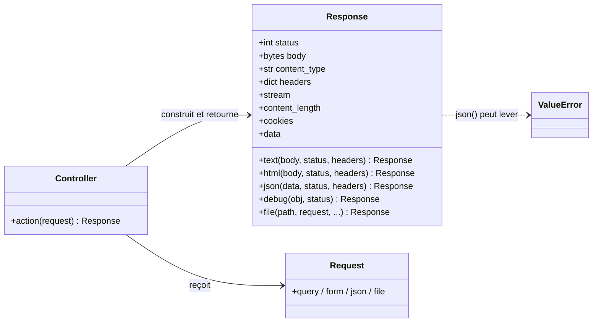
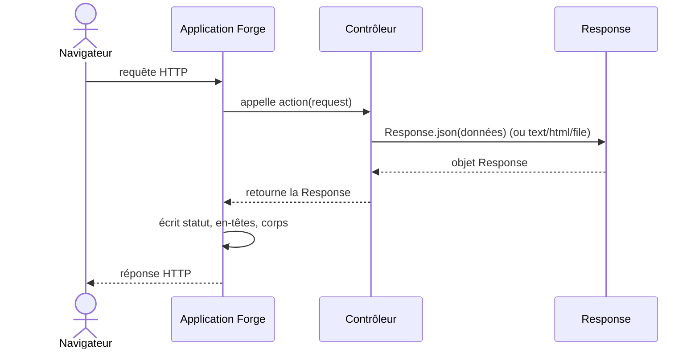

# L'objet Response dans Forge

Ce document explique ce qu'est une réponse HTTP, comment Forge la représente avec l'objet `Response`, ce qu'il contient et comment on le construit dans un contrôleur.

## 1. Rôle de la classe

Quand un contrôleur a fini son travail, il doit renvoyer quelque chose au navigateur : une page, du texte, du JSON, un fichier.

`Response` représente cette réponse HTTP sortante : un statut, un corps, un type de contenu et des en-têtes.

Vous construisez un `Response` (le plus souvent via un constructeur de commodité) et vous le retournez ; Forge l'écrit sur le réseau.

## 2. Vue d'ensemble rapide

| Élément | Valeur |
|---|---|
| Classe | `Response` |
| Module | `core.http.response` |
| Couche | HTTP |
| Rôle | représenter une réponse HTTP sortante |
| Construite par | le contrôleur (constructeurs `Response.text`, `.json`, `.file`...) |
| Retournée à | Forge, qui l'écrit sur le réseau |
| Utilisée avec | `Request` (l'autre moitié de l'échange) |
| Usage principal | renvoyer texte, HTML, JSON ou fichier au client |
| Inspection | `response.data` (vue masquée), `response.cookies` (noms seulement) |
| Exception liée | `ValueError` si `Response.json(...)` reçoit des données non sérialisables |

## 3. Schémas UML

Les deux schémas suivants montrent deux vues complémentaires de `Response`.

Le diagramme de classe montre les constructeurs et la place de `Response`.

Le diagramme de séquence montre comment une réponse est produite puis envoyée.

### 3.1 Diagramme de classe

Le diagramme de classe montre que le contrôleur construit une `Response` (souvent via un constructeur de commodité) et la retourne à Forge.



À retenir :

- `Response` porte statut, corps, type de contenu et en-têtes ;
- les constructeurs (`text`, `html`, `json`, `debug`, `file`) couvrent les cas courants ;
- le contrôleur reçoit `Request` et retourne `Response` ;
- `Response.json(...)` lève une erreur si les données ne sont pas sérialisables.

### 3.2 Diagramme de séquence

Le diagramme de séquence montre la construction d'une réponse jusqu'à son envoi.



À retenir :

- le contrôleur construit la réponse, il ne l'écrit pas lui-même ;
- Forge transforme l'objet `Response` en réponse HTTP réelle ;
- un fichier (`Response.file`) est envoyé en flux (téléchargements partiels possibles) ;
- rendre un gabarit passe par `BaseController.render(...)`, qui renvoie aussi un `Response`.

## 4. Les constructeurs

| Constructeur | Produit |
|---|---|
| `Response.text(corps)` | du texte brut (`text/plain`) |
| `Response.html(corps)` | du HTML (`text/html`) |
| `Response.json(données)` | du JSON (`application/json`) ; lève une erreur si non sérialisable |
| `Response.debug(objet)` | une page de debug lisible en développement, refusée en production |
| `Response.file(chemin)` | un fichier servi en flux (téléchargements partiels) |

Chaque constructeur accepte un `status` (défaut `200`) et des `headers` optionnels.

Pour rendre un **gabarit** (un fichier de vue), on n'utilise pas un constructeur de `Response` mais `BaseController.render(...)`, qui renvoie lui aussi un `Response` rempli avec le HTML produit.

## 5. Ce qu'il contient

| Attribut | Type | Contenu |
|---|---|---|
| `status` | `int` | le code de statut HTTP (défaut `200`) |
| `content_type` | `str` | le type du contenu, par exemple `text/html; charset=utf-8` |
| `body` | `bytes` | le corps de la réponse (encodé en UTF-8 si vous passez du texte) |
| `headers` | `dict` | les en-têtes additionnels, dont `Set-Cookie` |
| `stream` | itérable ou `None` | corps envoyé par morceaux (fichiers volumineux) ; `None` pour les réponses ordinaires |
| `content_length` | `int` ou `None` | taille en octets quand le corps est envoyé en flux |

Deux propriétés de lecture, utiles surtout pour l'inspection :

| Propriété | Type | Contenu |
|---|---|---|
| `cookies` | `list` | les **noms** des cookies posés (jamais leurs valeurs) |
| `data` | `dict` | une vue lisible et sûre de la réponse (valeurs sensibles masquées, sans le corps brut) |

## 6. Contextes d'utilisation

| Besoin | Élément |
|---|---|
| Répondre du texte | `Response.text(...)` |
| Rendre une page | `BaseController.render("vue.html", ...)` |
| Répondre du JSON (API) | `Response.json(...)` |
| Servir un fichier | `Response.file(...)` |
| Poser un cookie | écrire dans `response.headers["Set-Cookie"]` (voir la session) |
| Inspecter | `response.data` (vue masquée et sûre) |

## 7. Exemples d'utilisation

### 7.1 Texte et JSON

```python
from core.http.request import Request
from core.http.response import Response


def hello(request: Request) -> Response:
    return Response.text("Bonjour Forge")


def api(request: Request) -> Response:
    return Response.json({"ok": True})
```

### 7.2 Servir un fichier

```python
def download(request: Request) -> Response:
    return Response.file("storage/rapport.pdf", request=request)
```

En passant `request`, le service honore l'en-tête `Range` (téléchargement partiel).

!!! tip "Aide-mémoire"
    Un constructeur par usage :

    - `text` / `html` pour des réponses simples ;
    - `json` pour une API ;
    - `file` pour un fichier ;
    - `render(...)` (contrôleur) pour un gabarit.

!!! warning "Données JSON sérialisables"
    `Response.json(...)` lève `ValueError` si les données ne sont pas sérialisables en JSON.

    Convertissez vos objets (dates, décimaux) avant de les passer.

!!! note "Vue de debug sûre"
    `response.data` masque les valeurs sensibles et n'inclut jamais le corps brut.

    C'est une vue d'inspection, pas le format HTTP réel.

## Voir aussi

- [L'objet Request dans Forge](request.md) : l'autre moitié de l'échange HTTP.
- [Helpers de réponse (helpers.py)](helpers.md) : raccourcis de réponse.
- [En-tête Range (byte_range.py)](byte_range.md) : téléchargements partiels.
- [Inspection de debug (debug_dumper.py)](debug_dumper.md) : le masquage des valeurs sensibles.
