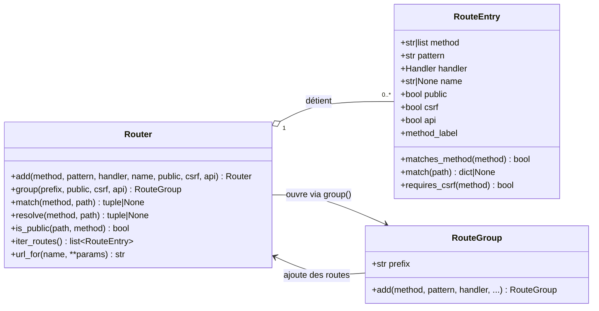
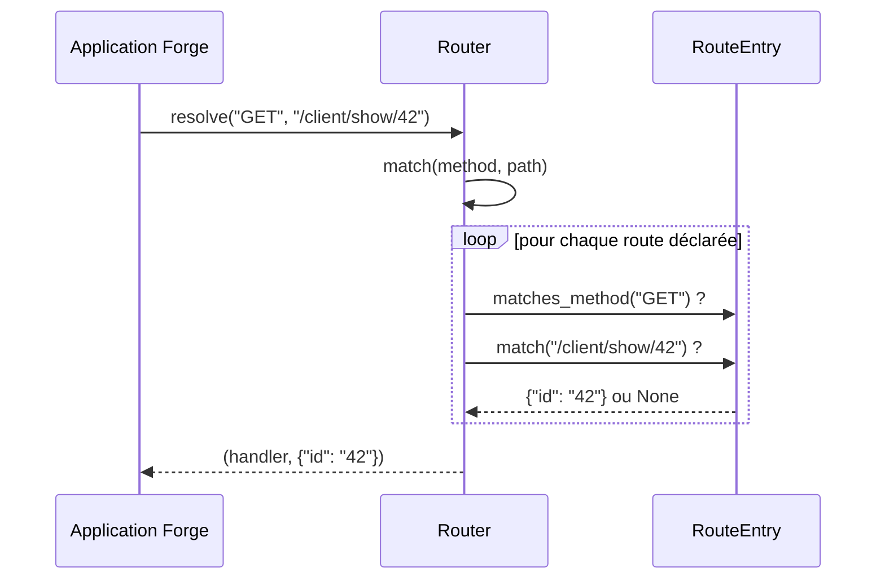

# Le routeur dans Forge

Ce document explique le routeur HTTP de Forge : déclarer des routes, les regrouper, les nommer et générer leurs URLs avec le module `core.http.router`.

## 1. Rôle

`core.http.router` associe une méthode HTTP et un chemin à un gestionnaire, c'est-à-dire l'action d'un contrôleur.

Le routeur compile chaque route en une expression régulière, capture les segments dynamiques (`/client/show/{id}`), et résout une requête entrante vers le bon gestionnaire.
Il permet aussi de regrouper des routes partageant des réglages communs (préfixe, accès public, protection CSRF, mode API) et de générer une URL depuis le nom d'une route.

La convention de route (ADR-029) est : chemin `/<contrôleur>/<méthode>` (l'index est le chemin nu), nom `<contrôleur>-<méthode>`.

### Règle de résolution

Quand plusieurs routes pourraient répondre au même chemin, Forge tranche ainsi.

1. Une route **statique** l'emporte sur une route **dynamique**, quel que soit l'ordre de déclaration.
2. Entre deux routes de même nature, la **première déclarée** gagne.

Une route est statique quand aucun de ses segments n'est un paramètre, c'est-à-dire un segment valant exactement `{mot}`.
Attention, `{id-x}` n'est **pas** un paramètre, le tiret n'appartenant pas aux caractères de mot : ce segment est littéral, donc la route reste statique.

!!! warning "Cette règle a changé"
    Jusqu'au ticket `ROUTER-STATIC-INDEX-001`, aucune règle n'était écrite et le résultat découlait de l'ordre de déclaration seul.

    ```python
    router.add("GET", "/client/{id}",  ClientController.show)
    router.add("GET", "/client/index", ClientController.index)
    ```

    L'ancien comportement résolvait `/client/index` vers `show`, avec `id="index"`.
    Le contrôleur recevait un identifiant nommé « index » et le développeur y lisait une erreur de base de données, jamais une erreur de routage.
    Le nouveau résout vers `index`, ce qui est presque toujours l'intention.

    Les générateurs de Forge ne produisent pas cette situation : sous l'ADR-029 le paramètre occupe le troisième segment (`/client/show/{id}`) tandis que les formes statiques en ont deux.
    Seule une route écrite à la main peut la déclencher.

## 2. Vue d'ensemble rapide

| Élément | Valeur |
|---|---|
| Module | `core.http.router` |
| Couche | HTTP |
| Rôle | associer méthode et chemin à un gestionnaire, résoudre les requêtes |
| Classes publiques | `Router`, `RouteGroup`, `RouteEntry` |
| Type lié | `Handler` (alias `Callable[..., Any]`) |
| Constantes liées | `SAFE_METHODS`, `UNSAFE_METHODS` |
| Exception liée | `TypeError` (handler non appelable), `ValueError` (nom de route en double), `KeyError` (route inconnue ou paramètre manquant dans `url_for`) |
| Convention | ADR-029 (chemin `/contrôleur/méthode`, nom `contrôleur-méthode`) |

## 3. Schémas UML

### 3.1 Diagramme de classe

Le diagramme montre les trois classes du module et leurs relations : le `Router` détient des `RouteEntry`, et un `RouteGroup` ajoute des routes au `Router` via un préfixe partagé.



À retenir :

- `Router` est le point d'entrée : il enregistre les routes et ouvre des groupes ;
- chaque route déclarée devient un `RouteEntry` compilé en expression régulière ;
- un `RouteGroup` factorise un préfixe et des réglages, puis délègue à `Router.add`.

### 3.2 Diagramme de séquence

Le diagramme montre la résolution d'une requête entrante vers un gestionnaire.



À retenir :

- `match` parcourt les routes dans l'ordre de déclaration et retourne la première qui correspond ;
- `resolve` renvoie le couple `(handler, params)` prêt à appeler ;
- les segments dynamiques capturés sont retournés sous forme de dictionnaire (vide pour une route statique).

## 4. API publique

### Router

| Élément | Signature | Rôle |
|---|---|---|
| `add` | `add(method: str | list[str], pattern: str, handler: Handler, *, name: str | None = None, public: bool = False, csrf: bool = True, api: bool = False) -> Router` | enregistre une route, retourne `self` pour le chaînage |
| `group` | `group(prefix: str, *, public: bool = False, csrf: bool = True, api: bool = False) -> RouteGroup` | ouvre un groupe partageant un préfixe et des réglages |
| `match` | `match(method: str, path: str) -> tuple[RouteEntry, dict[str, Any]] | None` | trouve l'entrée correspondante et ses paramètres |
| `resolve` | `resolve(method: str, path: str) -> tuple[Handler, dict[str, Any]] | None` | trouve le gestionnaire et ses paramètres |
| `is_public` | `is_public(path: str, method: str | None = None) -> bool` | indique si le chemin correspond à une route publique |
| `iter_routes` | `iter_routes() -> list[RouteEntry]` | retourne les routes dans l'ordre de déclaration |
| `url_for` | `url_for(name: str, **params: Any) -> str` | génère l'URL d'une route nommée (segments URL-encodés) |

### RouteGroup

| Élément | Signature | Rôle |
|---|---|---|
| `add` | `add(method: str | list[str], pattern: str, handler: Handler, *, name=None, public=None, csrf=None, api=None) -> RouteGroup` | ajoute une route héritant des réglages du groupe |

Un réglage laissé à `None` dans `RouteGroup.add` hérite de la valeur du groupe.

### RouteEntry

| Élément | Signature | Rôle |
|---|---|---|
| `RouteEntry` | `RouteEntry(method, pattern, handler, *, name=None, public=False, csrf=True, api=False)` | une route compilée (méthode(s), motif, gestionnaire, indicateurs) |
| `matches_method` | `matches_method(method: str) -> bool` | vrai si la route accepte cette méthode |
| `match` | `match(path: str) -> dict[str, Any] | None` | paramètres capturés, ou `None` si le chemin ne correspond pas |
| `requires_csrf` | `requires_csrf(method: str) -> bool` | vrai si la protection CSRF s'applique pour cette méthode |
| `method_label` | propriété | libellé lisible de la ou des méthodes, dans l'ordre de déclaration |
| `methods` | `frozenset[str]` | les méthodes acceptées, en majuscules, sans ordre |
| `is_static` | `bool` | vrai si aucun segment n'est un paramètre, ce qui décide de la règle de résolution |

Signification des indicateurs d'une route :

| Indicateur | Valeur par défaut | Rôle |
|---|---|---|
| `public` | `False` | route accessible sans authentification |
| `csrf` | `True` | protection CSRF exigée sur les méthodes non sûres |
| `api` | `False` | route d'API : les refus et erreurs du framework sont rendus en JSON, jamais en redirection ni en page HTML |

!!! info "Ce que fait exactement `api=True`"
    Le drapeau gouverne les réponses que **le framework** produit une fois la route trouvée.

    | Situation | Route ordinaire | Route `api=True` |
    |---|---|---|
    | Non authentifié | 302 vers `/login` | 401 `{"error": "unauthenticated"}` |
    | Refus explicite d'un middleware | statut conservé, page HTML | statut conservé, JSON |
    | Jeton CSRF invalide | 403 HTML | 403 `{"error": "forbidden"}` |
    | Base indisponible | 503 HTML | 503 `{"error": "service_unavailable"}` |
    | Erreur non gérée | 500 HTML, cause affichée en dev | 500 `{"error": "internal_error"}`, sans détail |

    Les en-têtes du refus sont conservés, cookies compris.
    C'est nécessaire : `AuthMiddleware` ferme la session quand il détecte une session orpheline (ADR-080), et perdre ce cookie laisserait la session ouverte.

    La cause d'une erreur non gérée n'est **jamais** exposée, même en `APP_ENV=dev`.
    Une page HTML est lue par un humain devant son navigateur, une réponse d'API part vers un client qui la journalise, la stocke ou la réexpose.
    La cause reste dans les journaux du serveur.

    **Limite assumée** : les 404 et 405 restent en HTML.
    Le drapeau appartient à une route, et sur ces deux cas aucune route n'a été trouvée : rien ne dit que le chemin visait une API.
    Servir une API sous un préfixe dédié n'y change rien, Forge ne devine pas l'intention d'un chemin inconnu.
| `name` | `None` | nom stable de la route (convention `contrôleur-méthode`) |

Motifs de chemin reconnus :

| Motif | Sens |
|---|---|
| `/clients` | route statique exacte |
| `/clients/{id}` | segment dynamique nommé |
| `/clients/{id}/edit` | segment dynamique en position intermédiaire |

## 5. Contextes d'utilisation

| Besoin | Élément |
|---|---|
| Déclarer les routes de l'application | `mvc/routes/`, un fichier par contrôleur, par groupes |
| Séparer routes publiques et protégées | `router.group(..., public=True)` |
| Ajouter les routes d'un opt-in | `register_<module>_routes(router)` |
| Résoudre une requête vers un gestionnaire | `router.resolve(method, path)` |
| Générer l'URL d'une route nommée | `router.url_for(name, **params)` |

## 6. Exemples d'utilisation

Déclarer des routes nommées et un groupe public :

```python
from core.http.router import Router

router = Router()

# Convention ADR-029 : chemin /<contrôleur>/<méthode>, nom <contrôleur>-<méthode>.
router.add("GET", "/", HomeController.index, name="home-index")
router.add("GET", "/client/show/{id}", ClientController.show, name="client-show")

with router.group("", public=True) as public:
    public.add("GET", "/login/form", LoginController.form, name="login-form")
    public.add("POST", "/login/login", LoginController.login, name="login-login")
```

Résoudre une requête et générer une URL :

```python
result = router.resolve("GET", "/client/show/42")
# (ClientController.show, {"id": "42"})

url = router.url_for("client-show", id=42)
# "/client/show/42"
```

!!! note "Validation à l'enregistrement"
    Un handler non appelable est rejeté dès `add`, avec une `TypeError` qui pointe la ligne fautive de `routes.py`.

    Un nom de route déjà utilisé lève une `ValueError`, ce qui évite les collisions silencieuses.

!!! tip "URL-encodage des segments"
    `url_for` encode chaque paramètre, y compris `/`, espace, `?` ou `#`.

    Un paramètre manquant lève une `KeyError` listant les segments non résolus.

## Voir aussi

- [L'objet Request dans Forge](request.md) : la requête routée et ses segments dynamiques.
- [Les helpers de réponse dans Forge](helpers.md) : produire la réponse d'un gestionnaire.
- [Les slugs d'URL dans Forge](slug.md) : produire des segments d'URL lisibles.
