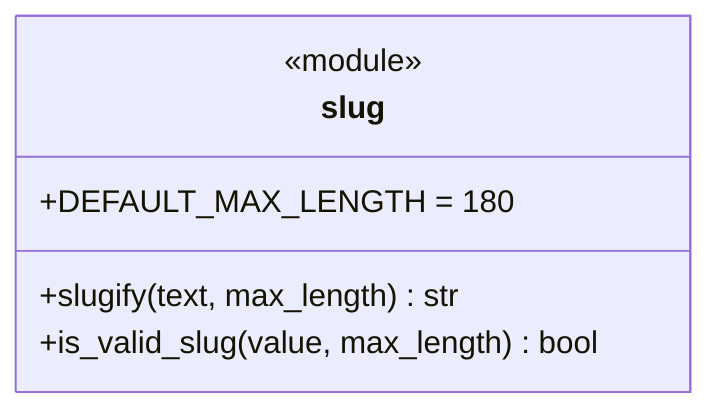

# Les slugs d'URL dans Forge

Ce document explique le module canonique de génération et de validation de slugs d'URL : `core.http.slug`.

## 1. Rôle

`core.http.slug` produit et valide des slugs d'URL en kebab-case.

Un slug d'URL est un identifiant URL-safe en kebab-case (`[a-z0-9-]`), destiné aux routes publiques (`/articles/premier-contact`).
Ce module est la seule implémentation officielle de Forge (charte §11, ADR-017) : `slugify` transforme un texte quelconque en slug, `is_valid_slug` valide un slug existant.

Les dépendances sont stdlib uniquement (`unicodedata`, `re`), au titre du runtime minimal de Forge : pas de `python-slugify` ni d'`unidecode`.

Ce module ne doit pas être confondu avec `cli.entities.migrations.slugify_migration_name`, qui produit des noms de fichiers de migration en snake_case (`_`), pas des URLs (ADR-017 D1).

## 2. Vue d'ensemble rapide

| Élément | Valeur |
|---|---|
| Module | `core.http.slug` |
| Couche | HTTP |
| Rôle | générer et valider des slugs d'URL kebab-case |
| API publique | `slugify`, `is_valid_slug` |
| Constante liée | `DEFAULT_MAX_LENGTH = 180` |
| Dépendances | `unicodedata`, `re` (stdlib uniquement) |
| Exception liée | `ValueError` si `slugify` ne peut produire aucun slug |
| Décision | ADR-017 (type `slug` et module canonique) |

## 3. Schémas UML

### 3.1 Diagramme de classe

Le module est un ensemble de deux fonctions pures et d'une constante.



À retenir :

- `slugify` transforme un texte libre en slug (peut lever `ValueError`) ;
- `is_valid_slug` valide un slug existant et renvoie un booléen ;
- la borne de longueur par défaut est `DEFAULT_MAX_LENGTH` (180).

## 4. API publique

| Élément | Signature | Rôle |
|---|---|---|
| `slugify` | `slugify(text: str, *, max_length: int = 180) -> str` | dérive un slug d'URL kebab-case depuis un texte libre |
| `is_valid_slug` | `is_valid_slug(value: str, *, max_length: int | None = 180) -> bool` | indique si `value` est un slug valide et path-safe |

Comportement de `slugify` :

- translittère les accents par décomposition NFKD (« Écrire » devient « ecrire ») ;
- insère un tiret aux frontières camelCase (« MaPage » devient « ma-page ») ;
- passe en minuscules, remplace toute suite hors `[a-z0-9]` par un tiret, compacte et retire les tirets de bordure ;
- borne la longueur à `max_length` ;
- le résultat est toujours path-safe (`../admin` devient `admin`) ;
- lève `ValueError` uniquement si le résultat est vide (aucun caractère exploitable).

Comportement de `is_valid_slug`, qui rejette :

- une valeur vide ;
- une longueur supérieure à `max_length` (sauf si `max_length=None`) ;
- la présence de `/`, `\` ou `..` ;
- tout ce qui n'est pas du kebab-case strict `[a-z0-9]+(?:-[a-z0-9]+)*` (majuscules, accents, espaces, tirets de bordure ou doublés).

## 5. Contextes d'utilisation

| Besoin | Élément |
|---|---|
| Générer un slug depuis un champ source d'entité (type `slug`) | `slugify(...)` |
| Produire un segment d'URL propre | `slugify(...)` |
| Valider un slug reçu (route, formulaire) | `is_valid_slug(...)` |
| Valider sans borne de longueur | `is_valid_slug(value, max_length=None)` |

## 6. Exemples d'utilisation

Générer et valider un slug :

```python
from core.http.slug import slugify, is_valid_slug

slugify("Bonjour le Monde !")     # "bonjour-le-monde"
slugify("Écrire un Article")      # "ecrire-un-article"
slugify("MaPage")                 # "ma-page"

is_valid_slug("bonjour-le-monde") # True
is_valid_slug("Bonjour Monde")    # False (majuscules et espace)
is_valid_slug("../admin")         # False (path traversal)
```

Idempotence : appliquer `slugify` deux fois donne le même résultat.

```python
from core.http.slug import slugify

once = slugify("Bonjour le Monde !")
slugify(once) == once   # True
```

!!! warning "Génération qui échoue"
    `slugify` lève `ValueError` si aucun caractère exploitable ne subsiste, par exemple sur un texte composé uniquement de ponctuation.

    Traitez ce cas quand l'entrée n'est pas garantie de produire un slug.

!!! note "Toujours path-safe"
    Le résultat de `slugify` ne contient jamais `/`, `\` ni `..`.

    `is_valid_slug` rejette ces mêmes éléments, ce qui protège les routes qui consomment un slug.

## Voir aussi

- [Le routeur dans Forge](router.md) : les motifs de route qui consomment les slugs.
