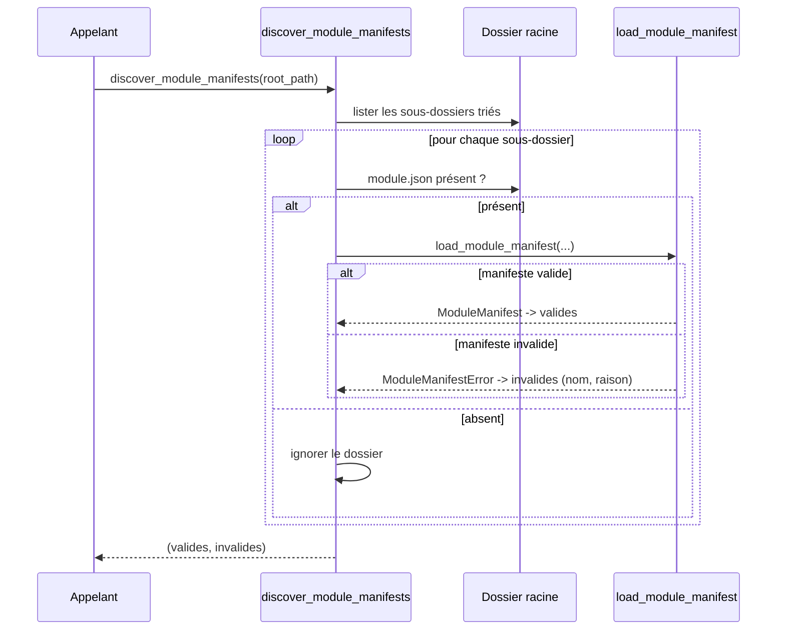

# La découverte de modules dans Forge

Avant d'installer ou de lister des modules, il faut les trouver.
Le sous-module `discovery` scanne un dossier local et y repère les manifestes valides.
Il sépare clairement les modules exploitables des dossiers dont le manifeste est invalide.

## 1. Rôle

`discovery` détecte les modules Forge présents dans un dossier.

Il parcourt les sous-dossiers directs d'une racine donnée, ne retient que ceux qui contiennent un fichier `module.json`, puis tente de charger chacun.
Les manifestes valides sont retournés comme objets `ModuleManifest`.
Les dossiers dont le manifeste est invalide sont retournés à part, avec la raison du rejet.

La découverte ne lève jamais d'exception sur un manifeste invalide : elle classe.
Une racine inexistante donne simplement deux listes vides.

## 2. Vue d'ensemble rapide

| Élément | Valeur |
|---|---|
| Module Python | `core.modules.discovery` |
| Couche | Système de modules (cœur) |
| Rôle | scanner un dossier et repérer les manifestes valides |
| Objet lié | `ModuleManifest` |
| Exception captée | `ModuleManifestError` (transformée en raison de rejet) |
| Dépend de | `core.modules.manifest` |
| Utilisé par | la CLI (`module:list`) et l'installation déclarative |

## 3. Schémas UML

### 3.1 Diagramme de séquence

Le diagramme montre le balayage d'une racine et le classement de chaque sous-dossier.



À retenir :

- seuls les sous-dossiers directs sont inspectés, pas la récursion profonde ;
- un dossier sans `module.json` est ignoré silencieusement ;
- un manifeste invalide n'interrompt pas le scan : il est rangé dans la liste des invalides.

## 4. API publique

| Fonction | Signature | Rôle |
|---|---|---|
| `discover_module_manifests` | `discover_module_manifests(root_path: str \| Path) -> tuple[list[ModuleManifest], list[tuple[str, str]]]` | retourne (modules valides, modules invalides) |
| `list_module_manifests` | `list_module_manifests(root_path: str \| Path) -> list[ModuleManifest]` | retourne seulement les manifestes valides |

La liste des modules invalides contient des paires `(nom_dossier, raison)`.

## 5. Contextes d'utilisation

| Besoin | Élément |
|---|---|
| Lister les modules installables d'un dossier | `list_module_manifests(root)` |
| Diagnostiquer les manifestes rejetés | `discover_module_manifests(root)` |
| Alimenter une commande `module:list` | `discover_module_manifests(root)` |

## 6. Exemples d'utilisation

Lister les modules valides d'un dossier :

```python
from core.modules.discovery import list_module_manifests

for manifest in list_module_manifests("modules"):
    print(manifest.name, manifest.version)
```

Distinguer les modules valides des dossiers invalides :

```python
from core.modules.discovery import discover_module_manifests

valides, invalides = discover_module_manifests("modules")

print(f"{len(valides)} module(s) valide(s)")
for nom, raison in invalides:
    print(f"rejeté : {nom} ({raison})")
```

## Voir aussi

- [Le manifeste de module](manifest.md) : ce qui est découvert et validé.
- [Le registre des modules](registry.md) : ce qui est ensuite installé.
