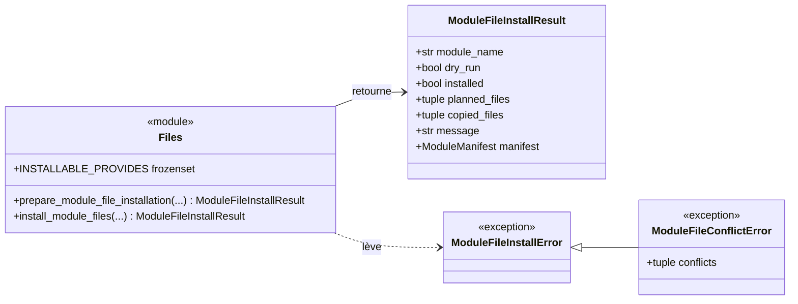
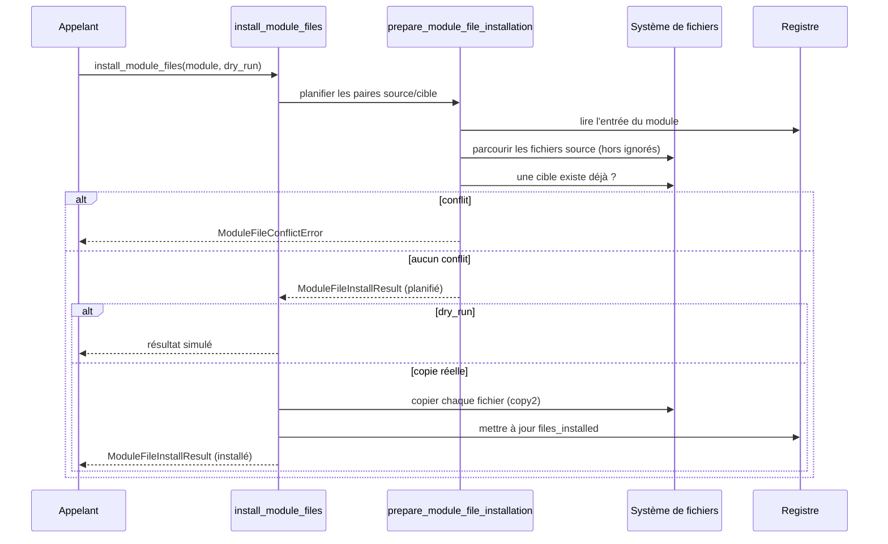

# L'installation des fichiers de module dans Forge

Installer un module copie ses fichiers dans le projet.
Le sous-module `files` réalise cette copie de façon contrôlée : il calcule d'abord ce qui serait écrit, refuse d'écraser un fichier existant et trace les fichiers copiés dans le registre.
Cette prudence applique le principe de préservation du code utilisateur.

## 1. Rôle

`files` copie dans le projet les fichiers déclarés par un module installé.

À partir d'un module déjà présent au registre, il lit le manifeste source, planifie les paires source vers cible pour chaque capacité installable, détecte les conflits, puis copie réellement les fichiers et met à jour la liste `files_installed` du registre.

La planification est défensive.
Elle refuse les chemins absolus, les segments `..`, les URL, et elle ignore les liens symboliques, les dossiers techniques (`__pycache__`, `.git`, `.venv`), les dotfiles et certains motifs (`*.pyc`, `*.tmp`, `*.bak`).
Un fichier cible déjà présent n'est jamais écrasé : le conflit est signalé.

## 2. Vue d'ensemble rapide

| Élément | Valeur |
|---|---|
| Module Python | `core.modules.files` |
| Couche | Système de modules (cœur) |
| Rôle | copier de façon contrôlée les fichiers d'un module installé |
| Capacités installables | `entities`, `controllers`, `views`, `docs` (constante `INSTALLABLE_PROVIDES`) |
| Objet lié | `ModuleFileInstallResult`, `ModuleManifest` |
| Exception liée | `ModuleFileInstallError`, `ModuleFileConflictError` |
| Dépend de | `core.modules.manifest`, `core.modules.registry` |
| Utilisé par | la CLI (`module:install`) et le sous-module `remove` |

Les cibles dépendent de la capacité : `mvc/entities`, `mvc/controllers`, `mvc/views` pour le code, et `docs/modules/<module>` pour la documentation.

## 3. Schémas UML

### 3.1 Diagramme de classe

Le diagramme montre le résultat d'installation et les deux exceptions, dont l'erreur de conflit dérivée.



À retenir :

- `ModuleFileConflictError` dérive de `ModuleFileInstallError` et porte la liste des cibles en conflit ;
- `INSTALLABLE_PROVIDES` limite ce qui est copié aux entités, contrôleurs, vues et docs ;
- `ModuleFileInstallResult` distingue les fichiers planifiés des fichiers réellement copiés.

### 3.2 Diagramme de séquence

Le diagramme montre une installation réelle des fichiers.



À retenir :

- la préparation détecte tous les conflits avant la moindre copie ;
- en `dry_run`, aucun fichier n'est écrit et le registre n'est pas touché ;
- les fichiers copiés sont tracés dans `files_installed` pour permettre une suppression sûre.

## 4. API publique

| Élément | Signature | Rôle |
|---|---|---|
| `prepare_module_file_installation` | `prepare_module_file_installation(module_name: str, *, registry_path=MODULE_REGISTRY_FILE) -> ModuleFileInstallResult` | planifie la copie et détecte les conflits |
| `install_module_files` | `install_module_files(module_name: str, *, registry_path=MODULE_REGISTRY_FILE, dry_run=False) -> ModuleFileInstallResult` | copie réellement les fichiers du module |
| `INSTALLABLE_PROVIDES` | `frozenset[str]` | capacités dont les fichiers sont copiables |
| `ModuleFileInstallResult` | dataclass gelée | résultat de l'installation des fichiers |
| `ModuleFileInstallError` | `class ModuleFileInstallError(ValueError)` | erreur de préparation ou de copie |
| `ModuleFileConflictError` | `class ModuleFileConflictError(ModuleFileInstallError)` | au moins une cible existe déjà |

## 5. Contextes d'utilisation

| Besoin | Élément |
|---|---|
| Voir ce qui serait copié | `prepare_module_file_installation(name)` |
| Copier les fichiers d'un module | `install_module_files(name)` |
| Simuler la copie sans écrire | `install_module_files(name, dry_run=True)` |
| Gérer un conflit de fichier | `except ModuleFileConflictError` |
| Connaître les capacités copiables | `INSTALLABLE_PROVIDES` |

## 6. Exemples d'utilisation

Simuler puis exécuter l'installation des fichiers :

```python
from core.modules.files import (
    install_module_files,
    ModuleFileConflictError,
)

apercu = install_module_files("blog", dry_run=True)
for source, cible in apercu.planned_files:
    print(f"{source} -> {cible}")

try:
    result = install_module_files("blog")
except ModuleFileConflictError as exc:
    print("Cibles en conflit :", exc.conflicts)
else:
    print(result.message, "-", len(result.copied_files), "fichier(s)")
```

## 7. Préservation du code utilisateur

!!! warning "Aucun écrasement silencieux"
    Si une cible existe déjà, `files` lève `ModuleFileConflictError` au lieu de l'écraser.
    La détection se fait à la préparation, mais aussi juste avant chaque copie, pour couvrir une création concurrente.

!!! note "Fichiers ignorés"
    Les liens symboliques sont refusés.
    Les dossiers `__pycache__`, `.git`, `.venv`, les dotfiles, ainsi que les motifs `*.pyc`, `*.tmp`, `*.bak`, sont ignorés à la copie.

## Voir aussi

- [Le registre des modules](registry.md) : l'enregistrement qui précède la copie.
- [Le manifeste de module](manifest.md) : la déclaration `paths` exploitée ici.
- [La suppression de module](remove.md) : le retrait des fichiers copiés.
