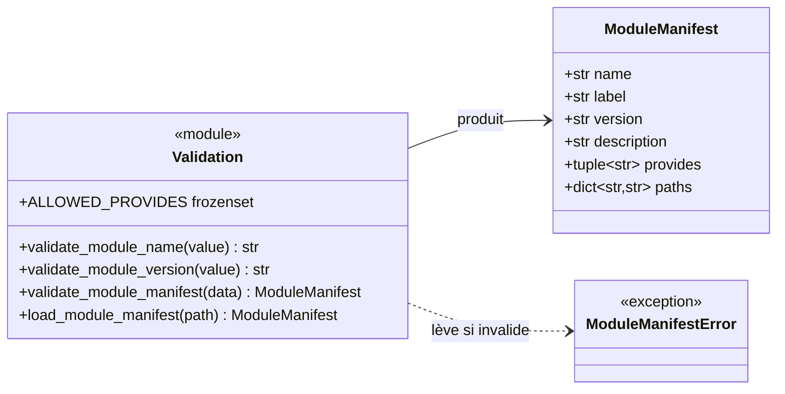
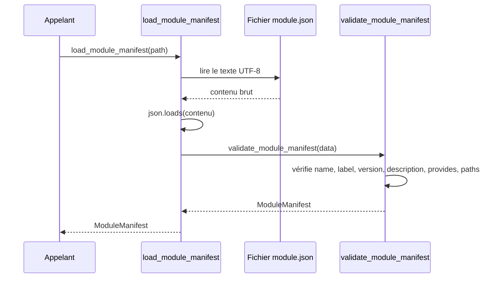

# Le manifeste de module dans Forge

Un module Forge se décrit par un fichier `module.json`.
Le sous-module `manifest` valide ce fichier et le charge en un objet `ModuleManifest` immuable.
C'est le contrat d'entrée du système de modules : rien n'est installé tant que le manifeste n'est pas validé.

## 1. Rôle

`manifest` définit le contrat d'un module Forge et le fait respecter.

Un manifeste décrit un module par son nom, son libellé, sa version, sa description, ce qu'il fournit (`provides`) et où trouver ces ressources (`paths`).
Le sous-module lit ce manifeste depuis un fichier JSON, le valide champ par champ, puis le matérialise en un `ModuleManifest`.

La validation est stricte et défensive.
Elle refuse les noms mal formés, les versions hors format, le HTML dans les champs texte, les valeurs `provides` inconnues, les chemins absolus, les chemins contenant `..` et les chemins contenant une URL.

## 2. Vue d'ensemble rapide

| Élément | Valeur |
|---|---|
| Module Python | `core.modules.manifest` |
| Couche | Système de modules (cœur) |
| Rôle | valider et charger le contrat `module.json` |
| Objet produit | `ModuleManifest` (dataclass gelée) |
| Exception liée | `ModuleManifestError` |
| Constante publique | `ALLOWED_PROVIDES` |
| Dépend de | bibliothèque standard uniquement (`json`, `re`, `dataclasses`, `pathlib`) |
| Utilisé par | `discovery`, `registry`, `routes`, `files`, `remove` |

`manifest` est le point d'entrée du système de modules : tous les autres sous-modules partent d'un `ModuleManifest` déjà validé.

## 3. Schémas UML

### 3.1 Diagramme de classe

Le diagramme montre la structure du manifeste, les fonctions de validation et l'exception levée en cas de manifeste invalide.



À retenir :

- `ModuleManifest` est une dataclass gelée : un manifeste validé est immuable ;
- les fonctions de validation produisent un `ModuleManifest` ou lèvent `ModuleManifestError` ;
- `ALLOWED_PROVIDES` énumère les capacités qu'un module peut déclarer.

### 3.2 Diagramme de séquence

Le diagramme montre le chargement d'un `module.json` depuis le disque jusqu'à l'objet validé.



À retenir :

- une lecture impossible ou un JSON invalide lève `ModuleManifestError` ;
- la validation s'applique toujours, que les données viennent d'un fichier ou d'un dictionnaire ;
- un manifeste déclarant `routes` dans `provides` doit fournir `paths.routes`.

## 4. API publique

| Élément | Signature | Rôle |
|---|---|---|
| `ModuleManifest` | `ModuleManifest(name, label, version, description, provides=(), paths={})` | manifeste validé et immuable |
| `validate_module_name` | `validate_module_name(value: Any) -> str` | valide un nom snake_case minuscule |
| `validate_module_version` | `validate_module_version(value: Any) -> str` | valide une version `MAJOR.MINOR.PATCH` |
| `validate_module_manifest` | `validate_module_manifest(data: Any) -> ModuleManifest` | valide un dictionnaire en `ModuleManifest` |
| `load_module_manifest` | `load_module_manifest(path: str \| Path) -> ModuleManifest` | lit un `module.json` et retourne le manifeste validé |
| `ALLOWED_PROVIDES` | `frozenset[str]` | capacités acceptées dans `provides` |
| `ModuleManifestError` | `class ModuleManifestError(ValueError)` | erreur de validation du manifeste |

Les valeurs acceptées dans `provides` sont : `entities`, `controllers`, `views`, `routes`, `docs`, `static`, `migrations`.

## 5. Contextes d'utilisation

| Besoin | Élément |
|---|---|
| Lire un manifeste depuis un fichier | `load_module_manifest(path)` |
| Valider un dictionnaire déjà chargé | `validate_module_manifest(data)` |
| Contrôler un nom de module isolé | `validate_module_name(name)` |
| Contrôler une version isolée | `validate_module_version(version)` |
| Connaître les capacités déclarables | `ALLOWED_PROVIDES` |
| Réagir à un manifeste invalide | `except ModuleManifestError` |

## 6. Exemples d'utilisation

Charger un manifeste depuis un fichier `module.json` :

```python
from core.modules.manifest import load_module_manifest, ModuleManifestError

try:
    manifest = load_module_manifest("modules/blog/module.json")
except ModuleManifestError as exc:
    print(f"Manifeste invalide : {exc}")
else:
    print(manifest.name, manifest.version, manifest.provides)
```

Valider un dictionnaire construit en mémoire :

```python
from core.modules.manifest import validate_module_manifest

data = {
    "name": "blog",
    "label": "Blog",
    "version": "1.0.0",
    "description": "Articles et commentaires",
    "provides": ["controllers", "views"],
    "paths": {"controllers": "src/controllers", "views": "src/views"},
}

manifest = validate_module_manifest(data)
print(manifest.paths["controllers"])
```

## 7. Règles de validation

!!! warning "Champs texte sans HTML ni URL"
    `label` et `description` ne doivent pas contenir de balise HTML.
    Les chemins de `paths` ne doivent contenir ni URL (`http://`, `ftp://`, `file://`), ni segment `..`, ni chemin absolu.
    Ces règles protègent l'installation contre les chemins hostiles et les traversées de répertoire.

!!! note "Cohérence provides / paths"
    Si `provides` contient `routes`, le manifeste doit déclarer `paths.routes`.
    Cette cohérence est vérifiée à la validation, pas au moment de l'installation.

## Voir aussi

- [La découverte de modules](discovery.md) : trouver les manifestes dans un dossier.
- [Le registre des modules](registry.md) : enregistrer un manifeste validé.
- [La génération des routes](routes.md) : exploiter `provides` et `paths.routes`.
