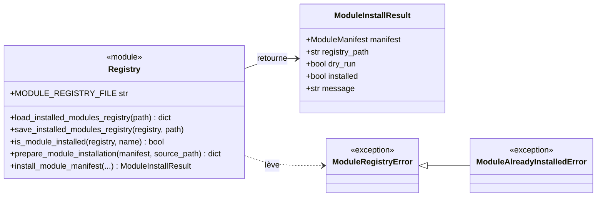
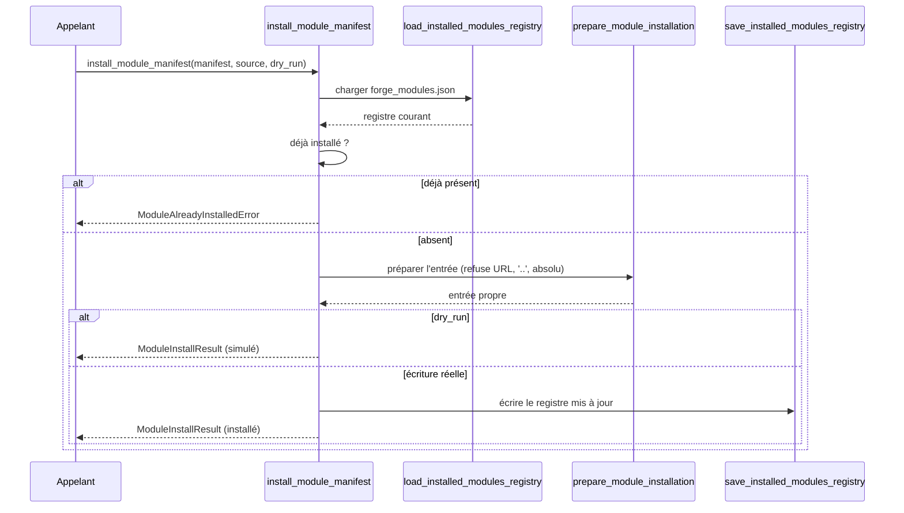

# Le registre des modules dans Forge

Forge garde la trace des modules installés dans un registre JSON, le fichier `forge_modules.json`.
Le sous-module `registry` lit, écrit et met à jour ce registre, et installe déclarativement un manifeste.
Installer au registre n'écrit aucun fichier de projet : c'est la déclaration d'intention, la copie vient ensuite.

## 1. Rôle

`registry` gère l'état des modules installés.

Il maintient un fichier JSON dont la clé `installed` associe chaque nom de module à son entrée : nom, libellé, version, description, chemin source et capacités fournies.
Il sait charger ce fichier (en renvoyant un registre vide s'il est absent), l'écrire de façon lisible, tester la présence d'un module, préparer une entrée propre et installer déclarativement un manifeste.

L'installation au registre est défensive : elle refuse une double installation, refuse les sources contenant une URL ou un `..`, et tente de relativiser un chemin source absolu par rapport au répertoire de travail.

## 2. Vue d'ensemble rapide

| Élément | Valeur |
|---|---|
| Module Python | `core.modules.registry` |
| Couche | Système de modules (cœur) |
| Rôle | persister et interroger l'état des modules installés |
| Fichier de registre | `forge_modules.json` (constante `MODULE_REGISTRY_FILE`) |
| Objet lié | `ModuleManifest`, `ModuleInstallResult` |
| Exception liée | `ModuleRegistryError`, `ModuleAlreadyInstalledError` |
| Dépend de | `core.modules.manifest` |
| Utilisé par | la CLI (`module:install`) et le sous-module `files` |

## 3. Schémas UML

### 3.1 Diagramme de classe

Le diagramme montre le résultat d'installation, les exceptions et les fonctions de gestion du registre.



À retenir :

- `MODULE_REGISTRY_FILE` vaut `"forge_modules.json"` : la source de vérité des modules installés ;
- `ModuleAlreadyInstalledError` dérive de `ModuleRegistryError` ;
- `install_module_manifest` retourne un `ModuleInstallResult`, jamais une simple valeur de retour booléenne.

### 3.2 Diagramme de séquence

Le diagramme montre une installation déclarative au registre.



À retenir :

- en `dry_run`, rien n'est écrit sur le disque ;
- une double installation est refusée avant toute écriture ;
- la préparation de l'entrée valide la source avant l'ajout au registre.

## 4. API publique

| Élément | Signature | Rôle |
|---|---|---|
| `load_installed_modules_registry` | `load_installed_modules_registry(path=MODULE_REGISTRY_FILE) -> dict[str, Any]` | charge le registre, `{"installed": {}}` si absent |
| `save_installed_modules_registry` | `save_installed_modules_registry(registry: dict[str, Any], path=MODULE_REGISTRY_FILE) -> None` | écrit le registre en JSON indenté |
| `is_module_installed` | `is_module_installed(registry: dict[str, Any], name: str) -> bool` | `True` si le module est présent |
| `prepare_module_installation` | `prepare_module_installation(manifest: ModuleManifest, source_path: str \| Path) -> dict[str, Any]` | construit l'entrée de registre validée |
| `install_module_manifest` | `install_module_manifest(manifest, source_path, registry_path=MODULE_REGISTRY_FILE, dry_run=False) -> ModuleInstallResult` | installe déclarativement un module |
| `MODULE_REGISTRY_FILE` | `str` | nom du fichier de registre (`forge_modules.json`) |
| `ModuleInstallResult` | dataclass gelée | résultat d'une installation |
| `ModuleRegistryError` | `class ModuleRegistryError(ValueError)` | erreur du registre |
| `ModuleAlreadyInstalledError` | `class ModuleAlreadyInstalledError(ModuleRegistryError)` | module déjà installé |

## 5. Contextes d'utilisation

| Besoin | Élément |
|---|---|
| Lire l'état des modules installés | `load_installed_modules_registry(path)` |
| Savoir si un module est installé | `is_module_installed(registry, name)` |
| Enregistrer un module découvert | `install_module_manifest(manifest, source)` |
| Simuler une installation | `install_module_manifest(..., dry_run=True)` |
| Refuser une double installation | `except ModuleAlreadyInstalledError` |

## 6. Exemples d'utilisation

Installer un module au registre après l'avoir découvert :

```python
from core.modules.discovery import list_module_manifests
from core.modules.registry import (
    install_module_manifest,
    ModuleAlreadyInstalledError,
)

manifest = list_module_manifests("modules")[0]

try:
    result = install_module_manifest(manifest, source_path="modules/blog")
except ModuleAlreadyInstalledError as exc:
    print(exc)
else:
    print(result.message)
```

Inspecter le registre courant :

```python
from core.modules.registry import (
    load_installed_modules_registry,
    is_module_installed,
)

registry = load_installed_modules_registry()
print("blog installé :", is_module_installed(registry, "blog"))
```

## 7. Forme du registre

!!! note "Structure de forge_modules.json"
    Le registre est un dictionnaire dont la clé `installed` associe chaque nom de module à son entrée.
    Une entrée contient `name`, `label`, `version`, `description`, `source` et, si le manifeste en déclare, `provides`.
    Le sous-module `files` y ajoute la liste `files_installed` une fois les fichiers copiés.

## Voir aussi

- [Le manifeste de module](manifest.md) : la source de l'entrée de registre.
- [La découverte de modules](discovery.md) : trouver les modules à installer.
- [L'installation des fichiers](files.md) : la copie qui suit l'enregistrement.
- [La suppression de module](remove.md) : le retrait du registre.
