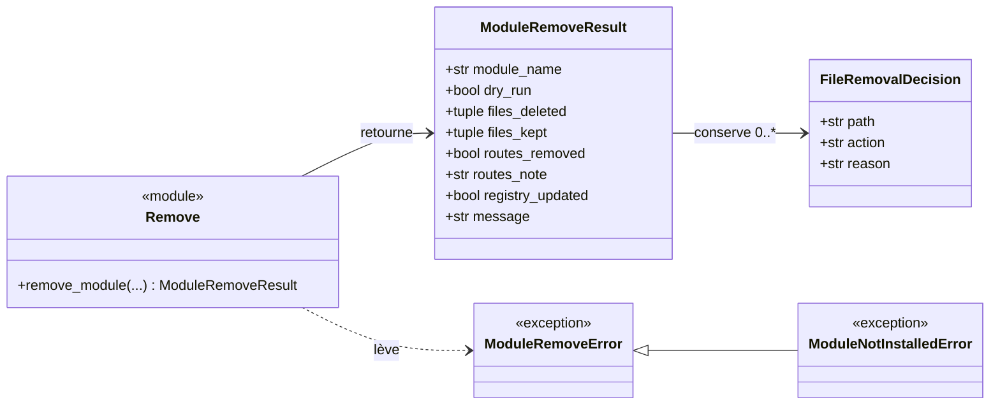
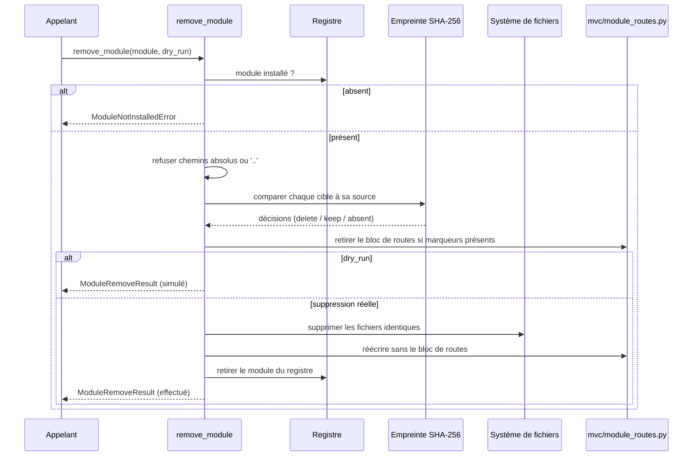

# La suppression de module dans Forge

Désinstaller un module le retire du registre et supprime ses fichiers, mais seulement ceux que Forge peut prouver avoir installés sans modification.
Le sous-module `remove` décide fichier par fichier, conserve tout ce qui a été modifié à la main et propose un mode simulation.
La règle centrale : Forge ne supprime que ce qu'il peut prouver avoir installé tel quel.

## 1. Rôle

`remove` désinstalle un module de façon contrôlée.

Pour chaque fichier tracé dans `files_installed`, il reconstruit la paire cible vers source à partir du manifeste, compare les empreintes SHA-256, puis décide : supprimer si identique à la source, conserver si modifié ou si la source est introuvable, ignorer si déjà absent.
Il retire ensuite le bloc de routes du module s'il trouve les marqueurs reconnus, puis met à jour le registre.

Un mode `dry_run` montre l'ensemble des décisions sans rien modifier.
Les chemins suspects (absolus ou contenant `..`) tracés dans le registre sont refusés avant toute action.

## 2. Vue d'ensemble rapide

| Élément | Valeur |
|---|---|
| Module Python | `core.modules.remove` |
| Couche | Système de modules (cœur) |
| Rôle | désinstaller un module sans détruire le travail utilisateur |
| Comparaison | empreinte SHA-256 cible contre source |
| Objet lié | `ModuleRemoveResult`, `FileRemovalDecision` |
| Exception liée | `ModuleRemoveError`, `ModuleNotInstalledError` |
| Dépend de | `core.modules.manifest`, `core.modules.registry`, `core.modules.routes`, `core.modules.files` |
| Utilisé par | la CLI (`module:remove`) |

## 3. Schémas UML

### 3.1 Diagramme de classe

Le diagramme montre le résultat de suppression, la décision par fichier et les deux exceptions.



À retenir :

- `FileRemovalDecision.action` vaut `delete`, `keep_modified`, `keep_source_missing` ou `already_absent` ;
- `ModuleNotInstalledError` dérive de `ModuleRemoveError` ;
- le résultat sépare les fichiers supprimés des fichiers conservés, avec leur raison.

### 3.2 Diagramme de séquence

Le diagramme montre la suppression réelle d'un module.



À retenir :

- un fichier modifié à la main est toujours conservé, jamais supprimé ;
- si la source est introuvable, Forge ne peut pas prouver l'origine et conserve le fichier ;
- en `dry_run`, ni les fichiers ni le registre ne sont modifiés.

## 4. API publique

| Élément | Signature | Rôle |
|---|---|---|
| `remove_module` | `remove_module(module_name: str, *, registry_path=MODULE_REGISTRY_FILE, routes_file=MODULE_ROUTES_FILE, dry_run=False) -> ModuleRemoveResult` | désinstalle un module du registre et de ses fichiers |
| `ModuleRemoveResult` | dataclass gelée | résultat complet de la suppression |
| `FileRemovalDecision` | dataclass gelée | décision prise pour un fichier (action, raison) |
| `ModuleRemoveError` | `class ModuleRemoveError(ValueError)` | erreur lors de la désinstallation |
| `ModuleNotInstalledError` | `class ModuleNotInstalledError(ModuleRemoveError)` | le module n'est pas dans le registre |

Les valeurs possibles de `FileRemovalDecision.action` :

| Action | Signification |
|---|---|
| `delete` | fichier identique à la source, supprimé |
| `keep_modified` | fichier modifié à la main, conservé |
| `keep_source_missing` | source introuvable, conservé par prudence |
| `already_absent` | fichier déjà supprimé, rien à faire |

## 5. Contextes d'utilisation

| Besoin | Élément |
|---|---|
| Voir ce qui serait supprimé ou conservé | `remove_module(name, dry_run=True)` |
| Désinstaller réellement un module | `remove_module(name)` |
| Réagir à un module absent | `except ModuleNotInstalledError` |
| Inspecter le sort de chaque fichier | `result.files_kept` (liste de `FileRemovalDecision`) |

## 6. Exemples d'utilisation

Simuler la suppression, puis l'exécuter :

```python
from core.modules.remove import remove_module, ModuleNotInstalledError

apercu = remove_module("blog", dry_run=True)
print(apercu.message)
for decision in apercu.files_kept:
    print(f"conservé : {decision.path} ({decision.reason})")

try:
    result = remove_module("blog")
except ModuleNotInstalledError as exc:
    print(exc)
else:
    print(f"{len(result.files_deleted)} fichier(s) supprimé(s)")
    print("routes retirées :", result.routes_removed, "-", result.routes_note)
```

## 7. Préservation du travail utilisateur

!!! warning "Forge ne supprime que ce qu'il a prouvé avoir installé"
    Un fichier n'est supprimé que si son empreinte SHA-256 correspond exactement à celle de la source.
    Tout fichier modifié à la main, ou dont la source est introuvable, est conservé et signalé.

!!! note "Retrait des routes par marqueurs"
    Le bloc de routes n'est retiré que si Forge retrouve ses marqueurs de début et de fin dans le fichier de routes.
    Sinon, le nettoyage reste manuel et la note du résultat le précise.

## Voir aussi

- [Le registre des modules](registry.md) : la trace lue puis mise à jour.
- [L'installation des fichiers](files.md) : la copie que la suppression annule.
- [La génération des routes](routes.md) : le bloc de routes retiré ici.
