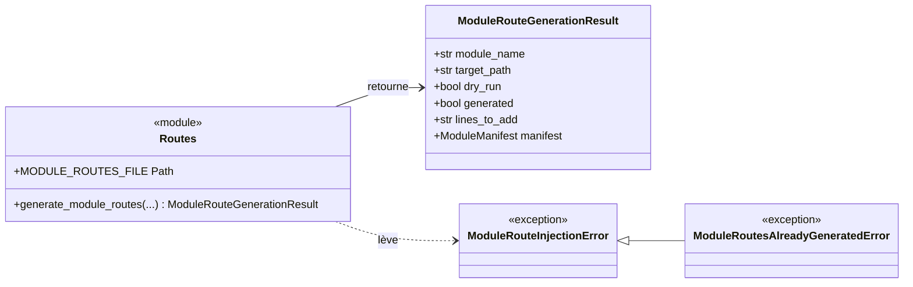
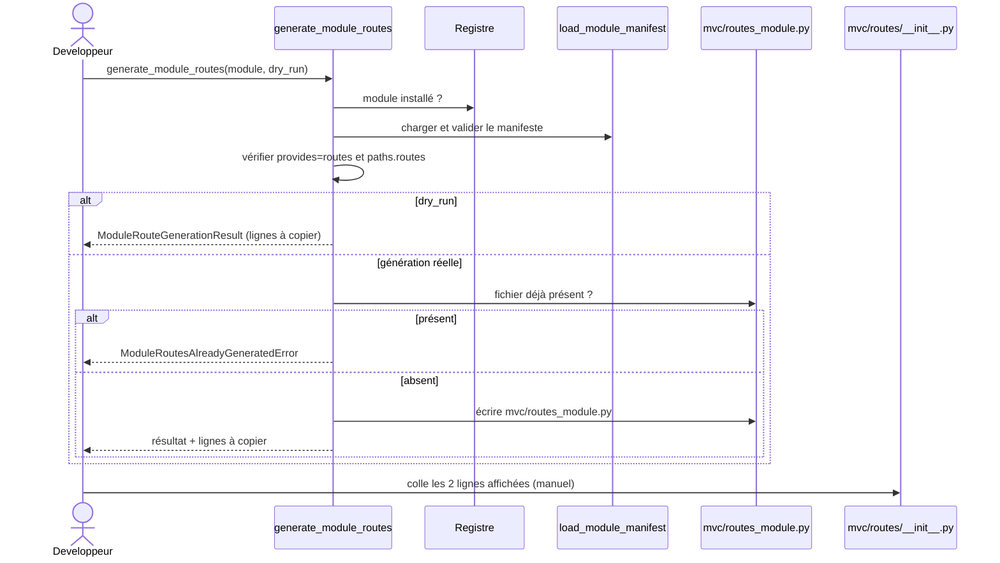

# La génération des routes de module dans Forge

Brancher les routes d'un module ne se fait jamais par injection silencieuse.
Le sous-module `routes` génère un fichier dédié `mvc/routes_<module>.py`, puis affiche les deux lignes que le développeur copie lui-même dans `mvc/routes/__init__.py`.
C'est une application directe du principe : pas d'écriture invisible dans le code utilisateur.

## 1. Rôle

`routes` produit le branchement explicite des routes d'un module installé.

À partir d'un module présent au registre et déclarant `routes` dans `provides`, il calcule le chemin d'import du fichier de routes source, génère un petit fichier `mvc/routes_<module>.py` qui réexporte la fonction d'enregistrement, et retourne les lignes à ajouter à la main dans le routeur de l'application.

Le fichier `mvc/routes/__init__.py` n'est jamais modifié par Forge.
Si le fichier généré existe déjà, la génération est refusée plutôt qu'écrasée.

## 2. Vue d'ensemble rapide

| Élément | Valeur |
|---|---|
| Module Python | `core.modules.routes` |
| Couche | Système de modules (cœur) |
| Rôle | générer un fichier de routes dédié, sans toucher `mvc/routes/__init__.py` |
| Fichier généré | `mvc/routes_<module>.py` |
| Fichier de routes utilisateur | `mvc/module_routes.py` (constante `MODULE_ROUTES_FILE`) |
| Objet lié | `ModuleRouteGenerationResult`, `ModuleManifest` |
| Exception liée | `ModuleRouteInjectionError`, `ModuleRoutesAlreadyGeneratedError` |
| Dépend de | `core.modules.manifest`, `core.modules.registry` |
| Utilisé par | la CLI (`module:routes`) et le sous-module `remove` |

## 3. Schémas UML

### 3.1 Diagramme de classe

Le diagramme montre le résultat de génération et les deux exceptions, dont l'erreur de fichier déjà présent.



À retenir :

- `ModuleRoutesAlreadyGeneratedError` dérive de `ModuleRouteInjectionError` ;
- le résultat porte `lines_to_add` : les lignes que le développeur copie lui-même ;
- `MODULE_ROUTES_FILE` désigne le fichier de routes que la suppression sait nettoyer.

### 3.2 Diagramme de séquence

Le diagramme montre la génération puis le branchement manuel par le développeur.



À retenir :

- Forge écrit `mvc/routes_<module>.py`, jamais `mvc/routes/__init__.py` ;
- le branchement final reste un geste manuel et conscient du développeur ;
- un module sans `routes` dans `provides` provoque une `ModuleRouteInjectionError`.

## 4. API publique

| Élément | Signature | Rôle |
|---|---|---|
| `generate_module_routes` | `generate_module_routes(module_name: str, *, registry_path=MODULE_REGISTRY_FILE, dry_run=False) -> ModuleRouteGenerationResult` | génère le fichier de routes dédié |
| `MODULE_ROUTES_FILE` | `Path` | fichier de routes nettoyé à la suppression (`mvc/module_routes.py`) |
| `ModuleRouteGenerationResult` | dataclass gelée | résultat de la génération |
| `ModuleRouteInjectionError` | `class ModuleRouteInjectionError(ValueError)` | erreur lors de la génération |
| `ModuleRoutesAlreadyGeneratedError` | `class ModuleRoutesAlreadyGeneratedError(ModuleRouteInjectionError)` | le fichier de routes existe déjà |

## 5. Contextes d'utilisation

| Besoin | Élément |
|---|---|
| Voir les lignes à copier sans rien écrire | `generate_module_routes(name, dry_run=True)` |
| Générer le fichier de routes dédié | `generate_module_routes(name)` |
| Gérer un fichier déjà généré | `except ModuleRoutesAlreadyGeneratedError` |
| Réagir à un module sans routes | `except ModuleRouteInjectionError` |

## 6. Exemples d'utilisation

Afficher les lignes à brancher, puis générer le fichier :

```python
from core.modules.routes import (
    generate_module_routes,
    ModuleRoutesAlreadyGeneratedError,
)

apercu = generate_module_routes("blog", dry_run=True)
print("À ajouter dans mvc/routes/__init__.py :")
print(apercu.lines_to_add)

try:
    result = generate_module_routes("blog")
except ModuleRoutesAlreadyGeneratedError as exc:
    print(exc)
else:
    print("Fichier généré :", result.target_path)
```

Le fichier généré réexporte la fonction `register_routes` du module sous l'alias `register_<module>_routes`.
Le développeur colle ensuite les deux lignes affichées dans son routeur.

## 7. Pas d'écriture invisible

!!! warning "mvc/routes/__init__.py n'est jamais modifié"
    `routes` se limite à créer `mvc/routes_<module>.py` et à afficher les lignes à copier.
    Le branchement dans le routeur de l'application reste un geste manuel, conforme au principe de préservation du code utilisateur.

!!! note "Régénération"
    Si le fichier dédié existe déjà, la génération échoue volontairement.
    Pour le régénérer, supprimez d'abord le fichier à la main.

## Voir aussi

- [Le registre des modules](registry.md) : l'état lu avant la génération.
- [Le manifeste de module](manifest.md) : la déclaration `provides` et `paths.routes`.
- [La suppression de module](remove.md) : le retrait du bloc de routes.
