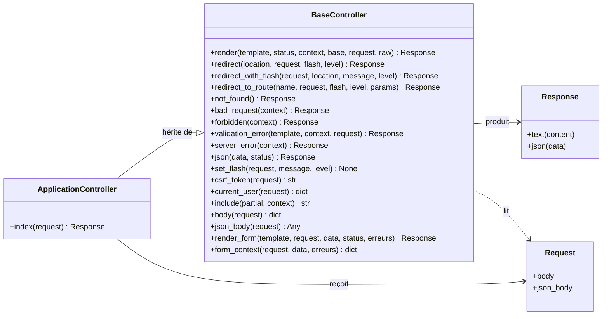
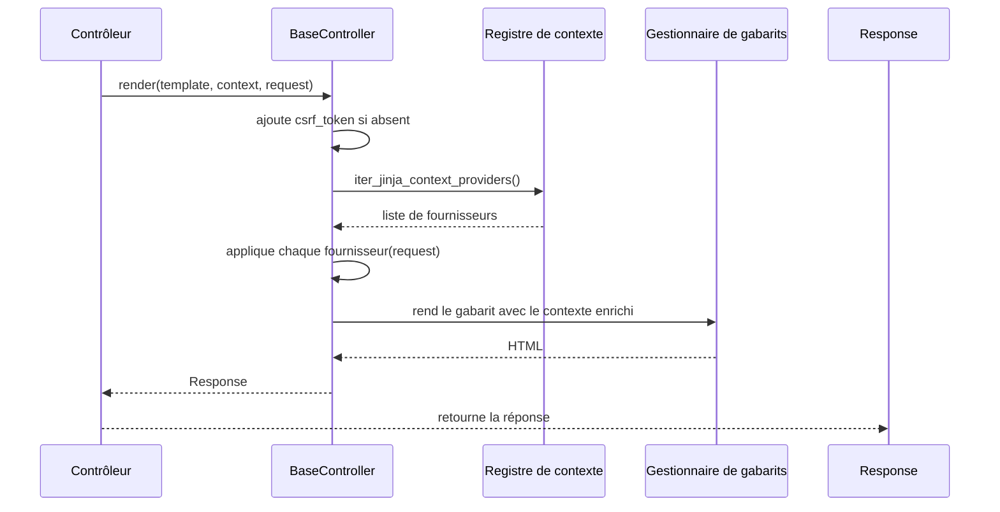

# Le contrôleur de base dans Forge

Ce document décrit `BaseController`, la classe mère de tous les contrôleurs Forge.

Le fichier de code correspondant est `core/mvc/controller/base_controller.py`.

## 1. Rôle de la classe

Un contrôleur reçoit une requête et produit une réponse.

`BaseController` regroupe les opérations communes à toutes les actions : rendre une vue HTML, rediriger, poser un message flash, répondre en JSON, produire les pages d'erreur usuelles.

Les contrôleurs de l'application héritent de `BaseController` et appellent ses méthodes statiques.

```python
from core.mvc.controller.base_controller import BaseController


class ArticleController(BaseController):
    @staticmethod
    def index(request):
        return BaseController.render(
            "article/index.html",
            request=request,
            context={"articles": rows},
        )
```

Toutes les méthodes sont statiques : on les appelle sur `BaseController` (ou sur la classe fille), sans instancier le contrôleur.

## 2. Vue d'ensemble rapide

| Élément | Valeur |
|---|---|
| Classe | `BaseController` |
| Module Python | `core.mvc.controller.base_controller` |
| Couche | MVC, contrôleur |
| Rôle | fournir les opérations communes à toutes les actions de contrôleur |
| Dépend de | `Response`, le gestionnaire de gabarits, la session, le registre de contexte Jinja |
| API publique | `render`, `redirect`, `redirect_with_flash`, `redirect_to_route`, `json`, `set_flash`, `csrf_token`, `current_user`, `include`, `body`, `json_body`, `render_form`, `form_context`, et les raccourcis d'erreur |
| Objet lié | `Response`, le registre `iter_jinja_context_providers()` |
| Usage principal | construire la réponse retournée par une action |

`BaseController` est une classe utilitaire de la couche contrôleur : elle ne porte pas d'état, elle expose des opérations.

## 3. Schémas UML

### 3.1 Diagramme de classe

Le diagramme montre la place de `BaseController` entre la requête, le rendu et la réponse.



À retenir :

- les contrôleurs de l'application héritent de `BaseController` ;
- chaque méthode prend (au besoin) la `Request` et retourne une `Response`, sauf `set_flash`, `csrf_token`, `current_user`, `include`, `body`, `json_body` et `form_context` qui retournent une donnée ;
- `BaseController` ne crée jamais la requête : il la reçoit.

### 3.2 Diagramme de séquence

Le diagramme montre un rendu HTML enrichi par le registre de contexte Jinja.



À retenir :

- `render` injecte automatiquement le `csrf_token` quand `request` est fourni et que le rendu n'est pas `raw` ;
- les fournisseurs de contexte enregistrés enrichissent le contexte avant le rendu ;
- en mode `raw=True` ou sans `request`, aucune injection automatique n'a lieu.

## 4. API publique

| Méthode | Signature | Rôle |
|---|---|---|
| `render` | `render(template, status=200, context=None, base="layouts/base.html", *, request=None, raw=False) -> Response` | rend un gabarit HTML, en injectant le `csrf_token` et les fournisseurs de contexte si `request` est fourni |
| `redirect` | `redirect(location, *, request=None, flash=None, level="success") -> Response` | redirection 302, avec message flash optionnel |
| `redirect_with_flash` | `redirect_with_flash(request, location, message, level="success") -> Response` | flux POST-Redirect-GET : pose un flash puis redirige |
| `redirect_to_route` | `redirect_to_route(name, *, request=None, flash=None, level="success", **params) -> Response` | redirige vers une route nommée via le routeur actif |
| `not_found` | `not_found() -> Response` | page 404 |
| `bad_request` | `bad_request(context=None) -> Response` | page 400 |
| `forbidden` | `forbidden(context=None) -> Response` | page 403 |
| `validation_error` | `validation_error(template="errors/422.html", context=None, *, request=None) -> Response` | page 422 rendue avec le contexte enrichi |
| `server_error` | `server_error(context=None) -> Response` | page 500 |
| `json` | `json(data, status=200) -> Response` | réponse `application/json; charset=utf-8` |
| `set_flash` | `set_flash(request, message, level="success") -> None` | stocke un message flash dans la session |
| `csrf_token` | `csrf_token(request) -> str` | retourne le token CSRF de la session courante |
| `current_user` | `current_user(request) -> dict[str, Any] | None` | retourne l'utilisateur courant stocké en session |
| `include` | `include(partial, context=None) -> str` | rend et retourne le HTML d'un partial Jinja2 |
| `body` | `body(request) -> dict[str, str]` | extrait le formulaire POST en dict plat (première valeur par clé) |
| `json_body` | `json_body(request) -> Any` | retourne le corps JSON parsé |
| `render_form` | `render_form(template, request, data, status=200, erreurs="") -> Response` | raccourci : `render` plus `form_context` |
| `form_context` | `form_context(request, data, erreurs="") -> dict[str, Any]` | construit le contexte commun à un formulaire (données, `csrf_token`, `erreurs`) |

## 5. Contextes d'utilisation

| Besoin | Élément |
|---|---|
| Rendre une vue HTML | `BaseController.render(...)` |
| Rediriger après un POST | `BaseController.redirect_with_flash(...)` |
| Rediriger vers une route nommée | `BaseController.redirect_to_route(...)` |
| Répondre à une API en JSON | `BaseController.json(...)` |
| Afficher une page d'erreur | `not_found`, `bad_request`, `forbidden`, `validation_error`, `server_error` |
| Lire un formulaire POST | `BaseController.body(request)` |
| Lire un corps JSON | `BaseController.json_body(request)` |
| Afficher un formulaire avec erreurs | `BaseController.render_form(...)` |
| Récupérer le token CSRF | `BaseController.csrf_token(request)` |
| Récupérer l'utilisateur connecté | `BaseController.current_user(request)` |

## 6. Exemples d'utilisation

Rendre une vue avec contexte :

```python
from core.mvc.controller.base_controller import BaseController


class ArticleController(BaseController):
    @staticmethod
    def index(request):
        rows = list_articles()
        return BaseController.render(
            "article/index.html",
            request=request,
            context={"articles": rows},
        )
```

Traiter un POST puis rediriger avec un message flash :

```python
class ArticleController(BaseController):
    @staticmethod
    def store(request):
        data = BaseController.body(request)
        create_article(data["title"])
        return BaseController.redirect_with_flash(
            request,
            "/article/index",
            "Article créé.",
        )
```

Répondre en JSON depuis une API :

```python
class ApiController(BaseController):
    @staticmethod
    def show(request):
        article_id = request.route("id", default="0")
        return BaseController.json({"id": article_id})
```

## 7. Détails utiles

!!! tip "Injection automatique du contexte"
    Quand `request` est fourni et que `raw` vaut `False`, `render` ajoute le `csrf_token` (s'il est absent du contexte) puis applique tous les fournisseurs enregistrés via `iter_jinja_context_providers()`.

!!! note "Redirection vers une route nommée"
    `redirect_to_route` lit le routeur actif dans la configuration.
    Si aucun routeur n'est enregistré, la méthode lève `RuntimeError`.

!!! warning "Méthodes statiques"
    Toutes les opérations de `BaseController` sont statiques.
    On les appelle sur la classe, jamais sur une instance ; les contrôleurs n'ont pas d'état d'instance.

## 8. Statut des méthodes (canoniques, à surveiller, legacy) { #coremvccontroller }

> Ticket : `BASE-CONTROLLER-API-DOC-001`.
> Audit de surface : `docs/history/audits/base-controller-surface-audit-001.md`.

`BaseController` expose **18 méthodes statiques** : 17 canoniques, 1 legacy (`current_user()`), 2 à surveiller (`set_flash()`, `csrf_token()`).

!!! note "Méthodes À_SURVEILLER"
    `set_flash` et `csrf_token` sont stables et utilisables, mais dépendent de `core.security.session` (module legacy, non déprécié).
    Elles seront réévaluées si ce module devait être supprimé à terme.

!!! warning "Méthode legacy : `current_user`"
    `current_user(request)` est **LEGACY** : elle appelle `core.security.session.get_user()`, qui émet un `DeprecationWarning`.
    Elle est absente de tous les starters récents ; ne l'utilisez pas dans les nouveaux projets.

    Alternative canonique :

    ```python
    from core.auth.session import get_authenticated_user_id
    from mvc.models.auth_model import get_user_by_id

    user_id = get_authenticated_user_id(request)
    utilisateur = get_user_by_id(user_id) if user_id else None
    ```

## Voir aussi

- [Le registre de contexte Jinja](registry.md) : enrichir le contexte de rendu.
- [La pagination](pagination.md) : son `context` se passe au gabarit via `render`.
