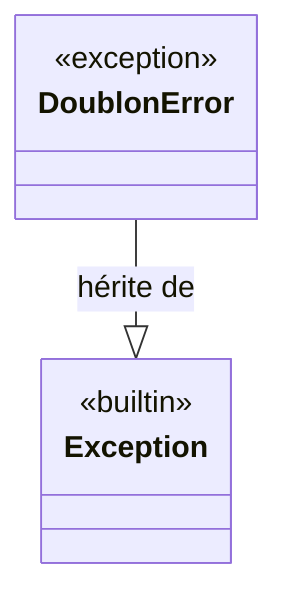

# L'erreur de doublon dans Forge

Ce document décrit `DoublonError`, l'exception levée côté modèle sur violation d'une contrainte d'unicité.

Le fichier de code correspondant est `core/mvc/model/exceptions.py`.

## 1. Rôle de l'exception

Quand un modèle tente d'insérer un enregistrement déjà existant, la base de données signale une violation d'unicité.

`DoublonError` traduit cette erreur technique en une exception identifiable côté application : le modèle la lève à partir de l'erreur d'intégrité, le contrôleur l'attrape pour afficher un message clair.

## 2. Vue d'ensemble rapide

| Élément | Valeur |
|---|---|
| Exception | `DoublonError` |
| Module Python | `core.mvc.model.exceptions` |
| Couche | MVC, modèle |
| Hérite de | `Exception` |
| Rôle | signaler une violation de contrainte d'unicité |
| Levée par | un modèle, depuis l'erreur d'intégrité de la base |
| Attrapée par | un contrôleur, pour produire un message d'unicité |
| Objet lié | `Validator` (le message est ajouté via `add_error`) |

`DoublonError` ne porte pas d'API propre : c'est une sous-classe d'`Exception`, dont l'argument transporte l'identifiant en cause.

## 3. Schéma UML

### 3.1 Diagramme de classe



À retenir :

- `DoublonError` est une simple sous-classe d'`Exception` ;
- l'argument passé au constructeur transporte l'identifiant en doublon ;
- le modèle la lève, le contrôleur l'attrape.

## 4. API publique

| Élément | Signature | Rôle |
|---|---|---|
| `DoublonError` | `DoublonError(*args)` | exception levée sur violation d'unicité ; l'argument transporte l'identifiant concerné |

## 5. Contextes d'utilisation

| Besoin | Élément |
|---|---|
| Signaler une insertion en doublon (modèle) | `raise DoublonError(identifiant)` |
| Traiter un doublon (contrôleur) | `except DoublonError as e:` |
| Transformer en message de formulaire | `validator.add_error(...)` |

## 6. Exemples d'utilisation

Lever l'exception dans un modèle :

```python
import mariadb

from core.mvc.model.exceptions import DoublonError


def create_client(client):
    try:
        insert_client(client)
    except mariadb.IntegrityError:
        raise DoublonError(client["ClientId"])
```

Attraper l'exception dans un contrôleur :

```python
from core.mvc.model.exceptions import DoublonError


def store(request):
    try:
        create_client(data)
    except DoublonError as e:
        validator.add_error(f"L'identifiant « {e} » existe déjà.")
```

## Voir aussi

- [Le validateur de modèle](validator.md) : reçoit le message de doublon via `add_error`.
- [Le contrôleur de base](base_controller.md) : affiche les erreurs de validation dans un formulaire.
