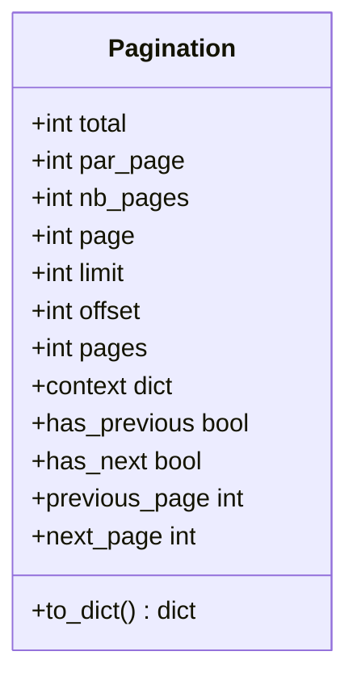

# La pagination dans Forge

Ce document décrit `Pagination`, l'objet qui calcule la pagination des vues liste.

Le fichier de code correspondant est `core/mvc/view/pagination.py`.

## 1. Rôle de la classe

Afficher une liste par pages demande de calculer la page courante, le nombre total de pages et les bornes de la requête.

`Pagination` encapsule cette logique : à partir de la requête, du nombre total d'éléments et du nombre par page, il déduit la page demandée, l'`offset` et la `limit` à passer au modèle, et fournit un contexte prêt à injecter dans le gabarit.

```python
from core.mvc.view.pagination import Pagination

pagination = Pagination(request, count_clients(), PAR_PAGE)
items = get_clients_page(pagination.limit, pagination.offset)
context = {"lignes": items, **pagination.context}
```

## 2. Vue d'ensemble rapide

| Élément | Valeur |
|---|---|
| Classe | `Pagination` |
| Module Python | `core.mvc.view.pagination` |
| Couche | MVC, vue |
| Rôle | calculer page courante, bornes et données de navigation pour une liste paginée |
| Construite avec | la requête, le total d'éléments, le nombre par page |
| API publique | constructeur, propriété `context`, `to_dict()`, propriétés de navigation |
| Lue par | le modèle (`limit`, `offset`) et le gabarit (`context`) |

`Pagination` est calculée dans le contrôleur, puis ses bornes alimentent le modèle et son `context` alimente la vue.

## 3. Schéma UML

### 3.1 Diagramme de classe



À retenir :

- `page` est extraite du paramètre d'URL `page`, puis bornée entre 1 et `nb_pages` ;
- `limit` et `offset` sont les bornes à passer au modèle ;
- `context` et `to_dict()` exposent les données de navigation pour le gabarit ;
- les propriétés `has_previous`, `has_next`, `previous_page` et `next_page` décrivent les liens de navigation.

## 4. API publique

| Membre | Signature | Rôle |
|---|---|---|
| Constructeur | `Pagination(request, total, par_page)` | calcule la page courante et les bornes |
| `context` | `context -> dict[str, Any]` (propriété) | dict prêt à injecter dans le template (page, bornes, liens, total) |
| `to_dict` | `to_dict() -> dict[str, Any]` | représentation détaillée de l'état de pagination |
| `has_previous` | `has_previous -> bool` (propriété) | vrai s'il existe une page précédente |
| `has_next` | `has_next -> bool` (propriété) | vrai s'il existe une page suivante |
| `previous_page` | `previous_page -> int | None` (propriété) | numéro de la page précédente, ou `None` |
| `next_page` | `next_page -> int | None` (propriété) | numéro de la page suivante, ou `None` |

Attributs calculés disponibles : `total`, `par_page`, `nb_pages`, `page`, `limit`, `offset`, `pages`.

## 5. Contextes d'utilisation

| Besoin | Élément |
|---|---|
| Connaître la page demandée | `pagination.page` |
| Borner la requête au modèle | `pagination.limit`, `pagination.offset` |
| Injecter la navigation au gabarit | `pagination.context` |
| Savoir s'il existe une page précédente ou suivante | `pagination.has_previous`, `pagination.has_next` |
| Construire les liens précédent/suivant | `pagination.previous_page`, `pagination.next_page` |

## 6. Exemples d'utilisation

Paginer une liste dans un contrôleur :

```python
from core.mvc.controller.base_controller import BaseController
from core.mvc.view.pagination import Pagination

PAR_PAGE = 20


class ClientController(BaseController):
    @staticmethod
    def index(request):
        pagination = Pagination(request, count_clients(), PAR_PAGE)
        clients = get_clients_page(pagination.limit, pagination.offset)
        return BaseController.render(
            "client/index.html",
            request=request,
            context={"clients": clients, **pagination.context},
        )
```

L'URL `/client/index?page=3` produit `page = 3`, et donc `offset = (3 - 1) * PAR_PAGE`.

## 7. Détails utiles

!!! note "Bornage de la page"
    Le numéro de page lu dans l'URL est borné entre 1 et `nb_pages`.
    Une valeur absente, négative ou non numérique retombe sur la page 1.

!!! tip "Total nul"
    Quand `total` vaut 0, `nb_pages` vaut 1 : la vue affiche une page vide plutôt qu'aucune page.

## Voir aussi

- [Le contrôleur de base](base_controller.md) : reçoit `pagination.context` et le passe au gabarit via `render`.
- [Le registre de contexte Jinja](registry.md) : autre source de données injectées dans le contexte de rendu.
