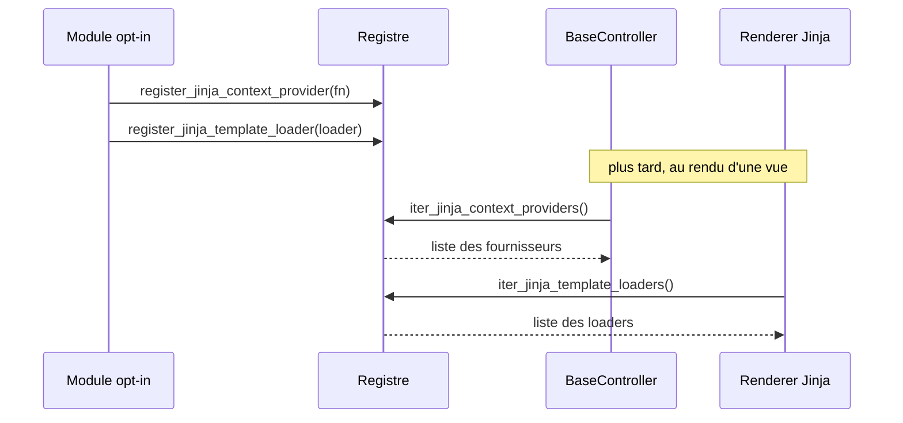

# Le registre de contexte Jinja dans Forge

Ce document décrit les registres d'extension du rendu Jinja : fournisseurs de contexte et loaders de templates.

Le fichier de code correspondant est `core/mvc/controller/registry.py`.

## 1. Rôle du module

Certaines valeurs doivent être disponibles dans tous les gabarits (utilisateur courant, helpers transverses).

Certains opt-ins fournissent aussi leurs propres templates par défaut.

Ce module expose deux registres « push »
: un pour les fournisseurs de contexte que `BaseController.render` injecte automatiquement, un pour les loaders de templates contribués par les opt-ins (ADR-046).

Le cœur itère sur ces registres sans nommer aucun module opt-in : chaque opt-in s'enregistre lui-même à l'import (charte, principe 8).

## 2. Vue d'ensemble rapide

| Élément | Valeur |
|---|---|
| Module Python | `core.mvc.controller.registry` |
| Couche | MVC, contrôleur (point d'extension) |
| Rôle | enregistrer fournisseurs de contexte et loaders de templates Jinja |
| API publique | `register_jinja_context_provider`, `iter_jinja_context_providers`, `register_jinja_template_loader`, `iter_jinja_template_loaders` |
| Consommé par | `BaseController.render` (contexte), le renderer Jinja (loaders) |
| Référence | ADR-046 (registre de loaders de templates Jinja pour les opt-ins) |

Le module ne porte que des fonctions et deux listes internes : c'est un point d'extension, pas une classe.

## 3. Schéma : le flux d'enregistrement

Le module n'a pas d'objet à modéliser en diagramme de classe ; le diagramme de séquence montre son rôle d'extension.



À retenir :

- l'opt-in s'enregistre lui-même à l'import, le cœur ne le nomme jamais ;
- les fournisseurs de contexte sont consommés par `BaseController.render` ;
- les loaders de templates sont composés après le dossier `mvc/views/` du projet : un template du projet de même chemin masque celui du paquet.

## 4. API publique

| Fonction | Signature | Rôle |
|---|---|---|
| `register_jinja_context_provider` | `register_jinja_context_provider(fn: Callable[[Any], dict[str, Any]]) -> None` | enregistre un fournisseur de contexte Jinja2 |
| `iter_jinja_context_providers` | `iter_jinja_context_providers() -> list[Callable[[Any], dict[str, Any]]]` | retourne une copie de la liste des fournisseurs enregistrés |
| `register_jinja_template_loader` | `register_jinja_template_loader(loader: Any) -> None` | enregistre un loader de templates Jinja contribué par un opt-in (ADR-046) |
| `iter_jinja_template_loaders` | `iter_jinja_template_loaders() -> list[Any]` | retourne une copie de la liste des loaders enregistrés |

Le module expose aussi `_clear_for_tests()` et `_clear_template_loaders_for_tests()`, réservés aux tests : le préfixe `_` signale qu'ils ne font pas partie de l'API applicative.

## 5. Contextes d'utilisation

| Besoin | Élément |
|---|---|
| Rendre une valeur disponible dans tous les gabarits | `register_jinja_context_provider(...)` |
| Lister les fournisseurs (rendu) | `iter_jinja_context_providers()` |
| Fournir des templates par défaut depuis un opt-in | `register_jinja_template_loader(...)` |
| Lister les loaders (renderer) | `iter_jinja_template_loaders()` |
| Réinitialiser entre deux tests | `_clear_for_tests()` |

## 6. Exemples d'utilisation

Enregistrer un fournisseur de contexte transverse :

```python
from core.mvc.controller.registry import register_jinja_context_provider


def user_context(request):
    return {"current_user": request.session.get("user")}


register_jinja_context_provider(user_context)
```

Chaque fournisseur reçoit la `request` et retourne un `dict` que `BaseController.render` fusionne dans le contexte de rendu.

Enregistrer un loader de templates depuis un opt-in :

```python
from jinja2 import PackageLoader

from core.mvc.controller.registry import register_jinja_template_loader


register_jinja_template_loader(PackageLoader("forge_mvc_rbac", "templates"))
```

## 7. Détails utiles

!!! note "Priorité des templates"
    Les loaders d'opt-in sont composés après le dossier `mvc/views/` du projet.
    Un template du projet portant le même chemin masque le template par défaut du paquet.

!!! warning "Fonctions de test"
    `_clear_for_tests()` ne vide que les fournisseurs de contexte, pas les loaders.
    Les loaders d'opt-in sont enregistrés à l'import (état de session) et seraient perdus pour les tests suivants ; pour les isoler, utiliser `_clear_template_loaders_for_tests()` avec sauvegarde et restauration.

## Voir aussi

- [Le contrôleur de base](base_controller.md) : `render` consomme les fournisseurs de contexte.
- [La pagination](pagination.md) : autre donnée injectée dans le contexte de rendu.
