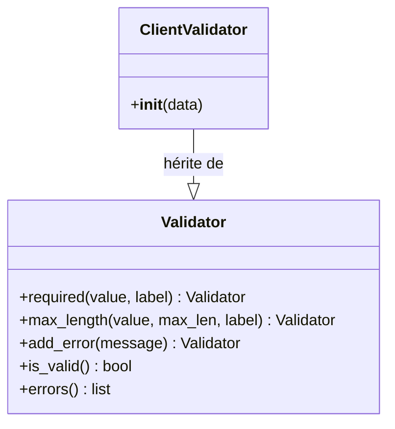

# Le validateur de modèle dans Forge

Ce document décrit `Validator`, la classe de base pour valider les données de formulaire côté modèle.

Le fichier de code correspondant est `core/mvc/model/validator.py`.

## 1. Rôle de la classe

`Validator` est une classe de base pour vérifier des données de formulaire au niveau du modèle.

On en dérive une classe propre à une entité, on applique des règles (champ obligatoire, longueur maximale, erreurs manuelles), puis on consulte la validité et la liste des messages d'erreur.

Les méthodes de règle retournent l'instance, ce qui permet de les chaîner.

```python
from core.mvc.model.validator import Validator


class ClientValidator(Validator):
    def __init__(self, data):
        super().__init__()
        self.required(data.get("nom", ""), "Nom")
        self.max_length(data.get("nom", ""), 40, "Nom")
```

## 2. Vue d'ensemble rapide

| Élément | Valeur |
|---|---|
| Classe | `Validator` |
| Module Python | `core.mvc.model.validator` |
| Couche | MVC, modèle |
| Rôle | accumuler les erreurs de validation d'un formulaire |
| API publique | `required`, `max_length`, `add_error`, `is_valid`, `errors` |
| Objet lié | `DoublonError` (erreurs d'unicité ajoutées via `add_error`) |
| Usage principal | valider les données avant insertion ou mise à jour |

`Validator` ne fait que collecter des messages : il ne lève pas d'exception et ne touche pas à la base de données.

## 3. Schéma UML

### 3.1 Diagramme de classe



À retenir :

- `required`, `max_length` et `add_error` retournent l'instance, donc ils se chaînent ;
- `is_valid()` est vrai tant qu'aucune erreur n'a été ajoutée ;
- `errors()` retourne une copie de la liste des messages.

## 4. API publique

| Méthode | Signature | Rôle |
|---|---|---|
| `required` | `required(value: Any, label: str) -> Validator` | ajoute une erreur si la valeur est vide ou ne contient que des espaces |
| `max_length` | `max_length(value: Any, max_len: int, label: str) -> Validator` | ajoute une erreur si la valeur dépasse `max_len` caractères |
| `add_error` | `add_error(message: str) -> Validator` | ajoute un message d'erreur manuel (par exemple un doublon) |
| `is_valid` | `is_valid() -> bool` | retourne vrai si aucune erreur n'a été accumulée |
| `errors` | `errors() -> list[str]` | retourne une copie de la liste des messages d'erreur |

## 5. Contextes d'utilisation

| Besoin | Élément |
|---|---|
| Imposer un champ obligatoire | `validator.required(...)` |
| Limiter la longueur d'un champ | `validator.max_length(...)` |
| Signaler une erreur métier (unicité) | `validator.add_error(...)` |
| Décider de poursuivre ou non | `validator.is_valid()` |
| Afficher les messages d'erreur | `validator.errors()` |

## 6. Exemples d'utilisation

Définir un validateur et l'employer dans un contrôleur :

```python
from core.mvc.controller.base_controller import BaseController
from core.mvc.model.validator import Validator
from core.mvc.model.exceptions import DoublonError


class ClientValidator(Validator):
    def __init__(self, data):
        super().__init__()
        self.required(data.get("nom", ""), "Nom")
        self.max_length(data.get("nom", ""), 40, "Nom")


class ClientController(BaseController):
    @staticmethod
    def store(request):
        data = BaseController.body(request)
        validator = ClientValidator(data)

        if not validator.is_valid():
            return BaseController.render_form(
                "client/add.html",
                request,
                data,
                status=422,
                erreurs="\n".join(validator.errors()),
            )

        try:
            create_client(data)
        except DoublonError as e:
            validator.add_error(f"L'identifiant « {e} » existe déjà.")
            return BaseController.render_form(
                "client/add.html",
                request,
                data,
                status=422,
                erreurs="\n".join(validator.errors()),
            )

        return BaseController.redirect_with_flash(
            request, "/client/index", "Client créé."
        )
```

## 7. Détails utiles

!!! note "Validateur sans état partagé"
    Chaque instance possède sa propre liste d'erreurs, initialisée dans `__init__`.
    Toujours appeler `super().__init__()` dans une classe fille avant d'ajouter des règles.

!!! tip "Chaînage des règles"
    Les méthodes de règle retournent l'instance, on peut donc les enchaîner : `validator.required(...).max_length(...)`.

## Voir aussi

- [L'erreur de doublon](exceptions.md) : `DoublonError`, dont le message est ajouté via `add_error`.
- [Le contrôleur de base](base_controller.md) : `render_form` affiche les messages renvoyés par `errors()`.
