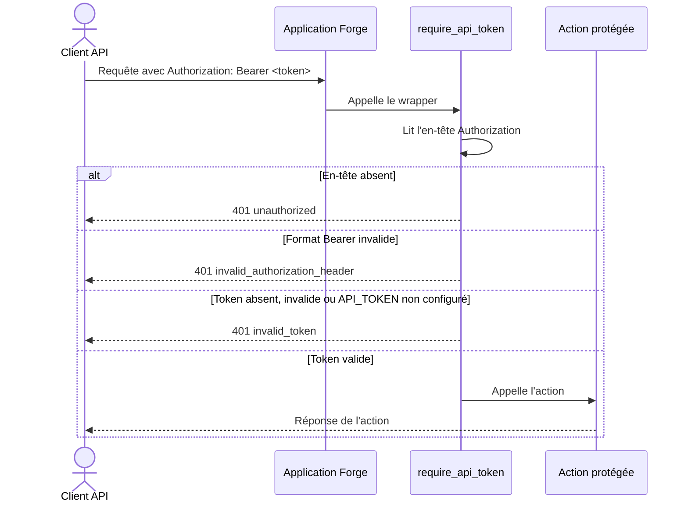

# L'authentification d'API par jeton dans Forge

Ce document décrit la protection minimale d'une route d'API par jeton Bearer statique.
Il sert aussi de modèle de formalisme pour documenter un module de fonctions du cœur Forge : rôle, vue d'ensemble, schémas, API publique, exemples et limites.

## 1. Rôle

Pour exposer une route d'API à des clients non navigateur, on la protège par un jeton Bearer statique plutôt que par une session.
Le module `core.security.api_auth` fournit l'extraction du jeton depuis l'en-tête `Authorization`, sa vérification contre la variable d'environnement `API_TOKEN`, et un décorateur de garde.

Le jeton est comparé en temps constant.
Il ne figure jamais dans les réponses ni dans les logs.

## 2. Vue d'ensemble rapide

| Élément | Valeur |
|---|---|
| Module | `core.security.api_auth` |
| Module Python | `core.security.api_auth` |
| Couche | Sécurité |
| Rôle | protéger une route d'API par jeton Bearer statique |
| Dépend de | `core.http.api_error`, `os.getenv("API_TOKEN")`, `hmac.compare_digest` |
| API publique | `get_api_token_from_request`, `is_valid_api_token`, `require_api_token` |
| Objet lié | `Request` (lecture de l'en-tête), `Response` (réponse de refus) |
| Configuration | variable d'environnement `API_TOKEN` |

## 3. Schémas UML

### 3.1 Diagramme de séquence

Le diagramme montre le parcours d'une requête d'API protégée par `require_api_token`.



À retenir :

- la garde lit l'en-tête `Authorization`, jamais un autre canal ;
- chaque cas de refus a son propre code d'erreur JSON et le statut `401` ;
- l'action protégée n'est appelée que si le jeton correspond exactement à `API_TOKEN` ;
- la comparaison passe par `hmac.compare_digest`, donc en temps constant.

## 4. API publique

| Fonction | Signature | Rôle |
|---|---|---|
| `get_api_token_from_request` | `get_api_token_from_request(request: Request) -> str \| None` | extrait la valeur après `Bearer ` dans l'en-tête `Authorization`, ou `None` si le format est invalide |
| `is_valid_api_token` | `is_valid_api_token(request: Request) -> bool` | `True` si le jeton de la requête correspond à `API_TOKEN` ; `False` si `API_TOKEN` est vide ou si le jeton ne correspond pas |
| `require_api_token` | `require_api_token(func: Handler) -> Handler` | décorateur qui protège une route d'API : renvoie un `401` JSON en cas de refus, sinon appelle l'action |

## 5. Contextes d'utilisation

| Besoin | Élément |
|---|---|
| Protéger une route d'API par jeton | `@require_api_token` |
| Tester la validité d'un jeton sans bloquer | `is_valid_api_token(request)` |
| Récupérer le jeton brut transmis | `get_api_token_from_request(request)` |

## 6. Exemples d'utilisation

```python
from core.security.api_auth import require_api_token
from core.http import api_success


@require_api_token
def status(request):
    return api_success({"status": "ok"})
```

Vérification manuelle sans décorateur :

```python
from core.security.api_auth import is_valid_api_token
from core.http import api_error, api_success


def metrics(request):
    if not is_valid_api_token(request):
        return api_error("Token API invalide", status=401, code="invalid_token")
    return api_success({"uptime": 1234})
```

## 7. Limites

!!! warning "Protection minimale"
    Cette protection repose sur un jeton statique unique (`API_TOKEN`).
    Elle convient à une route d'API interne ou à un usage contrôlé.
    Une API exposée largement demande une gestion de jetons plus riche (rotation, portée, expiration), à la charge de l'application.

!!! note "Configuration requise"
    Si `API_TOKEN` n'est pas défini dans l'environnement, `is_valid_api_token` renvoie toujours `False` et `require_api_token` refuse toutes les requêtes avec le code `invalid_token`.

## Voir aussi

- [Les décorateurs de sécurité](decorators.md) : les gardes de session.
- [Les middlewares de sécurité](middleware.md) : les gardes transverses.

Les helpers de réponse `api_success` et `api_error` sont fournis par le module `core.http`.
