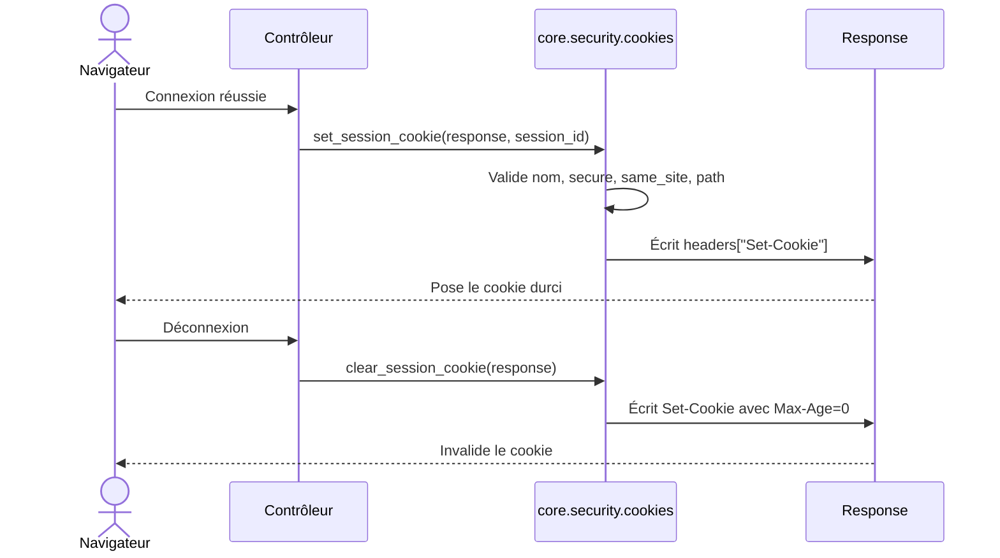

# Les cookies de session dans Forge

Ce document décrit la pose et l'invalidation du cookie de session Forge.
Il centralise les règles de sécurité appliquées au header `Set-Cookie`.

## 1. Rôle

L'identifiant de session voyage entre le navigateur et le serveur dans un cookie.
Le module `core.security.cookies` construit ce header `Set-Cookie` en un seul endroit, pour qu'une seule source applique les règles de sécurité minimales.

Il pose le cookie de façon durcie par défaut, et l'invalide au logout.

## 2. Vue d'ensemble rapide

| Élément | Valeur |
|---|---|
| Module | `core.security.cookies` |
| Module Python | `core.security.cookies` |
| Couche | Sécurité |
| Rôle | écrire et invalider le cookie de session de façon durcie |
| Dépend de | `core.security.session.SESSION_COOKIE_NAME` |
| API publique | `set_session_cookie`, `clear_session_cookie` |
| Objet lié | `Response` (le header `Set-Cookie` est écrit dessus) |
| Cookie posé | `__Host-session_id` par défaut |

Le nom de cookie par défaut est `__Host-session_id`.
Ce préfixe `__Host-` impose `Secure`, `Path=/` et l'absence de `Domain`.

## 3. Schémas UML

### 3.1 Diagramme de séquence

Le diagramme montre la pose puis l'invalidation du cookie au cours de la vie d'une session.



À retenir :

- la validation rejette toute combinaison interdite avant d'écrire le header ;
- `__Host-` exige `Secure` et `Path=/` ;
- `SameSite=None` exige `Secure=True` ;
- l'invalidation réémet le cookie avec `Max-Age=0`.

## 4. API publique

| Fonction | Signature | Rôle |
|---|---|---|
| `set_session_cookie` | `set_session_cookie(response, session_id, *, secure=True, same_site="Strict", path="/", max_age=None, cookie_name=SESSION_COOKIE_NAME) -> None` | écrit `response.headers["Set-Cookie"]` pour la session |
| `clear_session_cookie` | `clear_session_cookie(response, *, secure=True, same_site="Strict", path="/", cookie_name=SESSION_COOKIE_NAME) -> None` | invalide le cookie de session (équivaut à `set_session_cookie(..., max_age=0)`) |

Les deux fonctions lèvent `ValueError` pour toute combinaison qui violerait les règles `__Host-` ou `SameSite=None`.

## 5. Contextes d'utilisation

| Besoin | Élément |
|---|---|
| Poser le cookie après connexion ou rotation | `set_session_cookie(response, sid)` |
| Invalider le cookie au logout | `clear_session_cookie(response)` |
| Choisir une durée de vie explicite | `set_session_cookie(..., max_age=3600)` |

## 6. Exemples d'utilisation

```python
from core.security.cookies import set_session_cookie, clear_session_cookie

# À la connexion ou après régénération de session
set_session_cookie(response, session_id)

# Au logout
clear_session_cookie(response)
```

## 7. Le durcissement par défaut

!!! tip "Réglages sûrs par défaut"
    Le cookie est posé avec un socle de sécurité minimal :

    - préfixe `__Host-` : exige `Secure`, `Path=/`, pas de `Domain` (cookie lié à l'hôte exact) ;
    - `HttpOnly` : inaccessible au JavaScript ;
    - `SameSite=Strict` : non envoyé en contexte inter-sites ;
    - `Secure` : transmis sur HTTPS uniquement.

!!! warning "Contraintes du préfixe __Host-"
    Avec un nom de cookie qui commence par `__Host-`, `secure=True` et `path="/"` sont obligatoires.
    Toute autre valeur lève `ValueError`.
    De même, `same_site="None"` impose `secure=True`.

## Voir aussi

- [La session dans Forge](session.md) : l'identifiant transporté par ce cookie.
- [Les en-têtes de sécurité dans Forge](headers.md) : le reste du socle de sécurité HTTP.
- [La protection CSRF dans Forge](csrf.md) : la session retrouvée par ce cookie porte le jeton CSRF.
