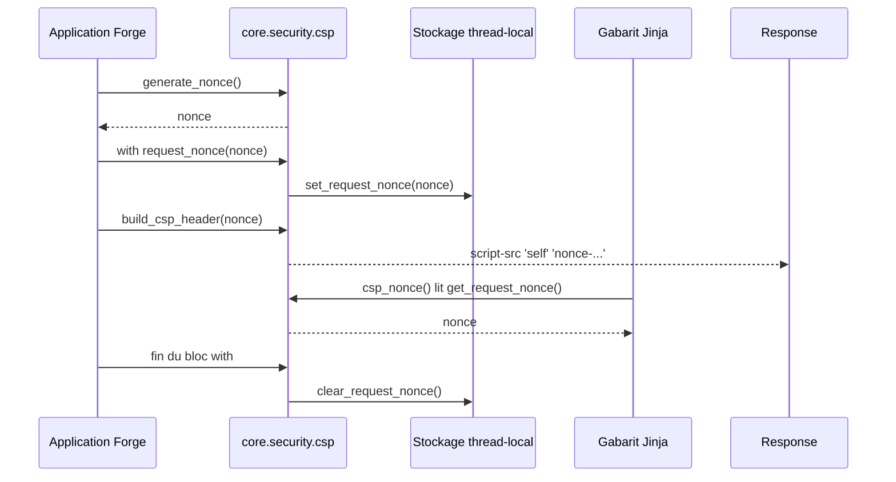

# Le nonce CSP dans Forge

Ce document décrit le nonce de Content-Security-Policy par requête.
Il explique comment autoriser un script inline contrôlé sans affaiblir la CSP.

## 1. Rôle

La CSP de Forge interdit les scripts inline par défaut (`script-src 'self'`).
Pour autoriser un script inline contrôlé sans ouvrir globalement la CSP avec `unsafe-inline`, le module `core.security.csp` fournit un nonce unique par requête.

Le nonce est stocké en thread-local pour la durée d'une requête, puis remis à zéro.
Le module construit aussi l'en-tête `Content-Security-Policy` complet.

## 2. Vue d'ensemble rapide

| Élément | Valeur |
|---|---|
| Module | `core.security.csp` |
| Module Python | `core.security.csp` |
| Couche | Sécurité |
| Rôle | fournir un nonce CSP par requête et bâtir l'en-tête CSP |
| Dépend de | `secrets`, `threading`, `contextlib` |
| API publique | `generate_nonce`, `set_request_nonce`, `get_request_nonce`, `clear_request_nonce`, `request_nonce`, `build_csp_header` |
| Configuration | variable d'environnement `APP_CSP_NONCE_ENABLED` |
| Stockage | thread-local (`threading.local`) |

Quand `APP_CSP_NONCE_ENABLED=false` (défaut), aucun nonce n'est posé et la CSP reste `script-src 'self'` seul.
`unsafe-inline` n'est jamais ajouté automatiquement.

## 3. Schémas UML

### 3.1 Diagramme de séquence

Le diagramme montre la pose d'un nonce le temps d'une requête avec le gestionnaire de contexte `request_nonce`.



À retenir :

- `request_nonce` est la façon officielle de poser un nonce par requête ;
- le bloc `with` garantit la remise à zéro en fin de requête, même en cas d'erreur ;
- sans remise à zéro, un nonce pourrait fuiter dans la CSP d'une requête suivante (les threads sont réutilisés) ;
- `build_csp_header(None)` produit une CSP sans nonce.

## 4. API publique

| Fonction | Signature | Rôle |
|---|---|---|
| `generate_nonce` | `generate_nonce() -> str` | génère un nonce sûr (base64 URL-safe, 128 bits) |
| `set_request_nonce` | `set_request_nonce(nonce: str \| None) -> None` | stocke le nonce de la requête courante en thread-local |
| `get_request_nonce` | `get_request_nonce() -> str \| None` | retourne le nonce courant, ou `None` |
| `clear_request_nonce` | `clear_request_nonce() -> None` | réinitialise le nonce courant |
| `request_nonce` | `request_nonce(nonce: str \| None) -> Generator[str \| None, None, None]` | gestionnaire de contexte qui porte le nonce puis garantit sa remise à zéro |
| `build_csp_header` | `build_csp_header(nonce: str \| None = None) -> str` | construit l'en-tête `Content-Security-Policy` (avec ou sans nonce) |

## 5. Contextes d'utilisation

| Besoin | Élément |
|---|---|
| Autoriser un script inline contrôlé | activer `APP_CSP_NONCE_ENABLED` puis poser `csp_nonce()` sur la balise |
| Poser un nonce le temps d'une requête | `with request_nonce(generate_nonce())` |
| Construire l'en-tête CSP | `build_csp_header(nonce)` |
| Lire le nonce courant dans un gabarit | `csp_nonce()` (qui s'appuie sur `get_request_nonce`) |

## 6. Exemples d'utilisation

Pose du nonce et construction de l'en-tête côté serveur :

```python
from core.security.csp import generate_nonce, request_nonce, build_csp_header

with request_nonce(generate_nonce()) as nonce:
    response.headers["Content-Security-Policy"] = build_csp_header(nonce)
    # rendu du template : csp_nonce() retourne nonce
```

Dans un gabarit Jinja :

```html
<script nonce="{{ csp_nonce() }}">/* script inline autorisé */</script>
```

## 7. Sécurité

!!! warning "Jamais unsafe-inline"
    `build_csp_header` n'ajoute jamais `unsafe-inline`.
    Seul un nonce valide autorise un script inline ; sinon la CSP reste `script-src 'self'`.

!!! note "Stockage thread-local"
    Le nonce vit dans un stockage thread-local et les threads sont réutilisés par le serveur de développement.
    Utiliser `request_nonce` plutôt que `set_request_nonce` directement garantit la remise à zéro en fin de requête.

## Voir aussi

- [Les en-têtes de sécurité dans Forge](headers.md) : la CSP fait partie du socle d'en-têtes posés.
