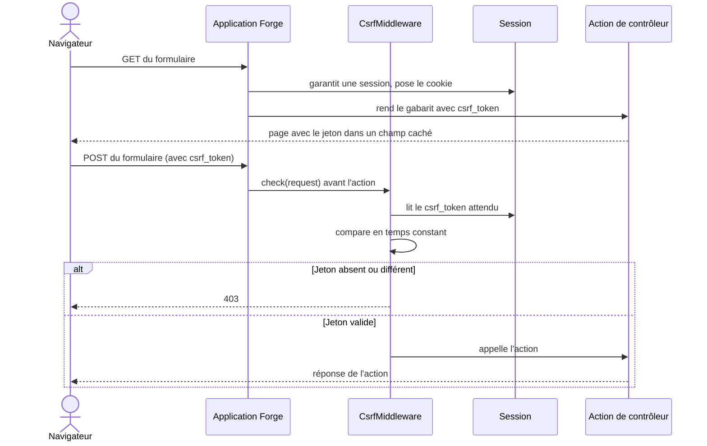

# La protection CSRF dans Forge

Ce document explique ce qu'est une attaque CSRF, comment Forge s'en protège, quelles requêtes sont vérifiées et comment utiliser le jeton dans vos formulaires.
La protection est mise en oeuvre par `CsrfMiddleware` (module `core.security.middleware`) et le décorateur `require_csrf` (module `core.security.decorators`).

## 1. Rôle

CSRF (Cross-Site Request Forgery, falsification de requête entre sites) est une attaque où un autre site déclenche, à l'insu du visiteur, une action sur votre site en profitant de sa session ouverte.

Exemple : connecté à votre banque, vous visitez une page piégée qui envoie en douce un formulaire vers votre banque.
Comme le navigateur joint automatiquement le cookie de session, la banque croit que la demande vient de vous.
La protection CSRF distingue une vraie action de l'utilisateur d'une action déclenchée par un site tiers.

Le principe : chaque action qui modifie des données doit porter un jeton secret lié à la session du visiteur.
Un site tiers ne connaît pas ce jeton, donc sa requête est rejetée.

## 2. Vue d'ensemble rapide

| Élément | Valeur |
|---|---|
| Composant | protection CSRF |
| Module Python | `core.security.middleware` (`CsrfMiddleware`), `core.security.decorators` (`require_csrf`) |
| Couche | Sécurité |
| Rôle | rejeter les requêtes d'écriture sans jeton CSRF valide |
| Dépend de | la session (`core.security.session`), `hmac.compare_digest` |
| Jeton | clé `csrf_token` dans la session |
| Transmission | champ de formulaire `csrf_token` ou en-tête `X-CSRF-Token` |
| Réponse de refus | `403` (gabarit `errors/403.html`) |
| Méthodes vérifiées | `POST`, `PUT`, `PATCH`, `DELETE` |

## 3. Schémas UML

### 3.1 Diagramme de séquence

Le diagramme montre l'affichage du formulaire (GET, non vérifié) puis l'envoi (POST, vérifié).



À retenir :

- les méthodes sûres (`GET`, `HEAD`, `OPTIONS`) ne sont pas vérifiées : elles ne font que lire ;
- le jeton vit dans la session, créé dès sa création ;
- la vérification a lieu avant l'appel de l'action ;
- la comparaison est faite en temps constant (`hmac.compare_digest`).

## 4. Quelles requêtes sont vérifiées

Forge ne vérifie le jeton que sur les requêtes qui changent l'état.

| Méthodes | Vérifiées ? |
|---|---|
| `GET`, `HEAD`, `OPTIONS` (dites sûres) | non : elles ne font que lire |
| `POST`, `PUT`, `PATCH`, `DELETE` (dites non sûres) | oui |

La protection est active par défaut sur les routes (`csrf=True`).
Une route peut la désactiver explicitement (`csrf=False`), par exemple une API qui s'appuie sur un autre mécanisme d'authentification.

## 5. Le jeton CSRF

| Aspect | Détail |
|---|---|
| Génération | le jeton (`csrf_token`) est créé dans la session, dès sa création ; il n'existe que s'il y a une session active |
| Transmission | le navigateur le renvoie par un champ de formulaire nommé `csrf_token`, ou par l'en-tête `X-CSRF-Token` (pratique pour les requêtes JavaScript) |
| Vérification | Forge compare le jeton reçu à celui de la session, en temps constant ; en cas d'absence ou de différence, la requête reçoit un `403` |

## 6. Contextes d'utilisation

| Besoin | Élément |
|---|---|
| Protéger un POST au cas par cas | décorateur `require_csrf` (après `require_auth`) |
| Protéger les routes non sûres en transverse | `CsrfMiddleware` |
| Poser le jeton dans un gabarit | `{{ csrf_token }}` dans un champ caché |
| Lire le jeton côté JavaScript | en-tête `X-CSRF-Token` |
| Désactiver pour une API à autre auth | `csrf=False` sur la route |

## 7. En pratique

Le jeton vit dans la session : il faut donc une session active pour qu'il ne soit pas vide.
Dans un gabarit, on place le jeton dans un champ caché.

```html
<form method="post" action="/welcome/form-submit">
    <input type="hidden" name="csrf_token" value="{{ csrf_token }}">
    <label>Prénom : <input type="text" name="name"></label>
    <button type="submit">Envoyer</button>
</form>
```

- En `GET` (affichage du formulaire) : aucune vérification ; on garantit la session, on pose son cookie, et on passe le jeton au gabarit.
- En `POST` (envoi) : Forge vérifie le jeton avant d'appeler votre contrôleur ; si tout est bon, votre méthode s'exécute, sinon le visiteur reçoit un `403`.

!!! note "Le duo CSRF et session"
    CSRF et session fonctionnent ensemble :

    - le jeton vit dans la session : sans session, `csrf_token` est vide et le POST est refusé ;
    - la session est retrouvée grâce à son cookie.

    C'est pourquoi un formulaire protégé commence toujours par garantir une session et poser son cookie.

## Voir aussi

- [La session dans Forge](session.md) : où vit le jeton.
- [Les cookies de session dans Forge](cookies.md) : comment la session est retrouvée.
- [Les middlewares de sécurité dans Forge](middleware.md) : `CsrfMiddleware`, le coeur de la vérification.
- [Les décorateurs de sécurité dans Forge](decorators.md) : `require_csrf`, la garde par action.
