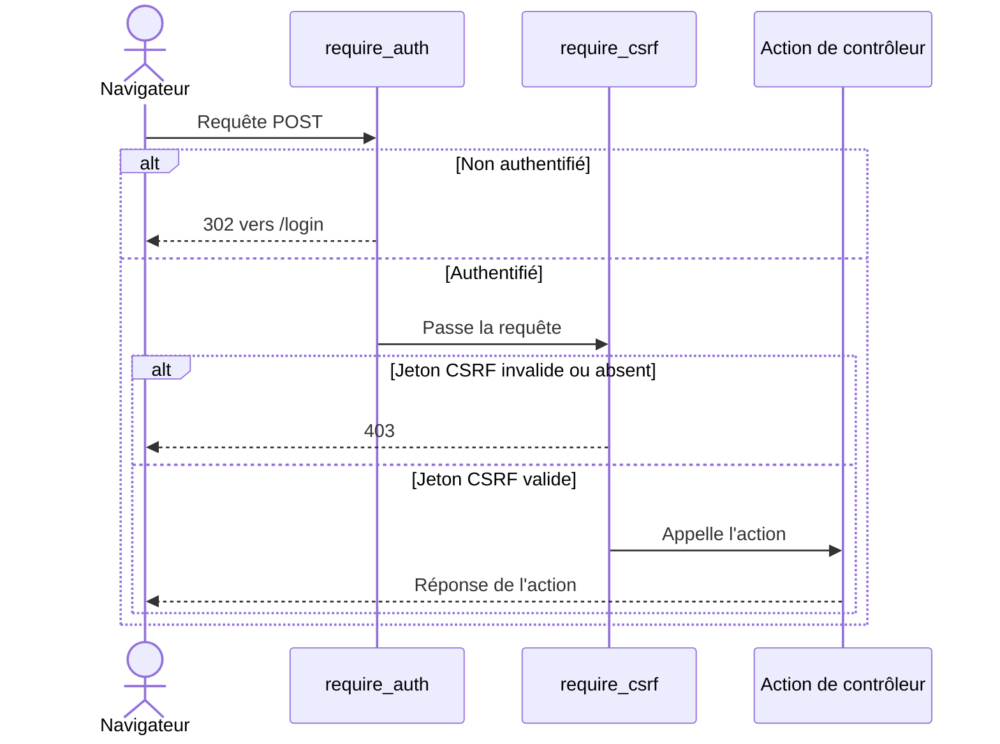

# Les décorateurs de sécurité dans Forge

Ce document décrit les décorateurs qui protègent une action de contrôleur.
Plutôt que de répéter les vérifications dans chaque action, on les pose en décorateurs.

## 1. Rôle

Le module `core.security.decorators` fournit trois gardes à poser sur une action de contrôleur : authentification, jeton CSRF et rôle.

Chaque garde s'exécute avant l'action.
Si la condition n'est pas remplie, la garde renvoie une réponse de refus (redirection ou `403`) et l'action n'est pas appelée.

## 2. Vue d'ensemble rapide

| Élément | Valeur |
|---|---|
| Module | `core.security.decorators` |
| Module Python | `core.security.decorators` |
| Couche | Sécurité |
| Rôle | protéger une action par authentification, CSRF ou rôle |
| Dépend de | `core.auth.session.is_authenticated`, `core.security.session.user_has_role`, `core.security.middleware.CsrfMiddleware`, `core.http.helpers.html` |
| API publique | `require_auth`, `require_csrf`, `require_role` |
| Objet lié | `Request`, `Response`, `Handler` |

`require_csrf` délègue à une instance partagée de `CsrfMiddleware` pour garantir une comparaison en temps constant.

## 3. Schémas UML

### 3.1 Diagramme de séquence

Le diagramme montre une action protégée par `require_auth` puis `require_csrf`.



À retenir :

- `require_auth` redirige vers `/login` si l'utilisateur n'est pas authentifié ;
- `require_csrf` se place après `require_auth` pour garantir qu'une session existe ;
- `require_role` cumule la vérification d'authentification et celle du rôle ;
- l'ordre des décorateurs reflète l'ordre d'exécution des gardes.

## 4. API publique

| Décorateur | Signature | Rôle |
|---|---|---|
| `require_auth` | `require_auth(func: Handler) -> Handler` | redirige (`302`) vers `/login` si l'utilisateur n'est pas authentifié |
| `require_csrf` | `require_csrf(func: Handler) -> Handler` | renvoie `403` si le jeton CSRF du formulaire ne correspond pas à la session |
| `require_role` | `require_role(role: str) -> Callable[[Handler], Handler]` | redirige vers `/login` si non authentifié, renvoie `403` (gabarit `errors/403.html`) si le rôle est absent |

`require_role` est une fabrique de décorateur : elle prend le nom du rôle et retourne le décorateur à appliquer.

## 5. Contextes d'utilisation

| Besoin | Élément |
|---|---|
| Protéger une route par authentification | `@require_auth` |
| Protéger un POST sensible contre le CSRF | `@require_csrf` (après `@require_auth`) |
| Réserver une action à un rôle | `@require_role("admin")` |

## 6. Exemples d'utilisation

Action réservée aux utilisateurs authentifiés, avec protection CSRF sur l'écriture :

```python
from core.security.decorators import require_auth, require_csrf


class NoteController:
    @staticmethod
    @require_auth
    @require_csrf
    def add(request):
        ...
```

Action réservée à un rôle :

```python
from core.security.decorators import require_auth, require_role


class AdminController:
    @staticmethod
    @require_auth
    @require_role("admin")
    def dashboard(request):
        ...
```

## 7. Limites

!!! note "RBAC léger et historique"
    `require_role` lit le champ `roles` de la session (RBAC léger historique).
    Pour des permissions fines, l'opt-in de contrôle d'accès basé sur les rôles est l'outil recommandé.

!!! tip "Ordre des décorateurs"
    Placer `require_csrf` après `require_auth` garantit qu'une session existe au moment de la vérification du jeton.

## Voir aussi

- [La protection CSRF dans Forge](csrf.md) : le mécanisme complet.
- [Les middlewares de sécurité dans Forge](middleware.md) : `AuthMiddleware`, `CsrfMiddleware`.
- [La session dans Forge](session.md) : où vivent l'utilisateur et le jeton.
