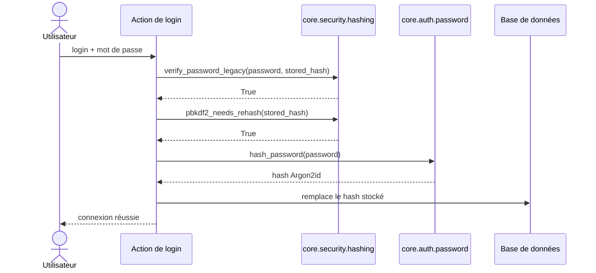

# Le hachage legacy dans Forge

Ce document décrit la vérification des mots de passe au format PBKDF2 hérité.
Ce module est en lecture seule : il ne crée plus de nouveaux hashes.

## 1. Rôle

Forge hache désormais les mots de passe en Argon2id, via le module `core.auth.password`.
Le module `core.security.hashing` est legacy : il sert uniquement à vérifier d'anciens hashes PBKDF2-HMAC-SHA256 stockés en base par des versions antérieures, et à signaler qu'ils doivent migrer vers Argon2id.

Il réexporte aussi, pour compatibilité, les fonctions de limitation de débit du login, qui vivent désormais dans `core.auth.rate_limit`.

## 2. Vue d'ensemble rapide

| Élément | Valeur |
|---|---|
| Module | `core.security.hashing` |
| Module Python | `core.security.hashing` |
| Couche | Sécurité (legacy, lecture seule) |
| Rôle | vérifier d'anciens hashes PBKDF2 et signaler leur migration |
| Dépend de | `hashlib`, `hmac`, `core.auth.rate_limit` (réexports) |
| API publique | `verify_password_legacy`, `pbkdf2_needs_rehash`, plus les réexports `record_attempt`, `is_rate_limited`, `MAX_ATTEMPTS`, `RATE_LIMIT_WINDOW` |
| Remplacé par | `core.auth.password` (Argon2id) pour la création de hashes |

Formats vérifiables :

- versionné : `pbkdf2_sha256$<iterations>$<sel_hex>$<hash_hex>` ;
- legacy : `<sel_hex>:<hash_hex>` (itérations égales à `LEGACY_ITERATIONS`, soit 260 000).

## 3. Schémas UML

### 3.1 Diagramme de séquence

Le diagramme montre la migration transparente d'un hash PBKDF2 vers Argon2id à la connexion.



À retenir :

- `verify_password_legacy` ne sert qu'à valider d'anciens hashes ;
- `pbkdf2_needs_rehash` retourne toujours `True` : tout hash PBKDF2 doit migrer ;
- la migration se fait à la première connexion réussie, sans action de l'utilisateur ;
- les nouveaux hashes sont créés par `core.auth.password.hash_password` (Argon2id).

## 4. API publique

| Fonction | Signature | Rôle |
|---|---|---|
| `verify_password_legacy` | `verify_password_legacy(password: str, stored_hash: str) -> bool` | vérifie un mot de passe contre un hash PBKDF2 stocké (formats versionné et legacy) |
| `pbkdf2_needs_rehash` | `pbkdf2_needs_rehash(stored_hash: str) -> bool` | retourne `True` pour tout hash PBKDF2 : tous doivent migrer vers Argon2id |

Réexports de compatibilité, issus de `core.auth.rate_limit` :

| Nom réexporté | Source | Rôle |
|---|---|---|
| `record_attempt` | `record_login_attempt` | note l'heure d'une tentative de login pour une IP |
| `is_rate_limited` | `is_login_rate_limited` | `True` si l'IP a dépassé la limite autorisée |
| `MAX_ATTEMPTS` | `LOGIN_MAX_ATTEMPTS` | nombre maximal de tentatives par fenêtre |
| `RATE_LIMIT_WINDOW` | `LOGIN_RATE_LIMIT_WINDOW` | durée de la fenêtre glissante |

## 5. Contextes d'utilisation

| Besoin | Élément |
|---|---|
| Vérifier un ancien mot de passe PBKDF2 | `verify_password_legacy(password, stored_hash)` |
| Savoir s'il faut re-hacher | `pbkdf2_needs_rehash(stored_hash)` |
| Créer un nouveau hash | `core.auth.password.hash_password` (Argon2id, hors de ce module) |

## 6. Exemples d'utilisation

```python
from core.security.hashing import verify_password_legacy, pbkdf2_needs_rehash
from core.auth.password import hash_password

if verify_password_legacy(password, stored_hash):
    if pbkdf2_needs_rehash(stored_hash):
        new_hash = hash_password(password)
        # remplacer le hash stocké en base par new_hash
    # connexion réussie
```

## 7. Limites

!!! warning "Module en sursis"
    Ce module ne crée plus de nouveaux hashes : il ne sert qu'à vérifier les hashes PBKDF2 hérités.
    Il sera supprimé quand tous les hashes PBKDF2 auront migré vers Argon2id.
    Tout nouveau projet doit utiliser directement `core.auth.password`.

## Voir aussi

- [Les décorateurs de sécurité dans Forge](decorators.md) : les gardes d'authentification.
- [La session dans Forge](session.md) : l'état conservé après une connexion réussie.
