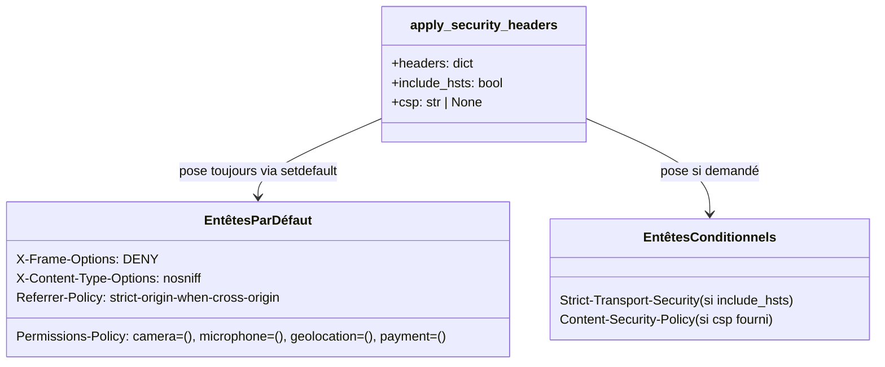

# Les en-têtes de sécurité dans Forge

Ce document décrit le helper qui pose les en-têtes HTTP de sécurité par défaut.
C'est la source de vérité du contrat de sécurité navigateur de Forge.

## 1. Rôle

Forge applique le même socle d'en-têtes de sécurité navigateur sur ses deux chemins de sortie HTTP : le serveur de développement (`python app.py`) et l'adaptateur WSGI.
Le module `core.security.headers` centralise cette application en un seul point.

Le helper mute le dict de headers via `setdefault` : il n'écrase jamais un en-tête déjà défini par l'application.

## 2. Vue d'ensemble rapide

| Élément | Valeur |
|---|---|
| Module | `core.security.headers` |
| Module Python | `core.security.headers` |
| Couche | Sécurité |
| Rôle | poser les en-têtes HTTP de sécurité par défaut |
| Dépend de | aucune dépendance externe |
| API publique | `apply_security_headers` |
| Stratégie | `setdefault` (n'écrase jamais un en-tête explicite) |
| Lié à | `core.security.csp.build_csp_header` (alimente l'argument `csp`) |

## 3. Schémas UML

### 3.1 Liste des en-têtes posés

Le module est un helper sans flux : il pose un ensemble fixe d'en-têtes.



À retenir :

- quatre en-têtes sont posés inconditionnellement (anti-clickjacking, anti-sniffing MIME, politique de referrer, politique de permissions) ;
- `Strict-Transport-Security` (HSTS) n'est posé que si `include_hsts=True` ;
- `Content-Security-Policy` n'est posé que si l'argument `csp` est fourni ;
- chaque pose passe par `setdefault`, donc un en-tête déjà défini par l'application reste prioritaire.

## 4. API publique

| Fonction | Signature | Rôle |
|---|---|---|
| `apply_security_headers` | `apply_security_headers(headers: dict[str, str], *, include_hsts: bool, csp: str \| None = None) -> None` | pose les en-têtes de sécurité Forge par défaut sur `headers`, en place |

Détail des valeurs posées :

| En-tête | Valeur | Condition |
|---|---|---|
| `X-Frame-Options` | `DENY` | toujours |
| `X-Content-Type-Options` | `nosniff` | toujours |
| `Referrer-Policy` | `strict-origin-when-cross-origin` | toujours |
| `Permissions-Policy` | `camera=(), microphone=(), geolocation=(), payment=()` | toujours |
| `Strict-Transport-Security` | `max-age=31536000; includeSubDomains` | si `include_hsts=True` |
| `Content-Security-Policy` | valeur de `csp` | si `csp` n'est pas `None` |

## 5. Contextes d'utilisation

| Besoin | Élément |
|---|---|
| Poser les en-têtes sur une réponse | `apply_security_headers(headers, include_hsts=...)` |
| Inclure HSTS sur une sortie HTTPS | `include_hsts=True` |
| Joindre la CSP | passer `csp=build_csp_header(nonce)` |

## 6. Exemples d'utilisation

```python
from core.security.headers import apply_security_headers
from core.security.csp import build_csp_header

apply_security_headers(headers, include_hsts=True, csp=build_csp_header())
```

## 7. La décision HSTS par chemin

!!! warning "HSTS uniquement en TLS réel"
    `Strict-Transport-Security` n'est pertinent que sur HTTPS et peut bloquer l'accès s'il est émis à tort.

    - Le serveur de développement passe `include_hsts=True` (il sait s'il sert TLS).
    - Le chemin WSGI passe `include_hsts=True` seulement si `environ["wsgi.url_scheme"] == "https"`.
    - Derrière un reverse proxy qui termine TLS, `wsgi.url_scheme` vaut `http` côté Forge : c'est alors au reverse proxy de poser HSTS.

!!! note "Garde-fous, pas configuration complète"
    Ces en-têtes sont des garde-fous par défaut.
    Ils ne remplacent ni une configuration de déploiement complète, ni une revue des gabarits.

## Voir aussi

- [Le nonce CSP dans Forge](csp.md) : `build_csp_header` alimente l'argument `csp`.
- [Les cookies de session dans Forge](cookies.md) : l'autre versant du durcissement HTTP.
